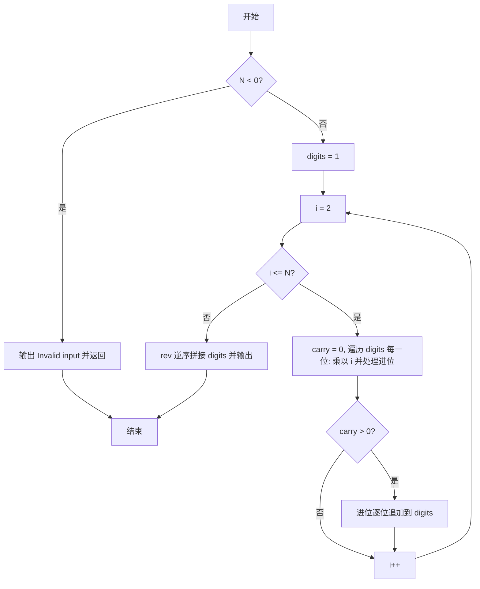
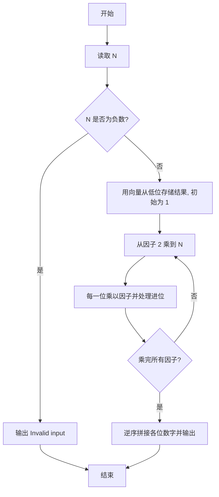

# PTA基础编程题目集 6-10阶乘计算升级版（R语言实现）

## 题目描述

本题要求实现一个打印非负整数阶乘的函数。

### 函数接口定义

```r
Print_Factorial <- function(N) {
  # N 非负时在一行打印 N!，否则打印 "Invalid input"
}
```

其中`N`是用户传入的参数，其值不超过1000。如果`N`是非负整数，则该函数必须在一行中打印出`N`!的值，否则打印"Invalid input"。

### 裁判测试程序样例

```r
Print_Factorial <- function(N) {
  # 你的代码将被嵌在这里
}

N <- scan(nmax = 1)
Print_Factorial(N)
```

### 输入样例

```in
15
```

### 输出样例

```out
1307674368000
```

## 解题思路

这道题的核心是**用向量模拟大数乘法**：`N` 最大为 1000，`1000!` 远超普通数值范围，必须用向量 `digits` 从低位到高位逐位存储结果，从因子 2 乘到 N，每次把每一位乘以当前因子并处理进位。

### 核心问题分析

1. **大数存储**：`digits` 向量从低位到高位（个位在前）逐位存储结果的每一位，初始 `digits <- 1L`（即 0!）。
2. **逐位乘法**：从因子 2 乘到 N，内层循环把 `digits` 的每一位乘以当前因子并处理进位。
3. **进位处理**：进位不止一位时用 `while` 循环逐位追加到向量末尾。
4. **结果输出**：全部因子乘完后，把 `digits` 逆序拼接成字符串输出。

### 算法原理说明

`N` 最大为 1000，`1000!` 远超普通数值范围，必须用**大数乘法**模拟。用向量 `digits` 从低位到高位逐位存储结果的每一位，初始 `digits <- 1L`（即 0!）。从因子 2 乘到 N，每次乘法把 `digits` 的每一位乘以当前因子并处理进位；进位不止一位时用 `while` 循环逐位追加到向量末尾。所有因子乘完后，把 `digits` 逆序拼接成字符串输出，即为最终阶乘结果。

### 具体计算步骤

1. 判断 `N < 0`：成立则调用 `cat("Invalid input\n")` 输出提示并 `return()` 结束函数。
2. 初始化 `digits <- 1L`，以逆序（个位在前）存放结果的各位数字，初始值为 1 表示 0!。
3. 当 `N >= 2` 时，外层循环 `for (i in 2:N)` 依次把当前结果乘以每个因子 `i`。
4. 内层循环 `for (j in seq_along(digits))` 遍历已存储的每一位：`z <- digits[j] * i + carry`，当前位存 `z %% 10L`，进位更新为 `z %/% 10L`。
5. 内层循环结束后若仍有进位 `carry > 0`，用 `while` 循环把剩余进位逐位追加到 `digits` 末尾。
6. 全部因子乘完后，用 `cat(paste0(rev(digits), collapse = ""), "\n", sep = "")` 将 `digits` 逆序拼接成字符串并输出。


## 完整代码

```r
# 6-10 阶乘计算升级版（大数）
Print_Factorial <- function(N) {
  # N 非负时打印 N!，否则打印 Invalid input
  if (is.na(N) || N < 0) { cat("Invalid input\n"); return(invisible(NULL)) }
  N <- as.integer(N)
  digits <- c(1L)  # 低位在前
  if (N >= 2) {
    for (i in 2:N) {
      carry <- 0L
      for (j in seq_along(digits)) {
        z <- digits[j] * i + carry
        digits[j] <- z %% 10L
        carry <- z %/% 10L
      }
      while (carry > 0) {
        digits <- c(digits, carry %% 10L)
        carry <- carry %/% 10L
      }
    }
  }
  cat(paste0(rev(digits), collapse=""), "\n", sep="")
}
# 使脚本可直接运行；裁判测试通过 source 引入时不执行（隔离）
if (sys.nframe() == 0L) {
  N <- scan(file="stdin", what=integer(), quiet=TRUE)[1]
  if (!is.na(N)) Print_Factorial(N) else cat("Invalid input\n")
}
```

## 代码流程说明

1. 判断 `N < 0`：成立则调用 `cat("Invalid input\n")` 输出提示并 `return()` 结束函数。
2. 初始化 `digits <- 1L`，以逆序（个位在前）存放结果的各位数字，初始值为 1 表示 0!。
3. 当 `N >= 2` 时，外层循环 `for (i in 2:N)` 依次把当前结果乘以每个因子 `i`。
4. 内层循环 `for (j in seq_along(digits))` 遍历已存储的每一位：`z <- digits[j] * i + carry`，当前位存 `z %% 10L`，进位更新为 `z %/% 10L`。
5. 内层循环结束后若仍有进位 `carry > 0`，用 `while` 循环把剩余进位逐位追加到 `digits` 末尾。
6. 全部因子乘完后，用 `cat(paste0(rev(digits), collapse = ""), "\n", sep = "")` 将 `digits` 逆序拼接成字符串并输出。

## 代码流程图



## 解题流程图


