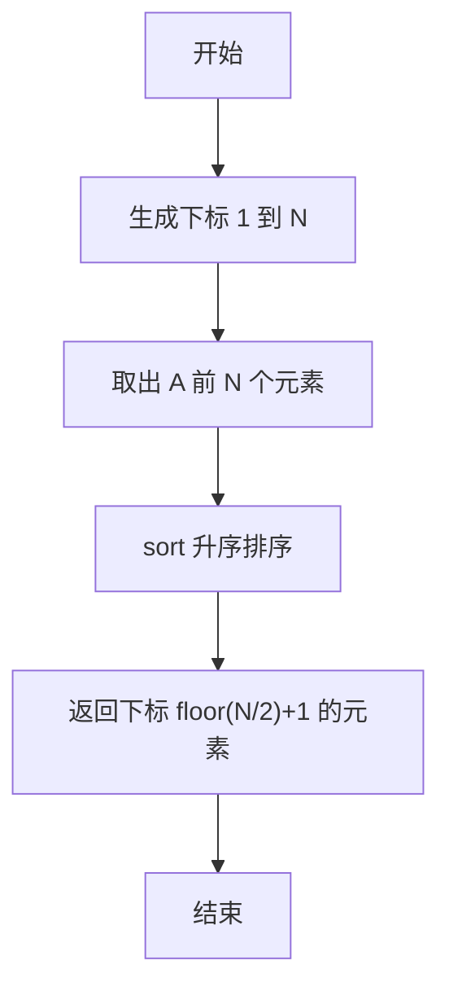
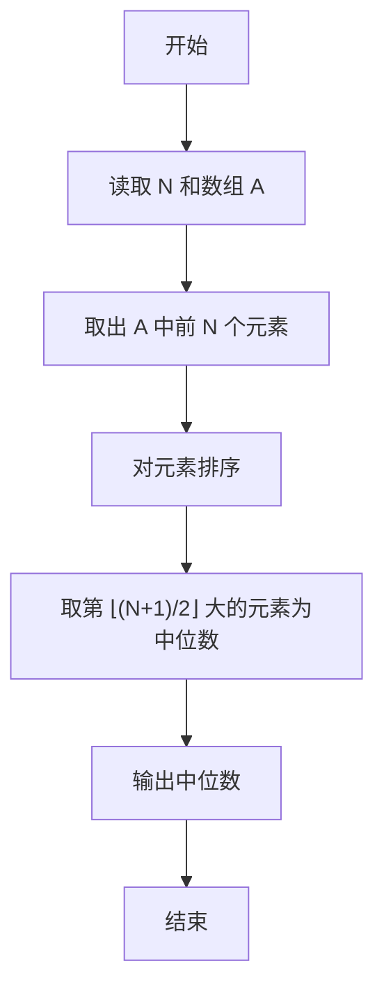

# PTA基础编程题目集 6-11求自定类型元素序列的中位数（R语言实现）

## 题目描述

本题要求实现一个函数，求N个集合元素A[]的中位数，即序列中第⌊(N+1)/2⌋大的元素。其中集合元素的类型为自定义的ElementType。

### 函数接口定义

```r
Median <- function(A, N) {
  # 返回 A 中前 N 个元素的中位数
}
```

其中给定集合元素存放在数组`A[]`中，正整数`N`是数组元素个数。该函数须返回`N`个`A[]`元素的中位数，其值也必须是`ElementType`类型。

### 裁判测试程序样例

```r
Median <- function(A, N) {
  # 你的代码将被嵌在这里
}

data <- scan()
N <- data[1]
A <- data[2:(1 + N)]
cat(sprintf("%.2f\n", Median(A, N)))
```

### 输入样例

```in
3
12.3 34 -5
```

### 输出样例

```out
12.30
```

## 函数部分

```text
函数 Median(A, N):
    values ← A 的前 N 个元素
    将 values 按升序排列
    返回下标 floor(N ÷ 2) + 1 的元素
```

## 解题思路

这道题的核心是**升序排序后按下标直接定位中位数**：中位数定义为排序后位于第 ⌊(N+1)/2⌋ 大的元素，升序排列后该元素恰好位于下标 `floor(N / 2) + 1`，直接返回即可。

### 核心问题分析

1. **元素选取**：用 `seq_len(N)` 取出集合 `A` 的前 N 个元素。
2. **排序**：用 `sort` 将这 N 个元素按升序排序。
3. **下标定位**：升序排列后第 ⌊(N+1)/2⌋ 大的元素位于下标 `floor(N / 2) + 1`（R 下标从 1 开始，N 为奇数或偶数时均成立）。

### 算法原理说明

中位数定义为排序后位于第 ⌊(N+1)/2⌋ 大的元素。先用 `seq_len(N)` 取出集合 `A` 的前 N 个元素，再用 `sort` 按升序排序；升序排列后第 ⌊(N+1)/2⌋ 大的元素恰好位于下标 `floor(N / 2) + 1`，直接返回该下标对应的元素即为中位数。

### 具体计算步骤

1. 调用 `seq_len(N)` 生成 1 到 N 的下标序列，用 `A[seq_len(N)]` 取出 `A` 中前 N 个元素。
2. 用 `sort` 将这 N 个元素按升序排序。
3. 返回排序后下标 `floor(N / 2) + 1` 的元素，即中位数。


## 完整代码

```r
# 6-11 求自定类型元素序列的中位数
Median <- function(A, N) {
  # 返回 A 中前 N 个元素的中位数（第 floor(N/2)+1 大）
  if (is.na(N) || N <= 0) return(NA_real_)
  s <- sort(A[seq_len(N)])
  s[floor(N/2) + 1]
}
# 使脚本可直接运行；裁判测试通过 source 引入时不执行（隔离）
if (sys.nframe() == 0L) {
  data <- scan(file="stdin", what=double(), quiet=TRUE)
  if (length(data) >= 1) {
    N <- suppressWarnings(as.integer(data[1]))
    A <- if (!is.na(N) && N > 0) data[seq_len(N) + 1] else numeric(0)
    cat(sprintf("%.2f\n", Median(A, N)))
  }
}
```

## 代码流程说明

1. 调用 `seq_len(N)` 生成 1 到 N 的下标序列，用 `A[seq_len(N)]` 取出 `A` 中前 N 个元素。
2. 用 `sort` 将这 N 个元素按升序排序。
3. 返回排序后下标 `floor(N / 2) + 1` 的元素，即中位数。

## 代码流程图



## 解题流程图



### 复杂度分析

- 时间复杂度：`O(N log N)`，主要成本来自对 N 个元素排序。
- 空间复杂度：`O(N)`，排序需要保存取出的元素副本。

### 常见易错点

1. 中位数定义为排序后第 `floor(N/2)+1` 个元素，不要套用偶数样本取两个中间值的统计学定义。
2. 排序方向应为升序，且只处理数组前 N 个元素。
3. R 的下标从 1 开始，因此 `floor(N/2)+1` 不能直接写成 `floor(N/2)`。
