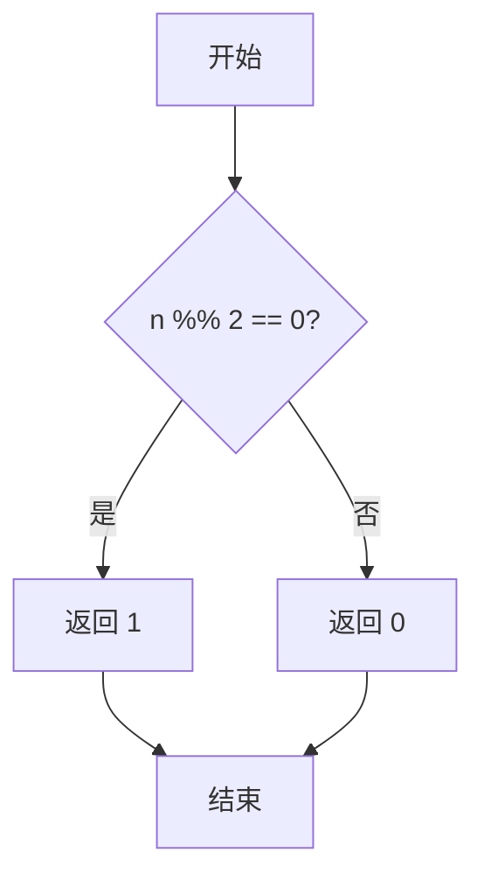
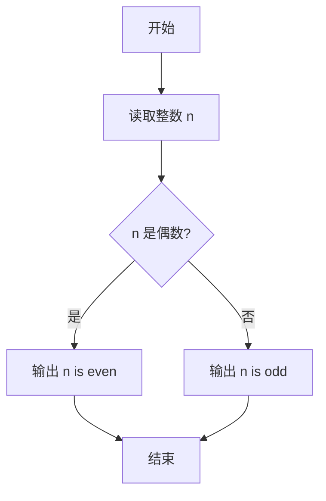

# PTA基础编程题目集 6-12判断奇偶性（R语言实现）

## 题目描述

本题要求实现判断给定整数奇偶性的函数。

### 函数接口定义

```r
even <- function(n) {
  # n 为偶数时返回 1，n 为奇数时返回 0
}
```

其中`n`是用户传入的整型参数。当`n`为偶数时，函数返回1；`n`为奇数时返回0。注意：0是偶数。

### 裁判测试程序样例

```r
even <- function(n) {
  # 你的代码将被嵌在这里
}

n <- scan(nmax = 1)
if (even(n) != 0) {
  cat(sprintf("%d is even.\n", n))
} else {
  cat(sprintf("%d is odd.\n", n))
}
```

### 输入样例1

```in
-6
```

### 输出样例1

```out
-6 is even.
```

### 输入样例2

```in
5
```

### 输出样例2

```out
5 is odd.
```

## 函数部分

```text
函数 even(n):
    如果 n mod 2 = 0，返回 1
    否则返回 0
```

## 解题思路

这道题的核心是**用取模运算判断奇偶**：看 `n` 是否能被 2 整除，`n %% 2 == 0` 说明是偶数，否则是奇数；题目约定偶数返回 1、奇数返回 0。

### 核心问题分析

1. **取模判断**：`n %% 2 == 0` 成立说明是偶数，否则是奇数。
2. **返回值约定**：题目约定偶数返回 1、奇数返回 0。
3. **0 的处理**：0 也是偶数，能被该条件正确判定。

### 算法原理说明

判断奇偶性只需看 `n` 是否能被 2 整除：`n %% 2 == 0` 说明是偶数，否则是奇数。题目约定偶数返回 1、奇数返回 0，因此判断 `n %% 2 == 0` 是否成立，成立则用 `as.integer` 转为 1，否则转为 0。注意 0 也是偶数，能被该条件正确判定。

### 具体计算步骤

1. 计算 `n %% 2`。
2. 判断 `n %% 2 == 0`：成立（偶数）返回 1，不成立（奇数）返回 0。
3. 用 `as.integer` 把逻辑值转换为整数 1 或 0。


## 完整代码

```r
# 6-12 判断奇偶性
even <- function(n) {
  # n 为偶数返回 1，奇数返回 0（0 为偶数）
  if (is.na(n)) return(0L)
  as.integer(n %% 2L == 0L)
}
# 使脚本可直接运行；裁判测试通过 source 引入时不执行（隔离）
if (sys.nframe() == 0L) {
  n <- scan(file="stdin", what=integer(), quiet=TRUE)[1]
  if (!is.na(n)) {
    if (even(n) != 0) cat(sprintf("%d is even.\n", n)) else cat(sprintf("%d is odd.\n", n))
  }
}
```

## 代码流程说明

1. 计算 `n %% 2`。
2. 判断 `n %% 2 == 0`：成立（偶数）返回 1，不成立（奇数）返回 0。
3. 用 `as.integer` 把逻辑值转换为整数 1 或 0。

## 代码流程图



## 解题流程图



### 复杂度分析

- 时间复杂度：`O(1)`，只进行一次取模判断。
- 空间复杂度：`O(1)`。

### 常见易错点

1. 偶数返回 1、奇数返回 0，不能直接返回 R 的逻辑值而忽略接口约定。
2. 0 也是偶数，应满足 `0 %% 2 == 0`。
3. 负数取模的结果仍可正确判断，不能因为负号而单独改写奇偶规则。
