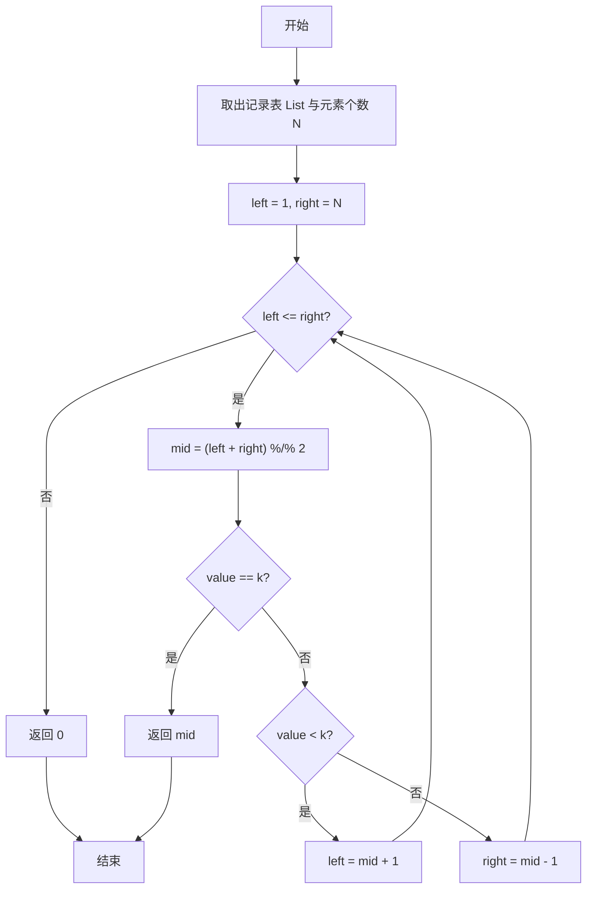
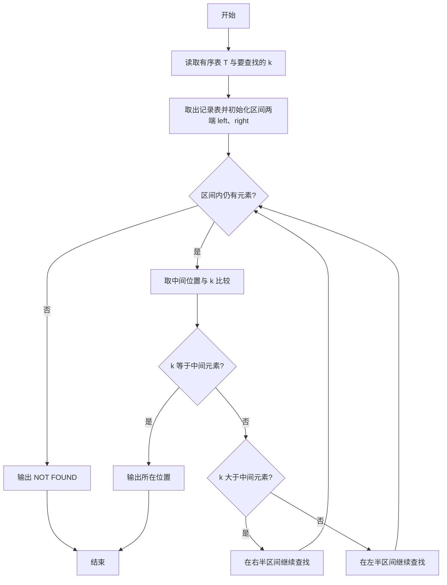

# PTA基础编程题目集 6-13折半查找（R语言实现）

## 题目描述

给一个严格递增数列，函数int Search_Bin(SSTable T, KeyType k)用来二分地查找k在数列中的位置。

### 函数接口定义

```r
Search_Bin <- function(T, k) {
  # 在有序表 T 中二分查找 k，返回位置（1 起），未找到返回 0 或 -1
}
```

### 裁判测试程序样例

```r
Search_Bin <- function(T, k) {
  # 你的代码将被嵌在这里
}

# 读取有序表与待查值
all <- scan()
n <- all[1]
vals <- all[2:(1 + n)]
k <- all[1 + n + 1]
T <- list(length = n, R = vals)
pos <- Search_Bin(T, k)
if (pos <= 0) cat("NOT FOUND\n") else cat(pos, "\n", sep="")
```

### 输入样例1

```in
5
1 3 5 7 9
7
```

### 输出样例1

```out
4
```

### 输入样例2

```in
5
1 3 5 7 9
10
```

### 输出样例2

```out
NOT FOUND
```

## 解题思路

这道题的核心是**二分查找**：用 `left`、`right` 指向区间两端，不断把查找区间折半，取中间位置与 k 比较，直到找到目标或区间为空。

### 核心问题分析

1. **输入形式兼容**：`T` 可能是 `list(length = 元素个数, R = 记录表)` 形式，也可能是普通向量，需统一取出记录表 `List` 和元素个数 `N`。
2. **区间维护**：`left`、`right` 指向区间两端，`mid` 取中间位置。
3. **折半比较**：`value == k` 返回 `mid`；`value < k` 到右半区继续；否则到左半区继续。
4. **未找到处理**：`left > right` 时区间为空，说明未找到，返回 0（裁判判 `pos<=0` 为未找到，-1 同样兼容）。

### 算法原理说明

二分查找适用于有序表，核心思路是不断把查找区间折半：用 `left`、`right` 指向区间两端，取中间位置 `mid` 与 `k` 比较——相等则找到并返回位置；`k` 较大则说明目标在右半区，把 `left` 移到 `mid + 1`；`k` 较小则目标在左半区，把 `right` 移到 `mid - 1`。当 `left > right` 时区间为空，说明未找到，返回 0（`<=0` 均判未找到）。

### 具体计算步骤

1. 处理输入形式：若 `T` 是带 `R` 字段的列表则取 `T$R` 作为记录表，否则直接用 `T` 本身，存入 `List`。
2. 确定元素个数 `N`：若 `T` 是带 `length` 字段的列表则取 `T$length`，否则取 `length(List)`。
3. 初始化左右边界 `left <- 1L`、`right <- N`。
4. `while (left <= right)` 循环：区间非空时取中间位置 `mid <- (left + right) %/% 2L`。
5. 取中间元素值 `value`（兼容"记录表"为 `list(key = ...)` 形式的结点）。
6. 若 `value == k` 直接返回 `mid`；若 `value < k` 则 `left <- mid + 1L` 到右半区继续；否则 `right <- mid - 1L` 到左半区继续。
7. 循环结束仍未找到，返回 `0L` 表示未找到（`pos<=0` 判 NOT FOUND）。


## 完整代码

```r
# 6-13 折半查找（二分查找）
Search_Bin <- function(T, k) {
  # T 可能是 list(length=..., R=...) 或向量，返回 1 起下标，未找到返回 0（与 C 接口一致，-1 亦被判为未找到）
  if (is.list(T) && !is.null(T$R)) {
    List <- T$R
    N <- if (!is.null(T$length)) as.integer(T$length) else length(List)
    # 若 R 为 list(key=...) 或 list(elem=...) 形式需提取数值
    if (is.list(List) && length(List) > 0 && is.list(List[[1]])) {
      List <- vapply(List, function(e) {
        if (!is.null(e$key)) as.numeric(e$key)
        else if (!is.null(e$Key)) as.numeric(e$Key)
        else as.numeric(e[[1]])
      }, numeric(1))
    }
  } else {
    List <- unlist(T)
    N <- length(List)
    if (is.list(T) && !is.null(T$length)) N <- as.integer(T$length)
  }
  List <- as.numeric(List)
  if (length(List) > N) List <- List[seq_len(N)]
  if (is.na(N) || N <= 0 || length(List) == 0) return(0L)
  left <- 1L; right <- as.integer(N)
  while (left <= right) {
    mid <- (left + right) %/% 2L
    val <- List[mid]
    if (is.na(val)) { left <- mid + 1L; next }
    if (val == k) return(mid)
    else if (val < k) left <- mid + 1L
    else right <- mid - 1L
  }
  return(0L)  # 未找到，返回 0（裁判判 pos<=0 为 NOT FOUND）
}
# 使脚本可直接运行；裁判测试通过 source 引入时不执行（隔离）
if (sys.nframe() == 0L) {
  all <- scan(file="stdin", what=double(), quiet=TRUE)
  all <- all[!is.na(all)]
  if (length(all) >= 2) {
    n <- suppressWarnings(as.integer(all[1]))
    vals <- if (!is.na(n) && n > 0) all[seq_len(n) + 1] else numeric(0)
    k <- all[1 + ifelse(is.na(n) || n < 0, 0, n) + 1]
    if (!is.na(k)) {
      T <- list(length=n, R=vals)
      pos <- Search_Bin(T, k)
      if (is.na(pos) || pos <= 0) cat("NOT FOUND\n") else cat(pos, "\n", sep="")
    }
  }
}
```

## 代码流程说明

1. 处理输入形式：若 `T` 是带 `R` 字段的列表则取 `T$R` 作为记录表，否则直接用 `T` 本身，存入 `List`。
2. 确定元素个数 `N`：若 `T` 是带 `length` 字段的列表则取 `T$length`，否则取 `length(List)`。
3. 初始化左右边界 `left <- 1L`、`right <- N`。
4. `while (left <= right)` 循环：区间非空时取中间位置 `mid <- (left + right) %/% 2L`。
5. 取中间元素值 `value`（兼容"记录表"为 `list(key = ...)` 形式的结点）。
6. 若 `value == k` 直接返回 `mid`；若 `value < k` 则 `left <- mid + 1L` 到右半区继续；否则 `right <- mid - 1L` 到左半区继续。
7. 循环结束仍未找到，返回 `0L` 表示未找到。

## 代码流程图



## 解题流程图


