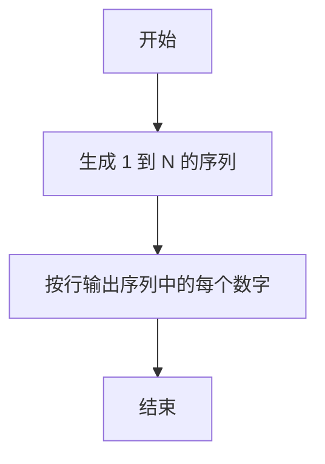
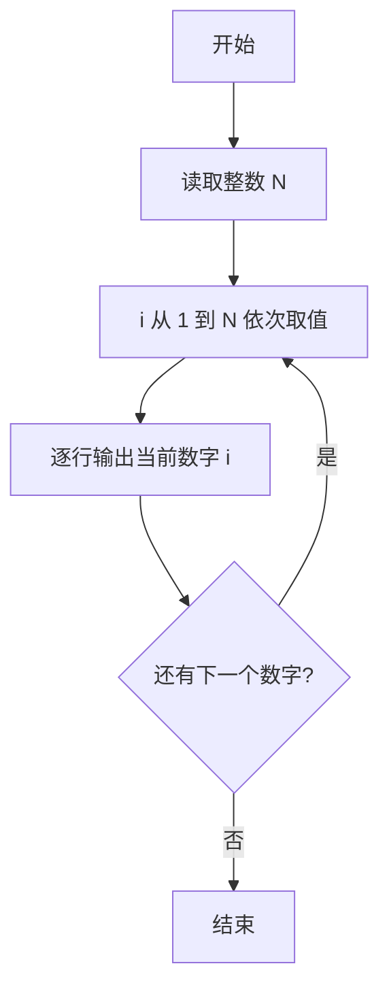

# PTA基础编程题目集 6-1简单输出整数（R语言实现）

## 题目描述

本题要求实现一个函数，对给定的正整数`N`，打印从1到`N`的全部正整数。

### 函数接口定义

```r
PrintN <- function(N) {
  # 将 1 到 N 的全部正整数顺序打印出来，每个数字占 1 行
}
```

其中`N`是用户传入的参数。该函数必须将从1到`N`的全部正整数顺序打印出来，每个数字占1行。

### 裁判测试程序样例

```r
PrintN <- function(N) {
  # 你的代码将被嵌在这里
}

N <- scan(nmax = 1)
PrintN(N)
```

### 输入样例

```in
3
```

### 输出样例

```out
1
2
3
```

## 解题思路

这道题的核心是**按顺序输出 1 到 N 的整数序列**：生成 1 到 N 的序列并用 cat 输出，每个数字占一行，即可完成全部输出。

### 核心问题分析

1. **输出范围**：从 1 到 N 共 N 个正整数，全部顺序输出。
2. **输出格式**：每个数字占 1 行，即每两个数字之间插入换行符。

### 算法原理说明

R 中可直接用 `seq_len(N)` 生成 1 到 N 的整数序列，再调用 `cat` 并以 `"\n"` 作为分隔符输出序列中的每个数字。`cat` 会在每个数字之间插入换行符，从而实现逐行打印。

### 具体计算步骤

1. 调用 `seq_len(N)` 生成 1 到 N 的整数序列。
2. 用 `cat` 以 `"\n"` 为分隔符输出序列中的每个数字。
3. 输出完成即结束函数。


## 完整代码

```r
# 6-1 简单输出整数：打印 1 到 N
PrintN <- function(N) {
  # 将 1 到 N 的全部正整数顺序打印出来，每个数字占 1 行
  N <- suppressWarnings(as.integer(N[1]))
  if (is.na(N) || N <= 0) return(invisible(NULL))
  for (i in seq_len(N)) cat(i, "\n", sep="")
  return(invisible(NULL))
}
# 使脚本可直接运行；裁判测试通过 source 引入时不执行（隔离）
if (sys.nframe() == 0L) {
  vals <- scan(file="stdin", what=integer(), quiet=TRUE)
  if (length(vals) >= 1 && !is.na(vals[1])) PrintN(vals[1])
}
```

## 代码流程说明

1. 调用 `seq_len(N)` 生成 1 到 N 的整数序列。
2. 用 `cat` 并以 `"\n"` 作为分隔符输出序列中的每个数字。
3. 输出完成即结束函数。

## 代码流程图



## 解题流程图


