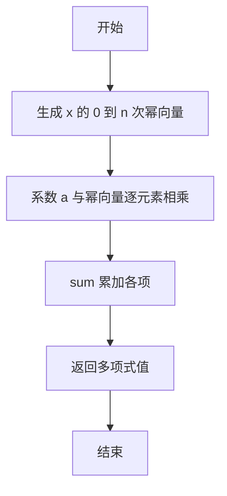
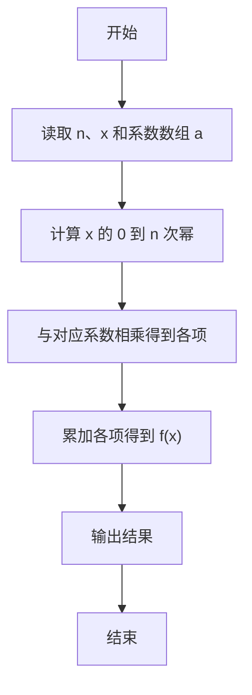

# PTA基础编程题目集 6-2多项式求值（R语言实现）

## 题目描述

本题要求实现一个函数，计算阶数为`n`，系数为`a[0]` ... `a[n]`的多项式*f*(*x*)=∑^n^~i=0~*(*a*[*i*]*×x^i^) 在`x`点的值。

### 函数接口定义

```r
f <- function(n, a, x) {
  # n 为阶数，a 存储系数，x 为给定点，返回多项式 f(x) 的值
}
```

其中`n`是多项式的阶数，`a[]`中存储系数，`x`是给定点。函数须返回多项式`f(x)`的值。

### 裁判测试程序样例

```r
f <- function(n, a, x) {
  # 你的代码将被嵌在这里
}

data <- scan()
n <- data[1]
x <- data[2]
a <- data[3:(3 + n)]
cat(sprintf("%.1f\n", f(n, a, x)))
```

### 输入样例

```in
2 1.1
1 2.5 -38.7
```

### 输出样例

```out
-43.1
```

## 解题思路

这道题的核心是**向量化多项式求值**：用 `x^(0:n)` 一次性生成 x 的 0 到 n 次幂向量，与系数逐元素相乘得到各项，再用 sum 累加，在 O(n) 时间内完成求值。

### 核心问题分析

1. **幂次生成**：多项式第 i 项含有 x 的 i 次幂，需要生成 x^0 到 x^n 共 n+1 个幂次。
2. **逐项乘积**：每个幂次与对应的系数 `a[i]` 相乘，得到该项的值。
3. **累加求和**：把 n+1 项的值累加起来即为 `f(x)`。

### 算法原理说明

多项式求值通常用**逐项累乘**的方式：先计算 `x^i` 再乘以系数 `a[i]` 累加。R 中可直接利用向量化运算：`x^(0:n)` 一次性生成 x 的 0 到 n 次幂向量，再与系数向量 `a` 逐元素相乘得到各项的值，最后用 `sum` 累加求和。

### 具体计算步骤

1. 用 `x^(0:n)` 生成 x 从 0 次到 n 次幂的向量。
2. 将系数向量 `a` 与幂向量逐元素相乘，得到多项式各项的值。
3. 用 `sum` 对各项求和，得到多项式在 x 点的值并返回。


## 完整代码

```r
# 6-2 多项式求值：f(x) = sum a[i]*x^i
f <- function(n, a, x) {
  # n 为阶数，a 为系数向量（a[1]=a0），x 为给定点
  if (is.na(n) || n < 0) return(0)
  # 仅取前 n+1 个系数，防止向量过长导致回收
  sum(a[seq_len(n + 1)] * x^(0:n))
}
# 使脚本可直接运行；裁判测试通过 source 引入时不执行（隔离）
if (sys.nframe() == 0L) {
  data <- scan(file="stdin", what=double(), quiet=TRUE)
  if (length(data) >= 3) {
    n <- suppressWarnings(as.integer(data[1]))
    x <- data[2]
    a <- if (!is.na(n) && n >= 0) data[seq_len(n + 1) + 2] else numeric(0)
    cat(sprintf("%.1f\n", f(n, a, x)))
  }
}
```

## 代码流程说明

1. 用 `x^(0:n)` 生成 x 从 0 次到 n 次幂的向量。
2. 将系数向量 `a` 与幂向量逐元素相乘，得到多项式各项的值。
3. 用 `sum` 对各项求和，得到多项式在 x 点的值并返回。

## 代码流程图



## 解题流程图


