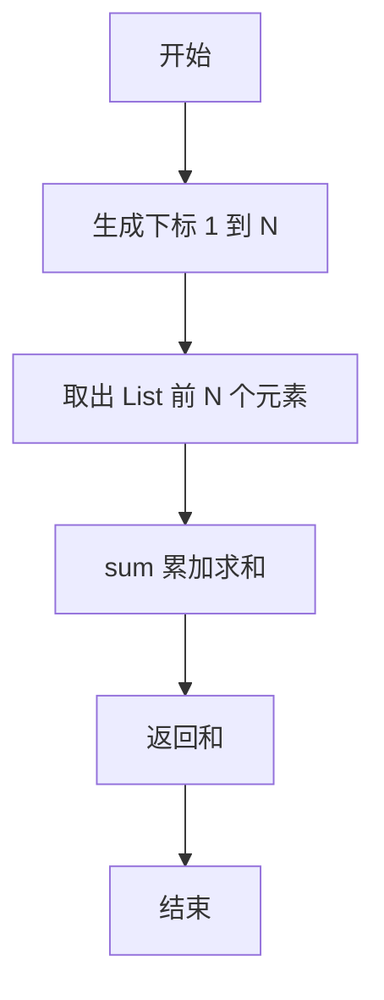
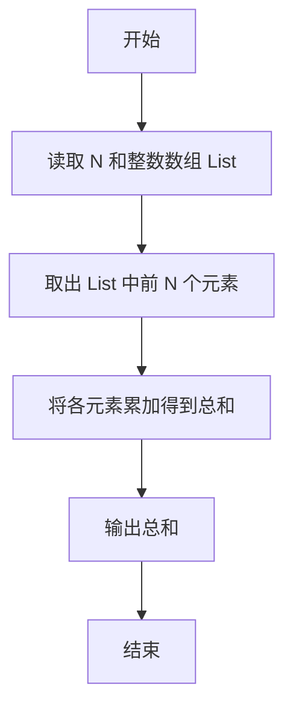

# PTA基础编程题目集 6-3简单求和（R语言实现）

## 题目描述

本题要求实现一个函数，求给定的`N`个整数的和。

### 函数接口定义

```r
Sum <- function(List, N) {
  # 返回 List 中前 N 个元素的和
}
```

其中给定整数存放在数组`List[]`中，正整数`N`是数组元素个数。该函数须返回`N`个`List[]`元素的和。

### 裁判测试程序样例

```r
Sum <- function(List, N) {
  # 你的代码将被嵌在这里
}

data <- scan()
N <- data[1]
List <- data[2:(1 + N)]
cat(Sum(List, N), "\n")
```

### 输入样例

```in
3
12 34 -5
```

### 输出样例

```out
41
```

## 解题思路

这道题的核心是**求前 N 个元素的和**：用变量保存累加结果、遍历数组元素依次累加；R 中可直接用内置 `sum` 函数一步完成。

### 核心问题分析

1. **元素选取**：只对 `List` 中前 N 个元素求和，需用 `seq_len(N)` 取出。
2. **累加求和**：把取出的 N 个元素累加得到总和。

### 算法原理说明

先用 `seq_len(N)` 生成下标 1 到 N 的序列，取出数组 `List` 的前 N 个元素，再调用内置 `sum` 对它们求和，即为全部 N 个整数的和。

### 具体计算步骤

1. 调用 `seq_len(N)` 生成 1 到 N 的下标序列。
2. 用 `List[seq_len(N)]` 取出 `List` 中前 N 个元素。
3. 用 `sum` 对取出的元素求和并返回。


## 完整代码

```r
# 6-3 简单求和
Sum <- function(List, N) {
  # 返回 List 中前 N 个元素的和
  if (is.na(N) || N <= 0) return(0)
  sum(List[seq_len(N)])
}
# 使脚本可直接运行；裁判测试通过 source 引入时不执行（隔离）
if (sys.nframe() == 0L) {
  data <- scan(file="stdin", what=double(), quiet=TRUE)
  if (length(data) >= 1) {
    N <- suppressWarnings(as.integer(data[1]))
    List <- if (!is.na(N) && N > 0) data[seq_len(N) + 1] else numeric(0)
    cat(Sum(List, N), "\n", sep="")
  }
}
```

## 代码流程说明

1. 调用 `seq_len(N)` 生成 1 到 N 的下标序列。
2. 用 `List[seq_len(N)]` 取出 `List` 中前 N 个元素。
3. 用 `sum` 对取出的元素求和并返回。

## 代码流程图



## 解题流程图


