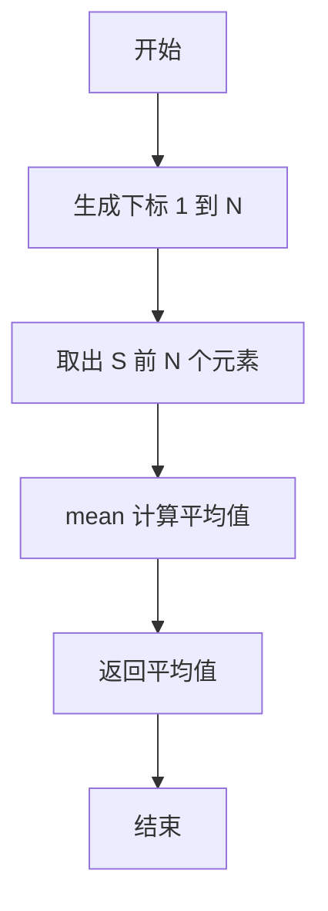
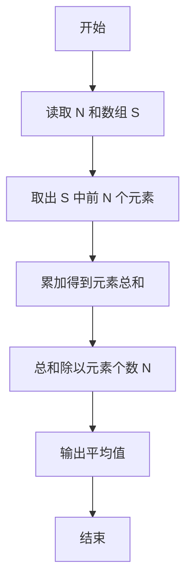

# PTA基础编程题目集 6-4求自定类型元素的平均（R语言实现）

## 题目描述

本题要求实现一个函数，求`N`个集合元素`S[]`的平均值，其中集合元素的类型为自定义的`ElementType`。

### 函数接口定义

```r
Average <- function(S, N) {
  # 返回 S 中前 N 个元素的平均值
}
```

其中给定集合元素存放在数组`S[]`中，正整数`N`是数组元素个数。该函数须返回`N`个`S[]`元素的平均值，其值也必须是`ElementType`类型。

### 裁判测试程序样例

```r
Average <- function(S, N) {
  # 你的代码将被嵌在这里
}

data <- scan()
N <- data[1]
S <- data[2:(1 + N)]
cat(sprintf("%.2f\n", Average(S, N)))
```

### 输入样例

```in
3
12.3 34 -5
```

### 输出样例

```out
13.77
```

## 函数部分

```text
函数 Average(S, N):
    total ← 0
    对 S 的前 N 个元素逐个遍历：
        total ← total + 当前元素
    返回 total ÷ N
```

## 解题思路

这道题的核心是**平均值 = 元素总和 ÷ 元素个数**：先取出集合 `S` 的前 N 个元素，再求和并除以元素个数；R 中可直接用内置 `mean` 函数一步完成。

### 核心问题分析

1. **元素选取**：只对 `S` 中前 N 个元素求平均，需用 `seq_len(N)` 取出。
2. **求平均值**：元素总和除以元素个数 N。
3. **类型一致性**：`mean` 返回浮点数，与题目要求的 `ElementType` 类型一致。

### 算法原理说明

平均值 = 元素总和 ÷ 元素个数。R 中可直接用内置 `mean` 函数一步完成：先用 `seq_len(N)` 取出前 N 个元素，再调用 `mean` 计算平均值，结果为浮点数。

### 具体计算步骤

1. 调用 `seq_len(N)` 生成 1 到 N 的下标序列。
2. 用 `S[seq_len(N)]` 取出 `S` 中前 N 个元素。
3. 用 `mean` 计算这 N 个元素的平均值并返回。


## 完整代码

```r
# 6-4 求自定类型元素的平均
Average <- function(S, N) {
  # 返回 S 中前 N 个元素的平均值
  if (is.na(N) || N <= 0) return(0)
  mean(S[seq_len(N)])
}
# 使脚本可直接运行；裁判测试通过 source 引入时不执行（隔离）
if (sys.nframe() == 0L) {
  data <- scan(file="stdin", what=double(), quiet=TRUE)
  if (length(data) >= 1) {
    N <- suppressWarnings(as.integer(data[1]))
    S <- if (!is.na(N) && N > 0) data[seq_len(N) + 1] else numeric(0)
    cat(sprintf("%.2f\n", Average(S, N)))
  }
}
```

## 代码流程说明

1. 调用 `seq_len(N)` 生成 1 到 N 的下标序列。
2. 用 `S[seq_len(N)]` 取出 `S` 中前 N 个元素。
3. 用 `mean` 计算这 N 个元素的平均值并返回。

## 代码流程图



## 解题流程图



### 复杂度分析

- 时间复杂度：`O(N)`，需要访问并累加 N 个元素。
- 空间复杂度：`O(1)`，只保留总和和计数等辅助变量。

### 常见易错点

1. 平均值应为总和除以元素个数 N，不能除以最后一个元素的下标。
2. 题目要求返回 `ElementType`，计算时应保留浮点精度。
3. N 为正整数，不能把空集合的默认值当作正常平均值。
