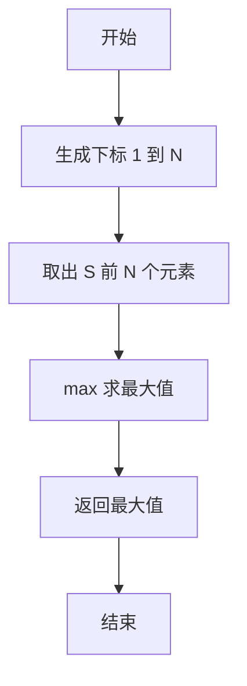
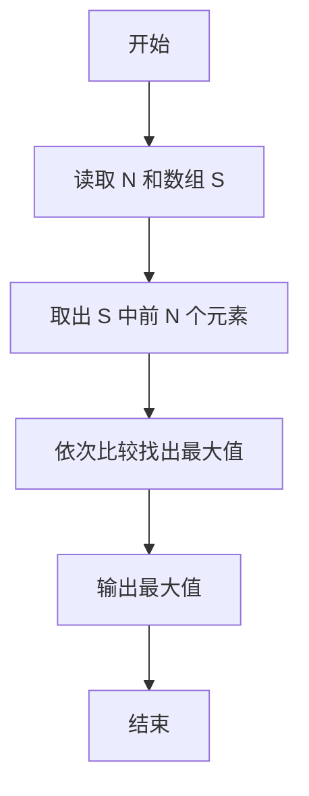

# PTA基础编程题目集 6-5求自定类型元素的最大值（R语言实现）

## 题目描述

本题要求实现一个函数，求`N`个集合元素`S[]`中的最大值，其中集合元素的类型为自定义的`ElementType`。

### 函数接口定义

```r
Max <- function(S, N) {
  # 返回 S 中前 N 个元素的最大值
}
```

其中给定集合元素存放在数组`S[]`中，正整数`N`是数组元素个数。该函数须返回`N`个`S[]`元素中的最大值，其值也必须是`ElementType`类型。

### 裁判测试程序样例

```r
Max <- function(S, N) {
  # 你的代码将被嵌在这里
}

data <- scan()
N <- data[1]
S <- data[2:(1 + N)]
cat(sprintf("%.2f\n", Max(S, N)))
```

### 输入样例

```in
3
12.3 34 -5
```

### 输出样例

```out
34.00
```

## 解题思路

这道题的核心是**求前 N 个元素的最大值**：通常采用"打擂台"思路，先把第一个元素当作当前最大值，再与其余元素依次比较并更新；R 中可直接用内置 `max` 函数一步完成。

### 核心问题分析

1. **元素选取**：只对 `S` 中前 N 个元素求最大值，需用 `seq_len(N)` 取出。
2. **求最大值**：把取出的 N 个元素逐一比较，找出其中的最大值。

### 算法原理说明

"打擂台"思路是先把第一个元素当作当前最大值，再与其余元素依次比较并更新。R 中可直接用内置 `max` 函数一步完成：先用 `seq_len(N)` 取出集合 `S` 的前 N 个元素，再调用 `max` 求出其中的最大值。

### 具体计算步骤

1. 调用 `seq_len(N)` 生成 1 到 N 的下标序列。
2. 用 `S[seq_len(N)]` 取出 `S` 中前 N 个元素。
3. 用 `max` 求出这 N 个元素的最大值并返回。


## 完整代码

```r
# 6-5 求自定类型元素的最大值
Max <- function(S, N) {
  # 返回 S 中前 N 个元素的最大值
  if (is.na(N) || N <= 0) return(NA_real_)
  max(S[seq_len(N)])
}
# 使脚本可直接运行；裁判测试通过 source 引入时不执行（隔离）
if (sys.nframe() == 0L) {
  data <- scan(file="stdin", what=double(), quiet=TRUE)
  if (length(data) >= 1) {
    N <- suppressWarnings(as.integer(data[1]))
    S <- if (!is.na(N) && N > 0) data[seq_len(N) + 1] else numeric(0)
    cat(sprintf("%.2f\n", Max(S, N)))
  }
}
```

## 代码流程说明

1. 调用 `seq_len(N)` 生成 1 到 N 的下标序列。
2. 用 `S[seq_len(N)]` 取出 `S` 中前 N 个元素。
3. 用 `max` 求出这 N 个元素的最大值并返回。

## 代码流程图



## 解题流程图


