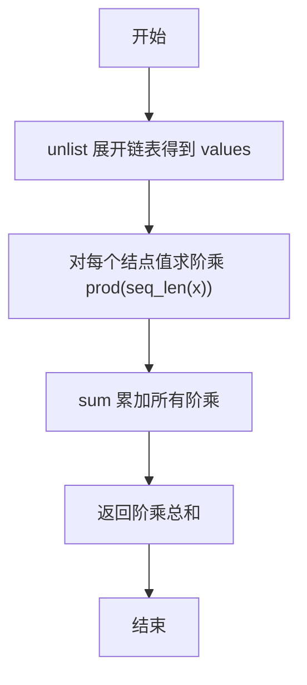
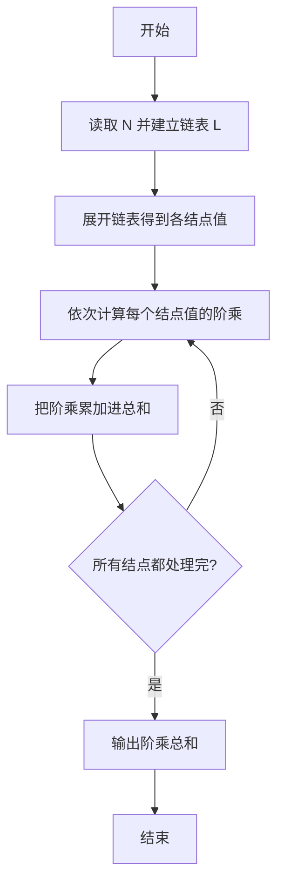

# PTA基础编程题目集 6-6求单链表结点的阶乘和（R语言实现）

## 题目描述

本题要求实现一个函数，求单链表`L`结点的阶乘和。这里默认所有结点的值非负，且题目保证结果在`int`范围内。

### 函数接口定义

```r
FactorialSum <- function(L) {
  # 返回单链表 L 各结点的阶乘和
}
```

### 裁判测试程序样例

```r
FactorialSum <- function(L) {
  # 你的代码将被嵌在这里
}

data <- scan()
N <- data[1]
vals <- data[2:(1 + N)]
L <- as.list(vals)
cat(FactorialSum(L), "\n")
```

### 输入样例

```in
3
5 3 6
```

### 输出样例

```out
846
```

## 函数部分

```text
函数 FactorialSum(L):
    result ← 0
    对链表 L 的每个结点逐个遍历：
        value ← 当前结点的 Data
        factorial ← 1
        对 i 从 2 到 value：
            factorial ← factorial × i
        result ← result + factorial
    返回 result
```

## 解题思路

这道题的核心是**展开链表后逐结点求阶乘并累加**：先把链表 `L` 用 `unlist` 展开为各结点 Data 值的向量 `values`，再对每个结点值求阶乘并累加，最后用 `sum` 把所有阶乘累加起来。

### 核心问题分析

1. **链表展开**：用 `unlist(L)` 把链表 `L` 展开为各结点 Data 值向量 `values`。
2. **逐点阶乘**：对每个结点值用 `prod(seq_len(x))` 求阶乘（1 到 x 的连乘，`0!` 也正确）。
3. **累加求和**：用 `sum` 把所有结点的阶乘累加起来。

### 算法原理说明

链表在 R 中用列表表示，元素依次为各结点的 Data 值。先 `unlist(L)` 展开得到 `values`，再用 `vapply(values, function(x) prod(seq_len(x)), numeric(1))` 对每个结点值求阶乘：`seq_len(x)` 生成 1 到 x 的序列，`prod` 连乘得到 `x!`；最后 `sum` 累加即为阶乘和。

### 具体计算步骤

1. 用 `unlist(L)` 把链表 `L` 展开为各结点 Data 值向量 `values`。
2. 用 `vapply` 对每个结点值求阶乘 `prod(seq_len(x))`。
3. 用 `sum` 累加所有结点的阶乘，返回总和。


## 完整代码

```r
# 6-6 求单链表结点的阶乘和
FactorialSum <- function(L) {
  # L 可为 list 或向量，展开后逐结点求阶乘并累加
  vals <- unlist(L)
  if (length(vals) == 0) return(0)
  # 过滤 NA，保持与 C 版 int 范围内逻辑一致
  s <- vapply(vals, function(x) {
    if (is.na(x) || x <= 1) return(1)
    prod(seq_len(as.integer(x)))
  }, numeric(1))
  sum(s)
}
# 使脚本可直接运行；裁判测试通过 source 引入时不执行（隔离）
if (sys.nframe() == 0L) {
  data <- scan(file="stdin", what=integer(), quiet=TRUE)
  if (length(data) >= 1) {
    N <- data[1]
    vals <- if (!is.na(N) && N > 0) data[2:(1 + N)] else integer(0)
    L <- as.list(vals)  # 模拟链表
    cat(FactorialSum(L), "\n", sep="")
  }
}
```

## 代码流程说明

1. 用 `unlist(L)` 把链表 `L` 展开为各结点 Data 值向量 `values`。
2. 用 `vapply(values, function(x) prod(seq_len(x)), numeric(1))` 对每个结点值求阶乘：`seq_len(x)` 生成 1 到 x 的序列，`prod` 连乘得到 `x!`。
3. 用 `sum` 累加所有结点的阶乘，返回总和。

## 代码流程图



## 解题流程图



### 复杂度分析

设第 i 个结点的值为 `vᵢ`：

- 时间复杂度：`O(∑vᵢ)`，每个结点都要计算一次阶乘。
- 空间复杂度：`O(1)` 额外空间；R 的临时序列大小取决于当前结点值。

### 常见易错点

1. `0!` 和 `1!` 都等于 1，不能把 0 的阶乘误算为 0。
2. 遍历链表时要处理所有结点，不能只计算头结点。
3. 阶乘结果可能较大，应使用题目保证范围内的数值类型，并保持累加初值为 0。
