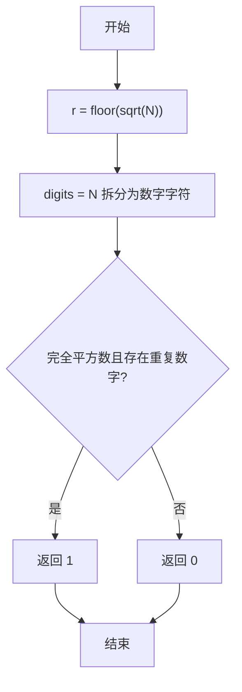
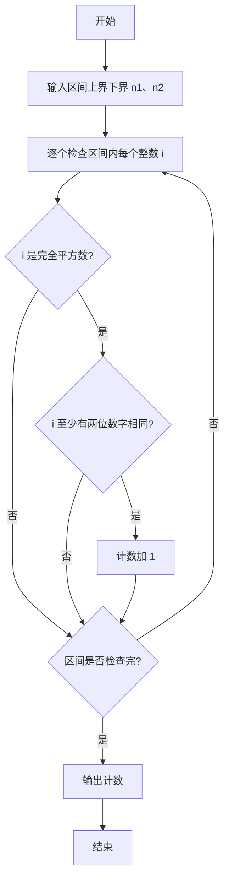

# PTA基础编程题目集 6-7统计某类完全平方数（R语言实现）

## 题目描述

本题要求实现一个函数，判断任一给定整数`N`是否满足条件：它是完全平方数，又至少有两位数字相同，如144、676等。

### 函数接口定义

```r
IsTheNumber <- function(N) {
  # N 是完全平方数且至少两位数字相同返回 1，否则返回 0
}
```

其中`N`是用户传入的参数。如果`N`满足条件，则该函数必须返回1，否则返回0。

### 裁判测试程序样例

```r
IsTheNumber <- function(N) {
  # 你的代码将被嵌在这里
}

data <- scan()
n1 <- data[1]
n2 <- data[2]
cnt <- 0
for (i in n1:n2) {
  cnt <- cnt + IsTheNumber(i)
}
cat(sprintf("cnt = %d\n", cnt))
```

### 输入样例

```in
105 500
```

### 输出样例

```out
cnt = 6
```

## 解题思路

这道题的核心是**两个条件同时满足才返回 1**：① 完全平方数；② 至少有两位数字相同。思路分两步判断，两个条件同时满足则返回 1，否则返回 0。

### 核心问题分析

1. **完全平方数判断**：用 `floor(sqrt(N))` 取 N 的平方根整数部分 `r`，判断 `r * r == N` 是否成立。
2. **重复数字判断**：把 N 转为字符串并用 `strsplit` 拆成数字字符向量 `digits`，用 `any(duplicated(digits))` 判断是否存在重复数字（即至少有两位相同）。
3. **结果返回**：两个条件同时满足则返回 1，否则返回 0。

### 算法原理说明

分两步验证：先用 `floor(sqrt(N))` 取平方根整数部分 `r`，`r * r == N` 成立即为完全平方数；再把 N 转为字符串用 `strsplit` 拆成各个数字字符向量 `digits`，`any(duplicated(digits))` 判断是否存在重复数字。两个条件同时成立时返回 1，否则返回 0。

### 具体计算步骤

1. 用 `floor(sqrt(N))` 计算 N 的平方根整数部分 `r`。
2. 用 `as.character(N)` 将 N 转为字符串，`strsplit(..., "", fixed = TRUE)[[1]]` 拆分为各个数字字符向量 `digits`。
3. 判断 `r * r == N`（完全平方数）且 `any(duplicated(digits))`（存在重复数字）。
4. 用 `as.integer` 把逻辑结果转为 1 或 0 返回。


## 完整代码

```r
# 6-7 统计某类完全平方数
IsTheNumber <- function(N) {
  # 判断 N 是否为完全平方数且至少有两位数字相同
  if (is.na(N) || N < 0) return(0L)
  r <- as.integer(sqrt(N))
  # 修正浮点误差
  while ((r + 1L) * (r + 1L) <= N) r <- r + 1L
  while (r * r > N) r <- r - 1L
  if (r * r != N) return(0L)
  digits <- strsplit(as.character(N), "", fixed = TRUE)[[1]]
  if (any(duplicated(digits))) return(1L) else return(0L)
}
# 使脚本可直接运行；裁判测试通过 source 引入时不执行（隔离）
if (sys.nframe() == 0L) {
  data <- scan(file="stdin", what=integer(), quiet=TRUE)
  if (length(data) >= 2) {
    n1 <- data[1]; n2 <- data[2]
    cnt <- 0L
    for (i in n1:n2) cnt <- cnt + IsTheNumber(i)
    cat(sprintf("cnt = %d\n", cnt))
  }
}
```

## 代码流程说明

1. 用 `floor(sqrt(N))` 计算 N 的平方根整数部分 `r`。
2. 用 `as.character(N)` 将 N 转为字符串，`strsplit(..., "", fixed = TRUE)[[1]]` 拆分为各个数字字符向量 `digits`。
3. 判断 `r * r == N`（完全平方数）且 `any(duplicated(digits))`（存在重复数字）。
4. 用 `as.integer` 把逻辑结果转为 1 或 0 返回。

## 代码流程图



## 解题流程图


