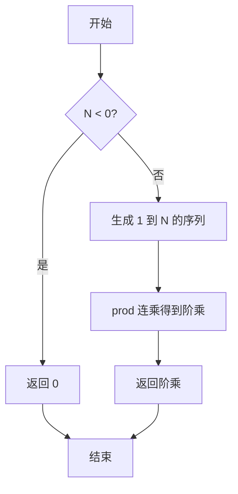
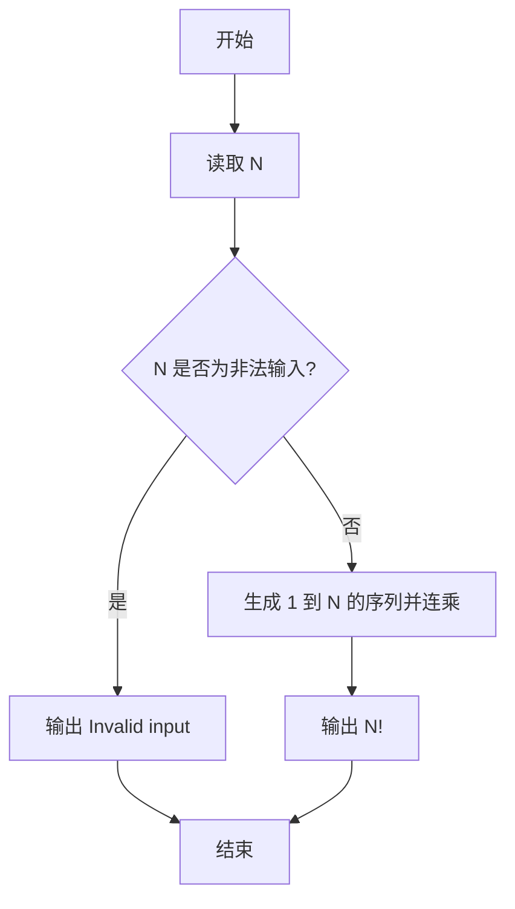

# PTA基础编程题目集 6-8简单阶乘计算（R语言实现）

## 题目描述

本题要求实现一个计算非负整数阶乘的简单函数。

### 函数接口定义

```r
Factorial <- function(N) {
  # N 为非负整数时返回其阶乘，否则返回 0
}
```

其中`N`是用户传入的参数，其值不超过12。如果`N`是非负整数，则该函数必须返回`N`的阶乘，否则返回0。

### 裁判测试程序样例

```r
Factorial <- function(N) {
  # 你的代码将被嵌在这里
}

N <- scan(nmax = 1)
NF <- Factorial(N)
if (NF != 0) {
  cat(sprintf("%d! = %d\n", N, NF))
} else {
  cat("Invalid input\n")
}
```

### 输入样例

```in
5
```

### 输出样例

```out
5! = 120
```

## 函数部分

```text
函数 Factorial(N):
    如果 N < 0，返回 0
    result ← 1
    对 i 从 2 到 N：
        result ← result × i
    返回 result
```

## 解题思路

这道题的核心是**非法输入返回 0、合法输入用连乘求阶乘**：先判断 `N < 0` 的非法输入直接返回 0；否则用 `seq_len(N)` 生成 1 到 N 的整数序列，再以 `prod` 连乘得到 N 的阶乘。

### 核心问题分析

1. **非法输入处理**：`N < 0` 时返回 0（题目约定非法输入返回 0）。
2. **连乘计算**：`seq_len(N)` 生成 1 到 N 的序列，`prod` 连乘得到 `N!`。
3. **边界情况**：N 为 0 或 1 时 `seq_len(N)` 只有 1 个元素 1，连乘结果仍为 1，符合 `0! = 1! = 1`。

### 算法原理说明

阶乘 `N! = 1 × 2 × ... × N`，且 `0! = 1`。先判断 `N < 0` 的非法输入，直接返回 0；否则用 `seq_len(N)` 生成 1 到 N 的整数序列，再以 `prod` 连乘得到 `N` 的阶乘。

### 具体计算步骤

1. 判断 `N < 0`：成立则返回 0（题目约定非法输入返回 0）。
2. 否则调用 `seq_len(N)` 生成 1 到 N 的整数序列。
3. 用 `prod` 对序列连乘，得到 N 的阶乘并返回。


## 完整代码

```r
# 6-8 简单阶乘计算
Factorial <- function(N) {
  # N 非负时返回阶乘，否则返回 0
  if (is.na(N) || N < 0) return(0)
  if (N == 0) return(1)
  prod(seq_len(as.integer(N)))
}
# 使脚本可直接运行；裁判测试通过 source 引入时不执行（隔离）
if (sys.nframe() == 0L) {
  N <- scan(file="stdin", what=integer(), quiet=TRUE)[1]
  if (!is.na(N)) {
    NF <- Factorial(N)
    if (NF != 0) {
      cat(sprintf("%d! = %d\n", N, NF))
    } else {
      cat("Invalid input\n")
    }
  }
}
```

## 代码流程说明

1. 判断 `N < 0`：成立则返回 0（题目约定非法输入返回 0）。
2. 否则调用 `seq_len(N)` 生成 1 到 N 的整数序列。
3. 用 `prod` 对序列连乘，得到 N 的阶乘并返回。

## 代码流程图



## 解题流程图



### 复杂度分析

- 时间复杂度：`O(N)`，需要完成从 2 到 N 的连乘。
- 空间复杂度：`O(N)`，R 中 `seq_len(N)` 产生阶乘计算所需的临时序列。

### 常见易错点

1. 负数是非法输入，应返回 0，由裁判程序转换为 `Invalid input`。
2. `0! = 1`，不能因为没有执行乘法循环就返回 0。
3. 题目范围内应使用整数结果，输出格式还要保留 `N! = value` 的形式。
