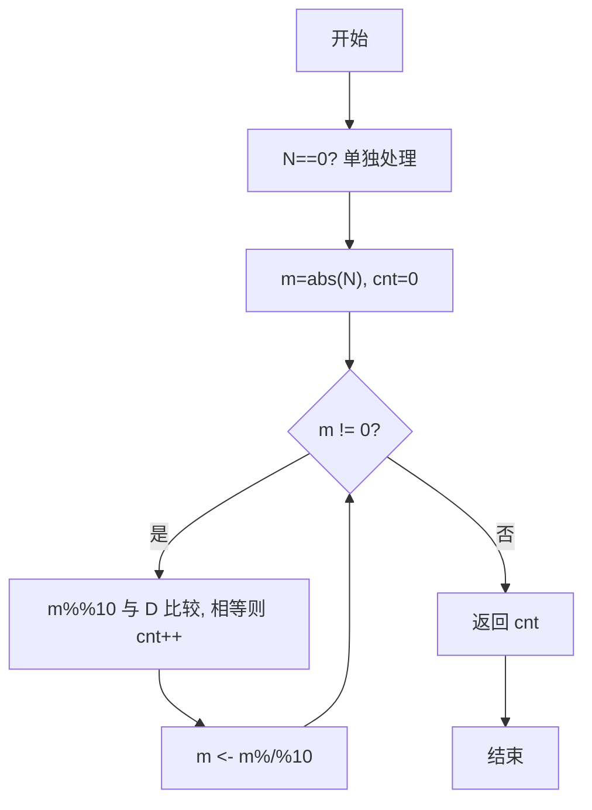
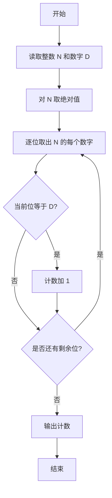

# PTA基础编程题目集 6-9统计个位数字（R语言实现）

## 题目描述

本题要求实现一个函数，可统计任一整数中某个位数出现的次数。例如-21252中，2出现了3次，则该函数应该返回3。

### 函数接口定义

```r
Count_Digit <- function(N, D) {
  # 返回整数 N 中数字 D 出现的次数
}
```

其中`N`和`D`都是用户传入的参数。`N`的值不超过`int`的范围；`D`是[0, 9]区间内的个位数。函数须返回`N`中`D`出现的次数。

### 裁判测试程序样例

```r
Count_Digit <- function(N, D) {
  # 你的代码将被嵌在这里
}

data <- scan(nmax = 2)
cat(Count_Digit(data[1], data[2]), "\n")
```

### 输入样例

```in
-21252 2
```

### 输出样例

```out
3
```

## 解题思路

这道题的核心是**逐位统计数字 D 出现的次数**：先取绝对值处理负数，再通过 `%%10`/`%/%10` 逐位取出 N 的每个十进制位并与 D 比较计数；`N==0` 单独处理。

### 核心问题分析

1. **负数处理**：用 `abs(N)` 取绝对值，避免负号干扰逐位统计。
2. **逐位拆分**：用 `%%10` 取个位、`%/%10` 去掉个位，循环取出每个数字。
3. **统计次数**：每取一位与 `D` 比较相等则计数加 1；注意 `N==0` 时需单独判断 `D==0` 返回 1 否则 0。

### 算法原理说明

统计数字 `D` 在整数 `N` 中出现的次数，核心是逐位检查。先单独处理 `N==0` 边界（`D==0` 计 1 次），其余情况取 `m=abs(N)`，循环 `while(m != 0)`：用 `m %%10` 取个位与 `D` 比较、计数，再 `m <- m %/%10` 去掉个位，直至所有位处理完。

### 具体计算步骤

1. 若 `N` 或 `D` 为 `NA` 返回 0；若 `N==0` 则 `D==0` 返回 1 否则 0。
2. 取 `m <- abs(as.numeric(N))`、`D <- as.integer(D)`，初始化 `cnt <-0L`。
3. `while(m !=0)` 循环：若 `m %%10 == D` 则 `cnt+1`，`m <- m %/%10`。
4. 返回 `cnt`。


## 完整代码

```r
# 6-9 统计个位数字
Count_Digit <- function(N, D) {
  # 统计整数 N 中数字 D 出现的次数（N 可为负）
  if (is.na(N) || is.na(D)) return(0L)
  if (N == 0 && D == 0) return(1L)
  if (N == 0 && D != 0) return(0L)
  m <- abs(suppressWarnings(as.numeric(N)))
  if (is.na(m)) {
    # 极端溢出回退到字符串统计
    digits <- strsplit(as.character(abs(as.numeric(N))), "", fixed=TRUE)[[1]]
    return(sum(digits == as.character(as.integer(D))))
  }
  D <- suppressWarnings(as.integer(D[1]))
  if (is.na(D)) return(0L)
  cnt <- 0L
  while (m != 0) {
    if (as.integer(m %% 10) == D) cnt <- cnt + 1L
    m <- m %/% 10
  }
  return(cnt)
}
# 使脚本可直接运行；裁判测试通过 source 引入时不执行（隔离）
if (sys.nframe() == 0L) {
  data <- scan(file="stdin", what=integer(), quiet=TRUE)
  if (length(data) >= 2) cat(Count_Digit(data[1], data[2]), "\n", sep="")
}
```

## 代码流程说明

1. 若 `N==0` 单独判断 `D` 是否为 0 并返回对应计数。
2. 取 `m <- abs(as.numeric(N))`，用 `%%10` 取个位与 `D` 比较计数，`%/%10` 去掉个位循环。
3. 循环结束返回累计计数值。

## 代码流程图



## 解题流程图


