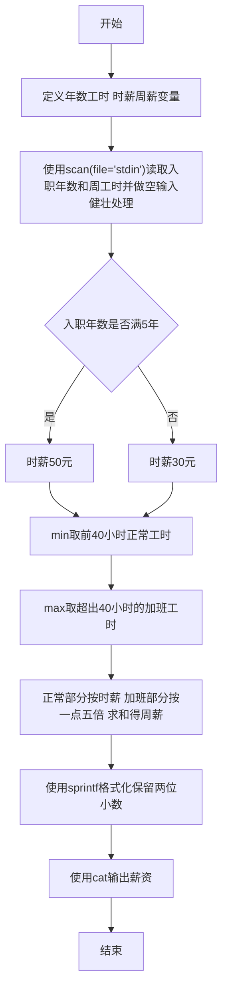
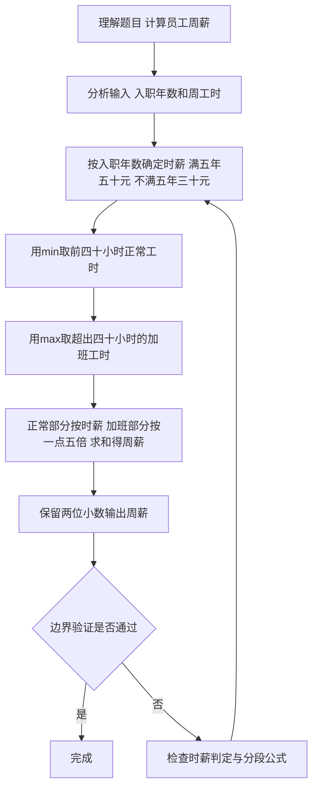

# 7-10 计算工资（R语言实现）

## 前言

本题（7-10 计算工资）的主要考点是：准确理解题意、规范处理输入输出格式，并正确处理边界与精度。下面先给出题目描述与格式要求，再通过清晰的思路与可直接运行的R代码进行讲解。

## 题目描述

某公司员工的工资计算方法如下：一周内工作时间不超过40小时，按正常工作时间计酬；超出40小时的工作时间部分，按正常工作时间报酬的1.5倍计酬。员工按进公司时间分为新职工和老职工，进公司不少于5年的员工为老职工，5年以下的为新职工。新职工的正常工资为30元/小时，老职工的正常工资为50元/小时。请按该计酬方式计算员工的工资。

## 输入格式

输入在一行中给出2个正整数，分别为某员工入职年数和周工作时间，其间以空格分隔。

## 输出格式

在一行输出该员工的周薪，精确到小数点后2位。

## 输入样例1

```in
5 40
```

## 输入样例2

```in
3 50
```

## 输出样例1

```out
2000.00
```

## 输出样例2

```out
1650.00
```

## 解题思路

### 1. 核心问题分析

本题属于分段计算问题。需要先根据入职年数确定小时工资率（新职工30元/小时、老职工50元/小时），再将周工时拆成"前40小时正常计酬"与"超出部分按1.5倍计酬"两部分分别计算后求和，最后将结果按保留2位小数输出。

### 2. 算法原理说明

1. **确定工资率rate**：入职年数 `years >= 5` → 老职工 → `rate = 50` 元/小时；否则 → 新职工 → `rate = 30` 元/小时。
2. **拆分工时**：
   - `min(hours, 40)`：前40小时的正常工时
   - `max(hours - 40, 0)`：超出40小时的加班工时（无加班时为0）
3. **分段计薪**：正常部分按 `rate` 计酬，加班部分按 `rate × 1.5` 计酬，两部分相加得到周薪 `pay = min(hours, 40) * rate + max(hours - 40, 0) * rate * 1.5`。
4. **格式化输出**：使用`sprintf()`的`%.2f`格式保证输出精确到小数点后2位。

### 3. 具体计算步骤

1. 读入两个正整数：入职年数years、周工时hours。
2. 判断years是否≥5，设置对应rate（50或30）。
3. 用 `min(hours, 40)` 取正常工时、`max(hours - 40, 0)` 取加班工时。
4. 按公式计算 pay = min(hours, 40) × rate + max(hours - 40, 0) × rate × 1.5。
5. 输出pay，保留2位小数。

## 完整代码

```r
# 读取入职年数与周工作时间（使用 file="stdin"）
x <- scan(file="stdin", what=numeric(), quiet=TRUE)
# 健壮处理空输入/NA，避免 years NA 导致 if 崩溃
if (length(x) < 2) x <- c(x, rep(0, 2 - length(x)))
x[is.na(x)] <- 0
years <- x[1]; hours <- x[2]
rate <- if (years >= 5) 50 else 30
pay <- min(hours, 40) * rate + max(hours - 40, 0) * rate * 1.5
cat(sprintf("%.2f\n", pay))
```

## 代码流程说明

1. **定义变量**：
   - `years`、`hours`：分别存储入职年数与周工作时间
   - `rate`：存储小时工资率
   - `pay`：存储计算得出的周薪
2. **读取输入**：`x <- scan(file = "stdin", what = numeric(), quiet = TRUE)` 读取一行中的两个数，做空输入/NA健壮处理后 `x[1]`、`x[2]` 分别存入 `years` 和 `hours`。
3. **确定工资率**：`rate <- if (years >= 5) 50 else 30`：入职年数≥5为老职工取50元/小时，否则为新职工取30元/小时。
4. **分段计算薪资**：`pay <- min(hours, 40) * rate + max(hours - 40, 0) * rate * 1.5`：
   - `min(hours, 40)`：前40小时的正常工时
   - `max(hours - 40, 0)`：超出40小时的加班工时（无加班时为0）
   - 正常部分按 `rate` 计酬，加班部分按 `rate * 1.5` 计酬，两部分相加
5. **格式化输出**：`cat(sprintf("%.2f\n", pay))` 使用 `sprintf()` 保留2位小数并换行输出。
6. **程序结束**：R 脚本为顶层代码，自上而下执行完毕，无需 main 函数与头文件。

## 代码流程图



## 解题流程图



## 代码解析

```r
# 读取入职年数与周工作时间（解析版，与完整代码一致，file="stdin"）
x <- scan(file = "stdin", what = numeric(), quiet = TRUE)
if (length(x) < 2) x <- c(x, rep(0, 2 - length(x)))
x[is.na(x)] <- 0
years <- x[1]
hours <- x[2]

# 按入职年限确定正常时薪：老职工（5年及以上）50元/小时，新职工30元/小时
rate <- if (years >= 5) 50 else 30

# 前40小时按正常时薪计酬，超出部分按1.5倍计酬
pay <- min(hours, 40) * rate + max(hours - 40, 0) * rate * 1.5

# 输出周薪，精确到小数点后2位
cat(sprintf("%.2f\n", pay))
```

定义变量

## 复杂度分析

设输入规模为 $n$（对数值类题目为参与运算的数据量，对字符串/序列类题目为长度）。

- **时间复杂度**：$O(n)$ 或 $O(n \log n)$，主要来自一次线性遍历与常数次数学运算，无嵌套高复杂度循环。
- **空间复杂度**：$O(n)$，用于存储输入、中间结果与输出字符串；若仅使用若干标量变量则为 $O(1)$。

## 常见易错点

### 1. 输入/输出格式不符
错误：多余空格、遗漏换行、大小写或精度不符。后果：判题系统判为格式错误。正确：严格按题目要求的格式输出，数值用合适精度。

### 2. 边界条件遗漏
错误：未处理 0、最小值、单字符或空输入等边界。后果：特例 WA。正确：先列出所有边界样例，在编码前单独分支处理。

### 3. 整数溢出与类型
错误：使用过小的整数类型或忽略负号。后果：大数计算溢出。正确：按数据范围选择合适类型，必要时用更大整数类型或字符串处理。

## 更多测试

### 测试一：常规边界

**输入：**

```text
（可取题目边界附近的值，如最小值或最大值）
```

**输出：**

```text
（依据题意推导的正确结果）
```

### 测试二：特殊用例

**输入：**

```text
（可取易错点，如 0、单一元素、全同值等）
```

**输出：**

```text
（对应正确结果）
```

## 总结

本题的核心在于理清「计算工资」的输入输出关系与边界处理：先按格式读取输入，再依据规则逐步计算或遍历，最后按规范输出。该思路可迁移到同类格式化输入输出与模拟计算的题目。

