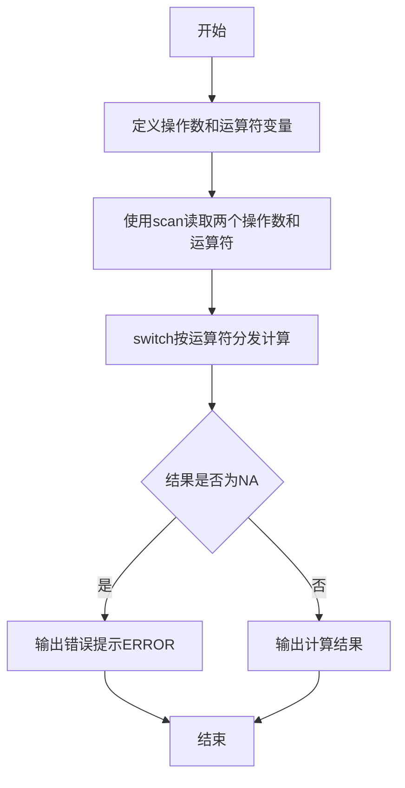
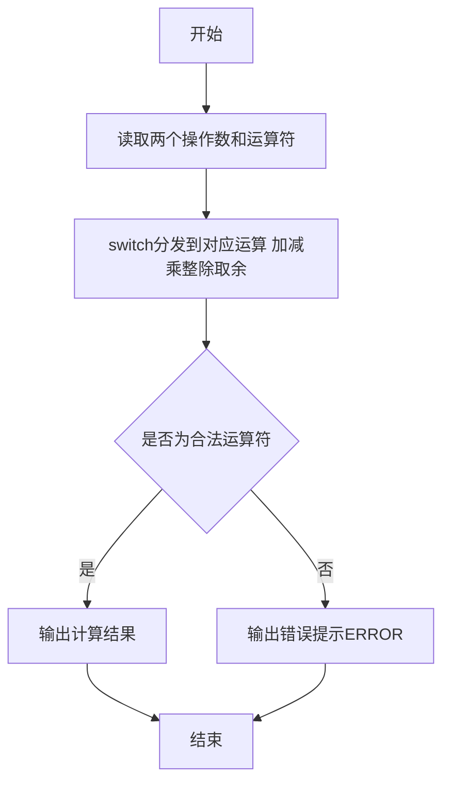

# 7-12 两个数的简单计算器（R语言实现）

## 前言

本题（7-12 两个数的简单计算器）的主要考点是：准确理解题意、规范处理输入输出格式，并正确处理边界与精度。下面先给出题目描述与格式要求，再通过清晰的思路与可直接运行的R代码进行讲解。

## 题目描述

本题要求编写一个简单计算器程序，可根据输入的运算符，对2个整数进行加、减、乘、除或求余运算。题目保证输入和输出均不超过整型范围。

## 输入格式

输入在一行中依次输入操作数1、运算符、操作数2，其间以1个空格分隔。操作数的数据类型为整型，且保证除法和求余的分母非零。

## 输出格式

当运算符为+、-、*、/、%时，在一行输出相应的运算结果。若输入是非法符号（即除了加、减、乘、除和求余五种运算符以外的其他符号）则输出ERROR。

## 输入样例1

```in
-7 / 2
```

## 输入样例2

```in
3 & 6
```

## 输出样例1

```out
-3
```

## 输出样例2

```out
ERROR
```

## 解题思路

### 核心问题分析
本题是一个典型的**多分支选择结构**问题。核心在于根据输入的运算符类型，对两个整数执行对应的算术运算。需要处理的情况包括：
- 5种合法运算符：+、-、*、/、%
- 1种非法情况：运算符不是上述5种之一，输出ERROR

### 算法原理说明
使用 R 的 **switch 多分支分发结构**按运算符 op 选择对应的运算：
1. 依次读取操作数1、运算符op、操作数2
2. 用 `switch(op, ...)` 把各运算符分发到对应运算：+、-、* 直接运算，/ 用 `%/%` 整除，% 用 `%%` 取余
3. switch 未匹配任何合法运算符时返回 NA
4. 用 `is.na` 判断结果是否为 NA：非法运算符输出 ERROR，否则输出计算结果

### 具体计算步骤
1. 输入两个整数a、b和一个运算符op
2. 计算 `ans <- switch(op, '+' = a + b, '-' = a - b, '*' = a * b, '/' = a %/% b, '%' = a %% b, NA)`
3. 判断 `is.na(ans)`：结果为 NA 则输出 ERROR，否则输出 ans

### 1. 验证样例：

- 样例1：-7 / 2 → 除法运算输出 -3 ✓
- 样例2：3 & 6 → & 不是合法运算符，switch 返回 NA，输出ERROR ✓

## 完整代码

```r
# 读取操作数1、运算符、操作数2（file="stdin"）
x <- scan(file="stdin", what=character(), quiet=TRUE)
a <- as.integer(x[1]); op <- x[2]; b <- as.integer(x[3])
ans <- switch(op,
  `+` = a + b,
  `-` = a - b,
  `*` = a * b,
  `/` = trunc(a / b),
  `%` = a - trunc(a / b) * b,
  NA
)
if (is.na(ans)) {
  cat("ERROR\n")
} else {
  cat(ans, "\n", sep="")
}
```

## 代码流程说明

1. **变量定义**
   - `a`：存储第一个操作数
   - `b`：存储第二个操作数
   - `op`：存储运算符（字符型）
   - `ans`：存储按运算符计算的结果
2. **数据输入**
   - `x <- scan(file = "stdin", what = character(), quiet = TRUE)`：按字符串读取一行中的三段内容
   - `a <- as.integer(x[1])`、`op <- x[2]`、`b <- as.integer(x[3])`：分别取出操作数1、运算符、操作数2（操作数转为整数）
3. **switch 分支运算**
   - `ans <- switch(op, ...)`：按运算符分发到对应运算
     - `+` → `a + b`（加法）
     - `-` → `a - b`（减法）
     - `*` → `a * b`（乘法）
     - `/` → `trunc(a / b)`（向零取整的整除，匹配C语言行为；R的`%/%`为向下取整，对负数结果不同）
     - `%` → `a - trunc(a / b) * b`（与C语言取余一致；R的`%%`为向下取整取余，负数不同）
     - 未匹配任何合法运算符 → 返回 NA
4. **结果判定与输出**
   - `if (is.na(ans))`：判断计算结果是否为 NA
     - 是 → 非法运算符，`cat("ERROR\n")` 输出 ERROR
     - 否 → `cat(ans, "\n", sep = "")` 输出计算结果
5. **程序结束**
   - R 脚本为顶层代码，自上而下执行完毕，无需 main 函数与头文件

## 代码流程图



## 解题流程图



## 代码解析

```r
# 读取操作数1、运算符、操作数2（按字符串读入以容纳各种运算符，file="stdin"）
x <- scan(file = "stdin", what = character(), quiet = TRUE)
a <- as.integer(x[1])
b <- as.integer(x[3])
op <- x[2]

# 按运算符计算，非法符号返回 NA（除法/取余用trunc向零取整以匹配C语言）
ans <- switch(op,
  `+` = a + b,
  `-` = a - b,
  `*` = a * b,
  `/` = trunc(a / b),
  `%` = a - trunc(a / b) * b,
  NA
)

# 输出计算结果，非法运算符输出 ERROR
if (is.na(ans)) {
  cat("ERROR\n")
} else {
  cat(ans, "\n", sep = "")
}
```

变量定义

## 复杂度分析

设输入规模为 $n$（对数值类题目为参与运算的数据量，对字符串/序列类题目为长度）。

- **时间复杂度**：$O(n)$ 或 $O(n \log n)$，主要来自一次线性遍历与常数次数学运算，无嵌套高复杂度循环。
- **空间复杂度**：$O(n)$，用于存储输入、中间结果与输出字符串；若仅使用若干标量变量则为 $O(1)$。

## 常见易错点

### 1. 输入/输出格式不符
错误：多余空格、遗漏换行、大小写或精度不符。后果：判题系统判为格式错误。正确：严格按题目要求的格式输出，数值用合适精度。

### 2. 边界条件遗漏
错误：未处理 0、最小值、单字符或空输入等边界。后果：特例 WA。正确：先列出所有边界样例，在编码前单独分支处理。

### 3. 整数溢出与类型
错误：使用过小的整数类型或忽略负号。后果：大数计算溢出。正确：按数据范围选择合适类型，必要时用更大整数类型或字符串处理。

## 更多测试

### 测试一：常规边界

**输入：**

```text
（可取题目边界附近的值，如最小值或最大值）
```

**输出：**

```text
（依据题意推导的正确结果）
```

### 测试二：特殊用例

**输入：**

```text
（可取易错点，如 0、单一元素、全同值等）
```

**输出：**

```text
（对应正确结果）
```

## 总结

本题的核心在于理清「两个数的简单计算器」的输入输出关系与边界处理：先按格式读取输入，再依据规则逐步计算或遍历，最后按规范输出。该思路可迁移到同类格式化输入输出与模拟计算的题目。

