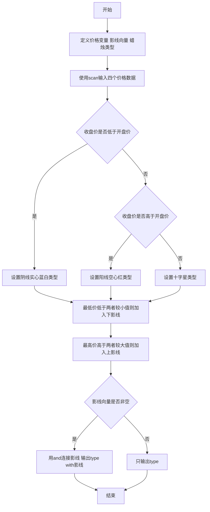
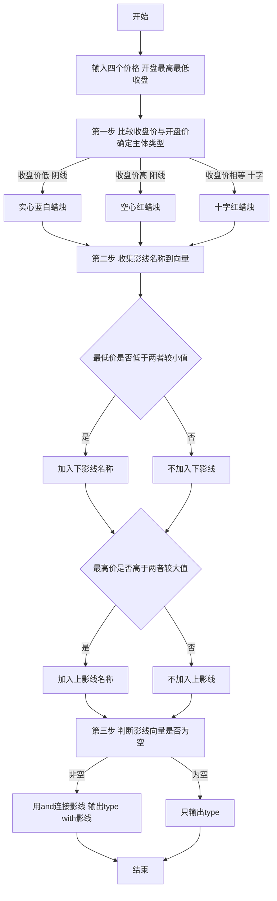

# 7-13 日K蜡烛图（R语言实现）

## 前言

本题（7-13 日K蜡烛图）的主要考点是：准确理解题意、规范处理输入输出格式，并正确处理边界与精度。下面先给出题目描述与格式要求，再通过清晰的思路与可直接运行的R代码进行讲解。

## 题目描述

股票价格涨跌趋势，常用蜡烛图技术中的K线图来表示，分为按日的日K线、按周的周K线、按月的月K线等。以日K线为例，每天股票价格从开盘到收盘走完一天，对应一根蜡烛小图，要表示四个价格：开盘价格Open（早上刚刚开始开盘买卖成交的第1笔价格）、收盘价格Close（下午收盘时最后一笔成交的价格）、中间的最高价High和最低价Low。

如果Close&lt;Open，表示为“BW-Solid”（即“实心蓝白蜡烛”）；如果Close&gt;Open，表示为“R-Hollow”（即“空心红蜡烛”）；如果Open等于Close，则为“R-Cross”（即“十字红蜡烛”）。如果Low比Open和Close低，称为“Lower Shadow”（即“有下影线”），如果High比Open和Close高，称为“Upper Shadow”（即“有上影线”）。请编程序，根据给定的四个价格组合，判断当日的蜡烛是一根什么样的蜡烛。

## 输入格式

输入在一行中给出4个正实数，分别对应Open、High、Low、Close，其间以空格分隔。

## 输出格式

在一行中输出日K蜡烛的类型。如果有上、下影线，则在类型后加上with 影线类型。如果两种影线都有，则输出with Lower Shadow and Upper Shadow。

## 输入样例1

```in
5.110 5.250 5.100 5.105
```

## 输入样例2

```in
5.110 5.110 5.110 5.110
```

## 输入样例3

```in
5.110 5.125 5.112 5.126
```

## 输出样例1

```out
BW-Solid with Lower Shadow and Upper Shadow
```

## 输出样例2

```out
R-Cross
```

## 输出样例3

```out
R-Hollow
```

## 解题思路

### 核心问题分析
本题是一个典型的**多条件组合判断**问题。核心任务是根据4个价格数据（开盘价Open、最高价High、最低价Low、收盘价Close）判断日K蜡烛图的类型，判断分为两个独立维度：
1. **蜡烛主体类型**（3种）：根据Close与Open的大小关系确定
   - Close < Open → BW-Solid（阴线，实心蓝白）
   - Close > Open → R-Hollow（阳线，空心红）
   - Close = Open → R-Cross（十字星）
2. **影线情况**：根据最低价是否低于 Open 与 Close 的较小值（下影线）、最高价是否高于 Open 与 Close 的较大值（上影线）确定

### 算法原理说明
采用**两步判断 + 向量收集**的方法：
1. 第一步：比较Close与Open，确定蜡烛主体类型 type
2. 第二步：用 `min(open, close)` 与 `max(open, close)` 确定实体边界，把满足条件的影线名称收集到向量 shadow：
   - `low < min(open, close)` 时加入 "Lower Shadow"
   - `high > max(open, close)` 时加入 "Upper Shadow"
3. 第三步：判断 `length(shadow) > 0`，有影线时用 `paste(shadow, collapse = " and ")` 拼接影线名称，按"type with 影线"格式输出；无影线时只输出类型

### 具体计算步骤
1. 输入四个价格：Open、High、Low、Close
2. 判断蜡烛主体类型：
   - 若 Close < Open → 类型为 "BW-Solid"
   - 若 Close > Open → 类型为 "R-Hollow"
   - 若 Close = Open → 类型为 "R-Cross"
3. 收集影线到向量 shadow：
   - Low < min(Open, Close) → 加入 "Lower Shadow"
   - High > max(Open, Close) → 加入 "Upper Shadow"
4. 组合输出：
   - 若 shadow 非空 → 输出类型加上 "with " 再加上用 " and " 连接的影线名称
   - 否则只输出类型

### 1. 验证样例：

- 样例1：Open=5.110, High=5.250, Low=5.100, Close=5.105
  - Close(5.105) < Open(5.110) → BW-Solid ✓
  - Low(5.100) < min(5.110, 5.105) → 有下影 ✓
  - High(5.250) > max(5.110, 5.105) → 有上影 ✓
  - 输出：BW-Solid with Lower Shadow and Upper Shadow ✓

- 样例2：全部都是5.110
  - Close = Open → R-Cross ✓
  - Low不小于实体边界，High不大于实体边界 → 无影线 ✓
  - 输出：R-Cross ✓

- 样例3：Open=5.110, High=5.125, Low=5.112, Close=5.126
  - Close(5.126) > Open(5.110) → R-Hollow ✓
  - Low(5.112)不小于5.110 → 无下影 ✓
  - High(5.125)不大于5.126 → 无上影 ✓
  - 输出：R-Hollow ✓

## 完整代码

```r
# 读取四个价格：Open、High、Low、Close（file="stdin"）
x <- scan(file="stdin", what=numeric(), quiet=TRUE)
open <- x[1]; high <- x[2]; low <- x[3]; close <- x[4]
type <- if (close < open) "BW-Solid" else if (close > open) "R-Hollow" else "R-Cross"
shadow <- c(
  if (low < min(open, close)) "Lower Shadow",
  if (high > max(open, close)) "Upper Shadow"
)
if (length(shadow) > 0) {
  cat(sprintf("%s with %s\n", type, paste(shadow, collapse=" and ")))
} else {
  cat(type, "\n", sep="")
}
```

## 代码流程说明

1. **变量定义**
   - `open`、`high`、`low`、`close`：4个数值变量，存储开盘价、最高价、最低价、收盘价
   - `type`：存储蜡烛类型的字符串
   - `shadow`：存储满足条件的影线名称的向量
2. **数据输入**
   - `x <- scan(file = "stdin", what = numeric(), quiet = TRUE)`：读取一行中的四个价格，`x[1]`~`x[4]`依次存入`open`、`high`、`low`、`close`
3. **判断蜡烛主体类型**
   - `if (close < open)`：收盘价低于开盘价（阴线）→ `type <- "BW-Solid"`（实心蓝白蜡烛）
   - `else if (close > open)`：收盘价高于开盘价（阳线）→ `type <- "R-Hollow"`（空心红蜡烛）
   - `else`：收盘价等于开盘价（十字星）→ `type <- "R-Cross"`（十字红蜡烛）
4. **收集影线**
   - `shadow <- c(if (low < min(open, close)) "Lower Shadow", if (high > max(open, close)) "Upper Shadow")`：
     - 最低价低于开盘价与收盘价的较小值 → 加入 "Lower Shadow"
     - 最高价高于开盘价与收盘价的较大值 → 加入 "Upper Shadow"
     - 条件不成立时 if 返回 NULL，不会加入向量
5. **组合输出结果**
   - `if (length(shadow) > 0)`：存在影线 → `cat(sprintf("%s with %s\n", type, paste(shadow, collapse = " and ")))` 用 " and " 连接影线名称并输出（无多余空格）
   - `else`：无影线 → `cat(type, "\n", sep = "")` 只输出蜡烛类型
6. **程序结束**
   - R 脚本为顶层代码，自上而下执行完毕，无需 main 函数与头文件

## 代码流程图



## 解题流程图



## 代码解析

```r
# 读取四个价格：Open、High、Low、Close（file="stdin"）
x <- scan(file = "stdin", what = numeric(), quiet = TRUE)
open <- x[1]
high <- x[2]
low <- x[3]
close <- x[4]

# 根据收盘价与开盘价的关系确定蜡烛主体类型
type <- if (close < open) {
  "BW-Solid"
} else if (close > open) {
  "R-Hollow"
} else {
  "R-Cross"
}

# 最低价低于开盘价和收盘价则有下影线
# 最高价高于开盘价和收盘价则有上影线
shadow <- c(
  if (low < min(open, close)) "Lower Shadow",
  if (high > max(open, close)) "Upper Shadow"
)

# 输出蜡烛类型，有影线时附加 with 影线类型（sprintf避免多余空格）
if (length(shadow) > 0) {
  cat(sprintf("%s with %s\n", type, paste(shadow, collapse = " and ")))
} else {
  cat(type, "\n", sep = "")
}
```

### 代码解析要点

先由收盘价与开盘价关系确定主体类型，再独立判断最低价和最高价是否超出主体范围，最后按下影线、上影线的顺序拼接结果。

## 复杂度分析

设输入规模为 $n$（对数值类题目为参与运算的数据量，对字符串/序列类题目为长度）。

- **时间复杂度**：$O(n)$ 或 $O(n \log n)$，主要来自一次线性遍历与常数次数学运算，无嵌套高复杂度循环。
- **空间复杂度**：$O(n)$，用于存储输入、中间结果与输出字符串；若仅使用若干标量变量则为 $O(1)$。

## 常见易错点

### 1. 输入/输出格式不符
错误：多余空格、遗漏换行、大小写或精度不符。后果：判题系统判为格式错误。正确：严格按题目要求的格式输出，数值用合适精度。

### 2. 边界条件遗漏
错误：未处理 0、最小值、单字符或空输入等边界。后果：特例 WA。正确：先列出所有边界样例，在编码前单独分支处理。

### 3. 整数溢出与类型
错误：使用过小的整数类型或忽略负号。后果：大数计算溢出。正确：按数据范围选择合适类型，必要时用更大整数类型或字符串处理。

## 更多测试

### 测试一：常规边界

**输入：**

```text
5.110 5.260 5.110 5.250
```

**输出：**

```text
R-Hollow with Upper Shadow
```

### 测试二：特殊用例

**输入：**

```text
5.110 5.110 5.110 5.110
```

**输出：**

```text
R-Cross
```

## 总结

本题的核心在于理清「日K蜡烛图」的输入输出关系与边界处理：先按格式读取输入，再依据规则逐步计算或遍历，最后按规范输出。该思路可迁移到同类格式化输入输出与模拟计算的题目。
