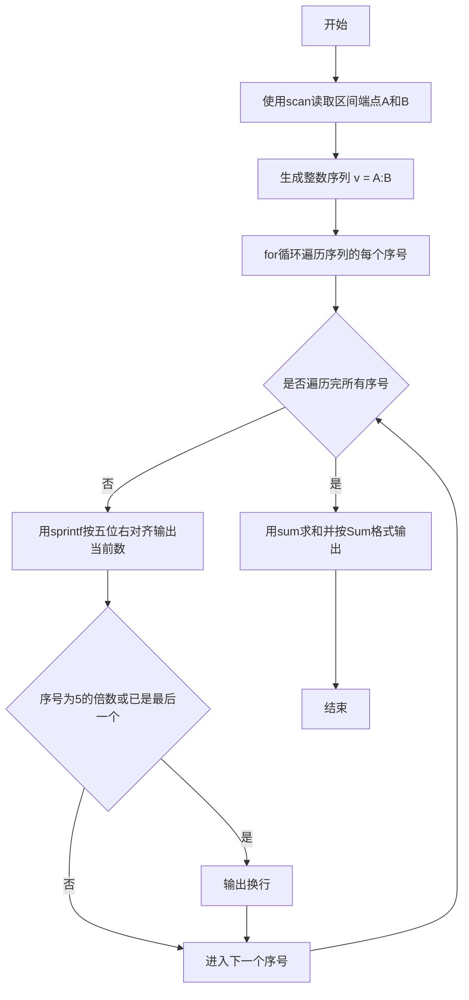
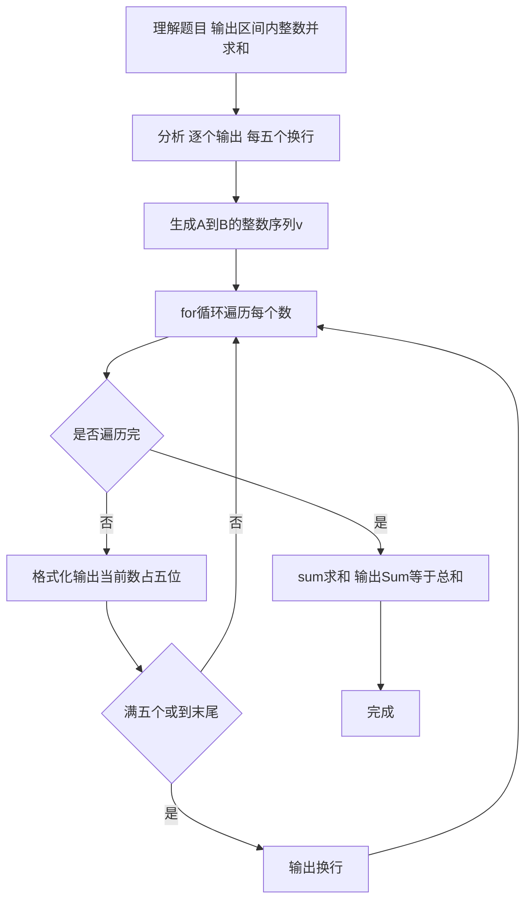

# 7-14 求整数段和（R语言实现）

## 前言

本题（7-14 求整数段和）的主要考点是：准确理解题意、规范处理输入输出格式，并正确处理边界与精度。下面先给出题目描述与格式要求，再通过清晰的思路与可直接运行的R代码进行讲解。

## 题目描述

给定两个整数A和B，输出从A到B的所有整数以及这些数的和。

## 输入格式

输入在一行中给出2个整数A和B，其中−100≤A≤B≤100，其间以空格分隔。

## 输出格式

首先顺序输出从A到B的所有整数，每5个数字占一行，每个数字占5个字符宽度，向右对齐。最后在一行中按Sum = X的格式输出全部数字的和X。

## 输入样例

```in
-3 8
```

## 输出样例

```out
   -3   -2   -1    0    1
    2    3    4    5    6
    7    8
Sum = 30
```

## 解题思路

### 核心问题分析
本题是一个典型的**循环遍历与累加求和**问题。需要完成三个核心任务：
1. 顺序遍历输出：从整数A到整数B（包含A和B）依次输出每个整数
2. 格式化排版：每个数字占5字符宽度、右对齐，每5个数字换一行
3. 累加求和：计算区间内所有整数的总和，按指定格式输出

### 算法原理说明
使用**序列生成 + for循环**实现区间遍历与求和：
1. 用 `A:B` 生成区间内全部整数组成的向量 v
2. 用 for 循环结合 `seq_along(v)` 逐个输出：
   - 使用 `sprintf()` 的 `%5d` 格式设置输出宽度为5个字符、右对齐
   - 当序号 i 满足 `i %% 5 == 0`（每满5个）或 `i == length(v)`（已到最后一个数）时输出换行
3. 循环结束后用 `sum(v)` 一次求出全部数字的总和
4. 按 "Sum = X" 格式输出总和

### 具体计算步骤
1. 输入整数A和B（保证A ≤ B）
2. 生成序列 v = A:B
3. 循环变量 i 从 1 到 length(v)：
   - 输出 `sprintf("%5d", v[i])`（5字符宽右对齐）
   - 若 i %% 5 == 0 或 i == length(v)：输出换行
4. 输出 "Sum = " 和总和 sum(v)

### 1. 验证样例：

- 输入A=-3，B=8
- 遍历序列：-3, -2, -1, 0, 1, 2, 3, 4, 5, 6, 7, 8（共12个数）
- 格式化输出：
  - 第1行（1-5个）：-3 -2 -1 0 1
  - 第2行（6-10个）：2 3 4 5 6
  - 第3行（11-12个）：7 8
- 求和：sum(v) = (-3)+(-2)+(-1)+0+1+2+3+4+5+6+7+8 = -6+36 = 30 ✓

## 完整代码

```r
# 读取区间端点 A 和 B（file="stdin"）
x <- scan(file="stdin", what=integer(), quiet=TRUE)
A <- x[1]; B <- x[2]
v <- A:B
for (i in seq_along(v)) {
  cat(sprintf("%5d", v[i]))
  if (i %% 5 == 0 || i == length(v)) cat("\n")
}
cat(sprintf("Sum = %d\n", sum(v)))
```

## 代码流程说明

1. **变量定义**
   - `x`：存储读取到的区间端点
   - `v`：由 A:B 生成的区间内全部整数组成的向量
2. **数据输入**
   - `x <- scan(file = "stdin", what = integer(), quiet = TRUE)`：读取一行中的两个整数
   - `v <- x[1]:x[2]`：生成从 A 到 B 的整数序列
3. **for循环遍历与输出**
   - `for (i in seq_along(v))`：循环变量 i 依次取序列 v 的下标
   - 循环体内操作：
     - `cat(sprintf("%5d", v[i]))`：使用 `sprintf()` 的 `%5d` 格式占5个字符宽度、右对齐输出当前数
     - `if (i %% 5 == 0 || i == length(v))`：序号是5的倍数（每满5个）或已到最后一个数 → `cat("\n")` 输出换行
4. **输出总和**
   - `cat(sprintf("Sum = %d\n", sum(v)))`：用 `sum(v)` 计算全部数字的总和，按 "Sum = X" 格式输出并换行
5. **程序结束**
   - R 脚本为顶层代码，自上而下执行完毕，无需 main 函数与头文件

## 代码流程图



## 解题流程图



## 代码解析

```r
# 读取区间端点 A 和 B（file="stdin"）
x <- scan(file = "stdin", what = integer(), quiet = TRUE)
v <- x[1]:x[2]

# 依次输出区间内所有整数，每个占5个字符宽度（右对齐），每5个一行
for (i in seq_along(v)) {
  cat(sprintf("%5d", v[i]))
  if (i %% 5 == 0 || i == length(v)) {
    cat("\n")
  }
}

# 最后输出全部数字的和
cat(sprintf("Sum = %d\n", sum(v)))
```

变量定义

## 复杂度分析

设输入规模为 $n$（对数值类题目为参与运算的数据量，对字符串/序列类题目为长度）。

- **时间复杂度**：$O(n)$ 或 $O(n \log n)$，主要来自一次线性遍历与常数次数学运算，无嵌套高复杂度循环。
- **空间复杂度**：$O(n)$，用于存储输入、中间结果与输出字符串；若仅使用若干标量变量则为 $O(1)$。

## 常见易错点

### 1. 输入/输出格式不符
错误：多余空格、遗漏换行、大小写或精度不符。后果：判题系统判为格式错误。正确：严格按题目要求的格式输出，数值用合适精度。

### 2. 边界条件遗漏
错误：未处理 0、最小值、单字符或空输入等边界。后果：特例 WA。正确：先列出所有边界样例，在编码前单独分支处理。

### 3. 整数溢出与类型
错误：使用过小的整数类型或忽略负号。后果：大数计算溢出。正确：按数据范围选择合适类型，必要时用更大整数类型或字符串处理。

## 更多测试

### 测试一：常规边界

**输入：**

```text
（可取题目边界附近的值，如最小值或最大值）
```

**输出：**

```text
（依据题意推导的正确结果）
```

### 测试二：特殊用例

**输入：**

```text
（可取易错点，如 0、单一元素、全同值等）
```

**输出：**

```text
（对应正确结果）
```

## 总结

本题的核心在于理清「求整数段和」的输入输出关系与边界处理：先按格式读取输入，再依据规则逐步计算或遍历，最后按规范输出。该思路可迁移到同类格式化输入输出与模拟计算的题目。

