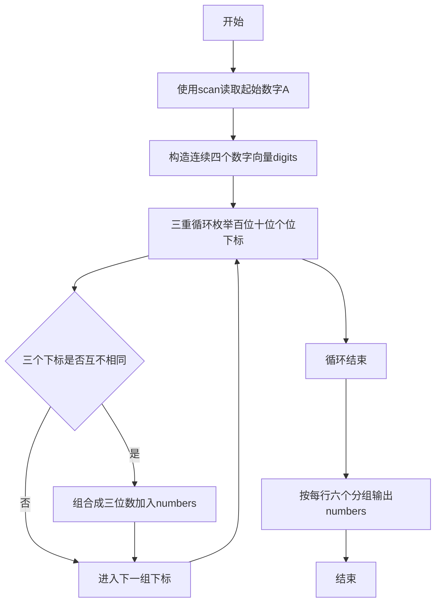
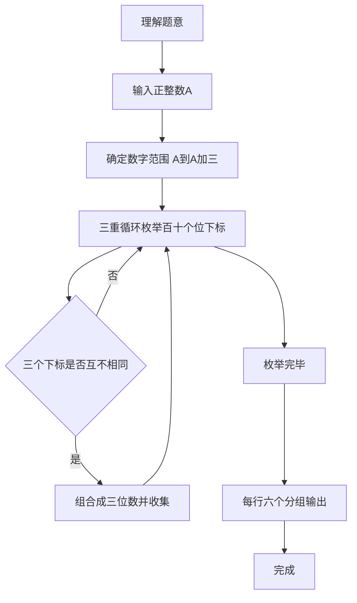

# 7-16 求符合给定条件的整数集（R语言实现）

## 前言

本题（7-16 求符合给定条件的整数集）的主要考点是：准确理解题意、规范处理输入输出格式，并正确处理边界与精度。下面先给出题目描述与格式要求，再通过清晰的思路与可直接运行的R代码进行讲解。

## 题目描述

给定不超过6的正整数A，考虑从A开始的连续4个数字。请输出所有由它们组成的无重复数字的3位数。

## 输入格式

输入在一行中给出A。

## 输出格式

输出满足条件的的3位数，要求从小到大，每行6个整数。整数间以空格分隔，但行末不能有多余空格。

## 输入样例

```in
2
```

## 输出样例

```out
234 235 243 245 253 254
324 325 342 345 352 354
423 425 432 435 452 453
523 524 532 534 542 543
```

## 解题思路

- **核心问题分析**：从A开始的4个连续数字中选取3个不重复的数字组成三位数，按升序输出，每行6个。
- **算法原理说明**：使用三重循环分别枚举百位、十位、个位的所有可能下标（1~4），通过 `length(unique(c(i, j, k))) == 3` 判断三个下标互不相同来确保数字不重复，满足条件的三位数依次收集到向量 numbers 中。由于三重循环按 i→j→k 的顺序遍历且数字向量按升序存储，生成的结果自然按升序排列。
- **具体计算步骤**：
  1. 读取正整数A，构造包含{A, A+1, A+2, A+3}的向量 digits
  2. 外层循环遍历百位下标i（1~4）
  3. 中层循环遍历十位下标j（1~4）
  4. 内层循环遍历个位下标k（1~4）
  5. 若 i、j、k 互不相同（length(unique(c(i, j, k))) == 3），则组合成三位数 digits[i]×100 + digits[j]×10 + digits[k] 并追加到 numbers
  6. 按 seq(1, length(numbers), 6) 分组，每行输出6个整数，整数间以空格分隔，行末无多余空格

## 完整代码

```r
# 求符合给定条件的整数集（file="stdin"）
a <- scan(file="stdin", what=integer(), quiet=TRUE)[1]
digits <- a + 0:3
numbers <- c()
for (i in 1:4) {
  for (j in 1:4) {
    for (k in 1:4) {
      if (length(unique(c(i, j, k))) == 3) {
        numbers <- c(numbers, digits[i] * 100 + digits[j] * 10 + digits[k])
      }
    }
  }
}
numbers <- sort(numbers)
for (i in seq(1, length(numbers), 6)) {
  end <- min(i + 5, length(numbers))
  cat(paste(numbers[i:end], collapse=" "), "\n", sep="")
}
```

## 代码流程说明

1. **变量声明与输入**：使用 `scan(file = "stdin", ...)` 读取输入A；`digits <- a + 0:3` 构造连续4个数字组成的向量。
2. **三重循环枚举组合**：
   - 外层 `for (i in 1:4)` 控制百位下标
   - 中层 `for (j in 1:4)` 控制十位下标
   - 内层 `for (k in 1:4)` 控制个位下标（R 向量下标从1开始，下标1~4对应数字A~A+3）
   - 条件判断 `length(unique(c(i, j, k))) == 3` 确保三个数位下标互不相同
   - 计算组合得到的三位数 `digits[i]*100 + digits[j]*10 + digits[k]` 并追加到 numbers 向量
3. **分组输出**：`for (i in seq(1, length(numbers), 6))` 以6个为一组：
   - `end <- min(i + 5, length(numbers))` 确定本组末尾下标
   - `cat(paste(numbers[i:end], collapse = " "), "\n", sep = "")` 用空格连接本组数字输出并换行，行末无多余空格
4. **程序结束**：R 脚本为顶层代码，自上而下执行完毕，无需 main 函数与头文件。

## 代码流程图



## 解题流程图



## 代码解析

```r
# 求符合给定条件的整数集：从A开始的连续4个数字中选取3个不重复的数字组成三位数，按升序每行6个输出

a <- scan(file = "stdin", what = integer(), quiet = TRUE)[1]  # 使用scan读取输入的正整数A（file="stdin"）

# 从A开始的连续4个数字
digits <- a + 0:3  # 等价于 a:(a+3)，R中 : 优先级高于 +，先算 0:3 再与a相加

# 生成所有由其中三个不同数字组成的无重复数字的3位数
numbers <- c()
for (i in 1:4) {  # 遍历百位下标
    for (j in 1:4) {  # 遍历十位下标
        for (k in 1:4) {  # 遍历个位下标
            # 三个位置上的下标必须互不相同
            if (length(unique(c(i, j, k))) == 3) {
                numbers <- c(numbers, digits[i] * 100 + digits[j] * 10 + digits[k])
            }
        }
    }
}

numbers <- sort(numbers)

# 每行输出6个整数，整数间以空格分隔，行末无多余空格
for (i in seq(1, length(numbers), 6)) {
    end <- min(i + 5, length(numbers))
    cat(paste(numbers[i:end], collapse = " "), "\n", sep = "")
}
```

变量声明与输入

## 复杂度分析

设输入规模为 $n$（对数值类题目为参与运算的数据量，对字符串/序列类题目为长度）。

- **时间复杂度**：$O(n)$ 或 $O(n \log n)$，主要来自一次线性遍历与常数次数学运算，无嵌套高复杂度循环。
- **空间复杂度**：$O(n)$，用于存储输入、中间结果与输出字符串；若仅使用若干标量变量则为 $O(1)$。

## 常见易错点

### 1. 输入/输出格式不符
错误：多余空格、遗漏换行、大小写或精度不符。后果：判题系统判为格式错误。正确：严格按题目要求的格式输出，数值用合适精度。

### 2. 边界条件遗漏
错误：未处理 0、最小值、单字符或空输入等边界。后果：特例 WA。正确：先列出所有边界样例，在编码前单独分支处理。

### 3. 整数溢出与类型
错误：使用过小的整数类型或忽略负号。后果：大数计算溢出。正确：按数据范围选择合适类型，必要时用更大整数类型或字符串处理。

## 更多测试

### 测试一：常规边界

**输入：**

```text
（可取题目边界附近的值，如最小值或最大值）
```

**输出：**

```text
（依据题意推导的正确结果）
```

### 测试二：特殊用例

**输入：**

```text
（可取易错点，如 0、单一元素、全同值等）
```

**输出：**

```text
（对应正确结果）
```

## 总结

本题的核心在于理清「求符合给定条件的整数集」的输入输出关系与边界处理：先按格式读取输入，再依据规则逐步计算或遍历，最后按规范输出。该思路可迁移到同类格式化输入输出与模拟计算的题目。

