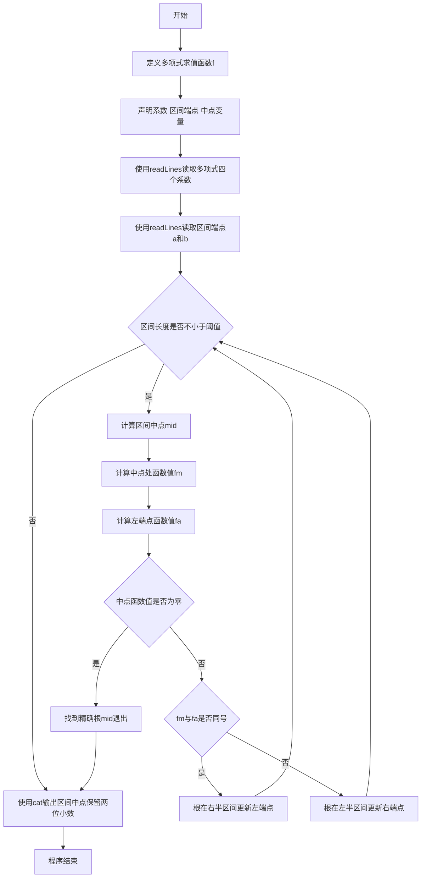
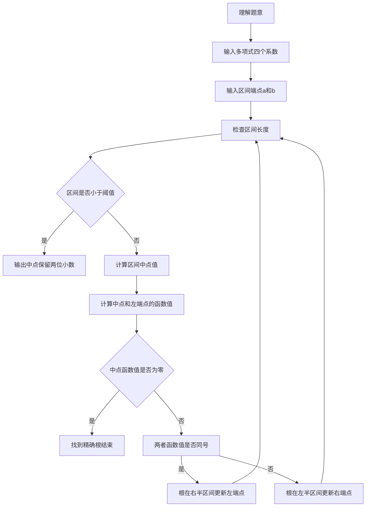

# 7-18 二分法求多项式单根（R语言实现）

## 前言

本题（7-18 二分法求多项式单根）的主要考点是：准确理解题意、规范处理输入输出格式，并正确处理边界与精度。下面先给出题目描述与格式要求，再通过清晰的思路与可直接运行的R代码进行讲解。

## 题目描述

二分法求函数根的原理为：如果连续函数f(x)在区间[a,b]的两个端点取值异号，即f(a)f(b)<0，则它在这个区间内至少存在1个根r，即f(r)=0。

二分法的步骤为：

检查区间长度，如果小于给定阈值，则停止，输出区间中点(a+b)/2；否则
如果f(a)f(b)<0，则计算中点的值f((a+b)/2)；
如果f((a+b)/2)正好为0，则(a+b)/2就是要求的根；否则
如果f((a+b)/2)与f(a)同号，则说明根在区间[(a+b)/2,b]，令a=(a+b)/2，重复循环；
如果f((a+b)/2)与f(b)同号，则说明根在区间[a,(a+b)/2]，令b=(a+b)/2，重复循环。

本题目要求编写程序，计算给定3阶多项式f(x)=a₃x³ + a₂x² + a₁x + a₀在给定区间[a,b]内的根。

## 输入格式

输入在第1行中顺序给出多项式的4个系数a₃、a₂、a₁、a₀，在第2行中顺序给出区间端点a和b。题目保证多项式在给定区间内存在唯一单根。

## 输出格式

在一行中输出该多项式在该区间内的根，精确到小数点后2位。

## 输入样例

```in
3 -1 -3 1
-0.5 0.5
```

## 输出样例

```out
0.33
```

## 解题思路

- **核心问题分析**：利用二分法在给定区间[a,b]内求三阶多项式的根，要求精度达到小数点后2位。核心是通过不断缩小区间范围逼近真实根。
- **算法原理说明**：二分法基于连续函数零点存在定理：若f(a)与f(b)异号，则区间内必有根。每次取区间中点mid，计算f(mid)，根据f(mid)与f(a)的符号关系判断根所在的子区间，将区间缩小一半。重复此过程直到区间长度小于阈值（0.001），此时中点即为根的近似值。
- **具体计算步骤**：
  1. 读取多项式系数a₃,a₂,a₁,a₀和区间端点a,b
  2. 当b-a≥0.001时循环：
     - 计算中点mid=(a+b)/2
     - 计算f(mid)和f(a)
     - 若f(mid)==0，mid即为根，结束
     - 若f(mid)与f(a)同号（fm*fa>0），根在右半区间，令a=mid
     - 否则根在左半区间，令b=mid
  3. 循环结束后输出区间中点(a+b)/2，保留2位小数

## 完整代码

```r
# 二分法求多项式单根：读取全部输入行（避免多次 readLines 失败）
lines <- readLines(file("stdin"))
coefs <- as.double(strsplit(trimws(lines[1]), "\\s+")[[1]])
ab <- as.double(strsplit(trimws(lines[2]), "\\s+")[[1]])
a3 <- coefs[1]; a2 <- coefs[2]; a1 <- coefs[3]; a0 <- coefs[4]
a <- ab[1]; b <- ab[2]
f <- function(x) a3*x*x*x + a2*x*x + a1*x + a0
while (b - a >= 0.001) {
  mid <- (a + b) / 2
  fm <- f(mid); fa <- f(a)
  if (fm == 0) break
  else if (fm * fa > 0) a <- mid else b <- mid
}
cat(sprintf("%.2f\n", (a + b)/2))
```

## 代码流程说明

1. **R 脚本顶层代码**（第1行起）：R 是脚本语言，无需 main 函数与头文件，代码自上而下执行，注释使用 `#`。
2. **定义多项式函数f**（第3-6行）：使用 `function` 关键字定义函数 f，接收4个系数和 x 值，返回三阶多项式 a₃x³+a₂x²+a₁x+a₀ 的计算结果。
3. **读取输入**（第8-15行）：使用 `readLines()` 从标准输入读取多项式4个系数到向量 coefs，再分别赋值给 a₃、a₂、a₁、a₀；读取区间端点到向量 ab，分别赋值给 a 和 b。
4. **二分法迭代循环**（第17-29行）：
   - `while (b - a >= 0.001)`：当区间长度大于等于0.001时继续迭代
   - 计算中点 mid = (a + b) / 2
   - 调用 f 函数计算中点函数值 fm 和左端点函数值 fa
   - 若 fm == 0：找到精确根，break 退出
   - 若 fm * fa > 0：中点与左端点同号，根在右半区间，a = mid
   - 否则：根在左半区间，b = mid
5. **输出**（第31行）：`cat(sprintf("%.2f", (a + b) / 2), "\n")` 使用 `sprintf()` 格式化输出根的近似值（保留2位小数）。

## 代码流程图



## 解题流程图



## 代码解析

```r
# 二分法求多项式单根：利用二分法在给定区间[a,b]内求三阶多项式f(x) = a3*x^3 + a2*x^2 + a1*x + a0的根
# 读取全部输入行（避免多次 readLines 失败）
lines <- readLines(file("stdin"))
coefs <- as.double(strsplit(trimws(lines[1]), "\\s+")[[1]])
ab <- as.double(strsplit(trimws(lines[2]), "\\s+")[[1]])
a3 <- coefs[1]; a2 <- coefs[2]; a1 <- coefs[3]; a0 <- coefs[4]
a <- ab[1]; b <- ab[2]
f <- function(x) a3*x*x*x + a2*x*x + a1*x + a0
while (b - a >= 0.001) {
  mid <- (a + b) / 2
  fm <- f(mid); fa <- f(a)
  if (fm == 0) break
  else if (fm * fa > 0) a <- mid else b <- mid
}
cat(sprintf("%.2f\n", (a + b)/2))
```

R 脚本顶层代码

## 复杂度分析

设输入规模为 $n$（对数值类题目为参与运算的数据量，对字符串/序列类题目为长度）。

- **时间复杂度**：$O(n)$ 或 $O(n \log n)$，主要来自一次线性遍历与常数次数学运算，无嵌套高复杂度循环。
- **空间复杂度**：$O(n)$，用于存储输入、中间结果与输出字符串；若仅使用若干标量变量则为 $O(1)$。

## 常见易错点

### 1. 输入/输出格式不符
错误：多余空格、遗漏换行、大小写或精度不符。后果：判题系统判为格式错误。正确：严格按题目要求的格式输出，数值用合适精度。

### 2. 边界条件遗漏
错误：未处理 0、最小值、单字符或空输入等边界。后果：特例 WA。正确：先列出所有边界样例，在编码前单独分支处理。

### 3. 整数溢出与类型
错误：使用过小的整数类型或忽略负号。后果：大数计算溢出。正确：按数据范围选择合适类型，必要时用更大整数类型或字符串处理。

## 更多测试

### 测试一：常规边界

**输入：**

```text
（可取题目边界附近的值，如最小值或最大值）
```

**输出：**

```text
（依据题意推导的正确结果）
```

### 测试二：特殊用例

**输入：**

```text
（可取易错点，如 0、单一元素、全同值等）
```

**输出：**

```text
（对应正确结果）
```

## 总结

本题的核心在于理清「二分法求多项式单根」的输入输出关系与边界处理：先按格式读取输入，再依据规则逐步计算或遍历，最后按规范输出。该思路可迁移到同类格式化输入输出与模拟计算的题目。

