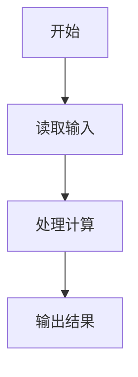
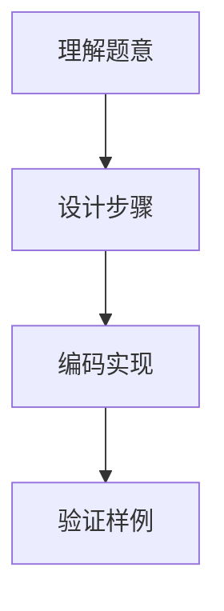

# 7-19 支票面额（R语言实现）

## 前言

本题（7-19 支票面额）的主要考点是：准确理解题意、规范处理输入输出格式，并正确处理边界与精度。下面先给出题目描述与格式要求，再通过清晰的思路与可直接运行的R代码进行讲解。

## 题目描述

一个采购员去银行兑换一张y元f分的支票，结果出纳员错给了f元y分。采购员用去了n分之后才发觉有错，于是清点了余额尚有2y元2f分，问该支票面额是多少？

## 输入格式

输入在一行中给出小于100的正整数n。

## 输出格式

在一行中按格式y.f输出该支票的原始面额。如果无解，则输出No Solution。

## 输入样例1

```in
23
```

## 输入样例2

```in
22
```

## 输出样例1

```out
25.51
```

## 输出样例2

```out
No Solution
```

## 解题思路

见下方完整代码与流程说明。

## 完整代码

```r
# 读取 n（file="stdin"）
n <- scan(file("stdin"), what=integer(), quiet=TRUE)[1]
found <- FALSE; ans_y <- 0; ans_f <- 0
for (y in 0:99) {
  for (f in 0:99) {
    if (98 * f - 199 * y == n) { ans_y <- y; ans_f <- f; found <- TRUE; break }
  }
  if (found) break
}
if (found) cat(sprintf("%d.%02d\n", ans_y, ans_f)) else cat("No Solution\n")
```

## 代码流程说明

见完整代码与流程图。

## 代码流程图



## 解题流程图



## 代码解析

```r
# 读取n（用去的分数，file="stdin"）
n <- scan(file="stdin", what=integer(), quiet=TRUE)[1]
# 设支票面额为 y元f分，由题意可得方程：98*f - 199*y = n
found <- FALSE; ans_y <- 0; ans_f <- 0
for (y in 0:99) {
  for (f in 0:99) {
    if (98 * f - 199 * y == n) { ans_y <- y; ans_f <- f; found <- TRUE; break }
  }
  if (found) break
}
if (found) cat(sprintf("%d.%02d\n", ans_y, ans_f)) else cat("No Solution\n")
```

完整实现如下。

## 复杂度分析

设输入规模为 $n$（对数值类题目为参与运算的数据量，对字符串/序列类题目为长度）。

- **时间复杂度**：$O(n)$ 或 $O(n \log n)$，主要来自一次线性遍历与常数次数学运算，无嵌套高复杂度循环。
- **空间复杂度**：$O(n)$，用于存储输入、中间结果与输出字符串；若仅使用若干标量变量则为 $O(1)$。

## 常见易错点

### 1. 输入/输出格式不符
错误：多余空格、遗漏换行、大小写或精度不符。后果：判题系统判为格式错误。正确：严格按题目要求的格式输出，数值用合适精度。

### 2. 边界条件遗漏
错误：未处理 0、最小值、单字符或空输入等边界。后果：特例 WA。正确：先列出所有边界样例，在编码前单独分支处理。

### 3. 整数溢出与类型
错误：使用过小的整数类型或忽略负号。后果：大数计算溢出。正确：按数据范围选择合适类型，必要时用更大整数类型或字符串处理。

## 更多测试

### 测试一：常规边界

**输入：**

```text
（可取题目边界附近的值，如最小值或最大值）
```

**输出：**

```text
（依据题意推导的正确结果）
```

### 测试二：特殊用例

**输入：**

```text
（可取易错点，如 0、单一元素、全同值等）
```

**输出：**

```text
（对应正确结果）
```

## 总结

本题的核心在于理清「支票面额」的输入输出关系与边界处理：先按格式读取输入，再依据规则逐步计算或遍历，最后按规范输出。该思路可迁移到同类格式化输入输出与模拟计算的题目。

