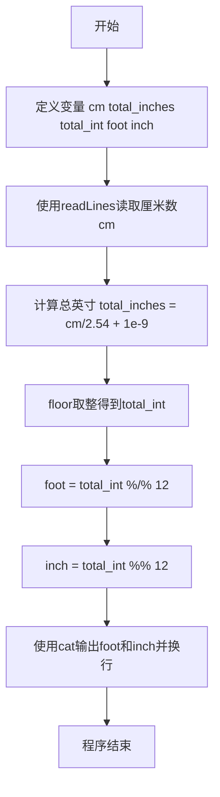
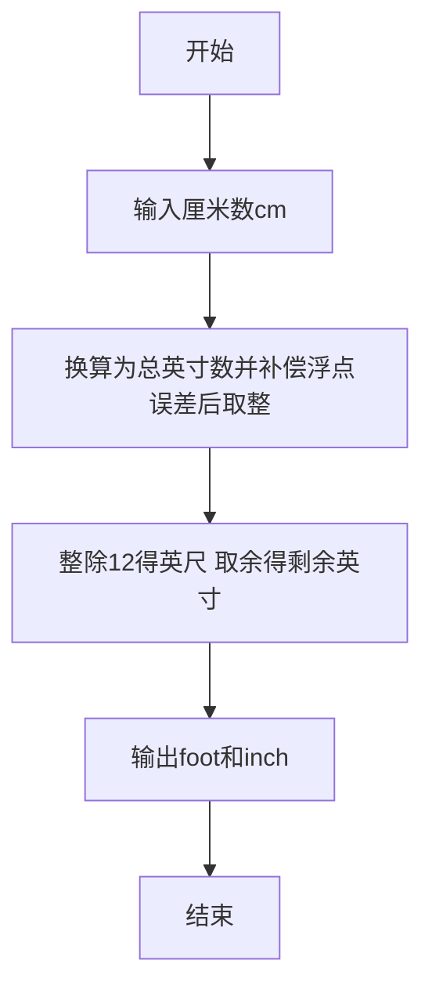

# 7-1 厘米换算英尺英寸（R语言实现）

## 前言

本题（7-1 厘米换算英尺英寸）的主要考点是：准确理解题意、规范处理输入输出格式，并正确处理边界与精度。下面先给出题目描述与格式要求，再通过清晰的思路与可直接运行的R代码进行讲解。

## 题目描述

如果已知英制长度的英尺*f**oo**t*和英寸*in**c**h*的值，那么对应的米是(*f**oo**t*+*in**c**h*/12)×0.3048。现在，如果用户输入的是厘米数，那么对应英制长度的英尺和英寸是多少呢？别忘了1英尺等于12英寸。

## 输入格式

输入在一行中给出1个正整数，单位是厘米。

## 输出格式

在一行中输出这个厘米数对应英制长度的英尺和英寸的整数值，中间用空格分开。英寸的值应小于12。

## 输入样例

```in
170
```

## 输出样例

```out
5 6
```

## 解题思路

这道题的核心是**厘米与英制长度单位（英尺、英寸）的换算**。

### 换算公式推导

已知条件：
- 1 英寸 = 2.54 厘米
- 1 英尺 = 12 英寸

因此，给定厘米数 cm，先换算成总英寸数：

总英寸数 = cm / 2.54

为避免浮点运算带来的精度误差，给总英寸数加上一个极小量 1e-9 后再向下取整，得到整数总英寸数：

total_int = floor(cm / 2.54 + 1e-9)

又因为 1 英尺 = 12 英寸，把整数总英寸数拆成英尺和剩余英寸：

foot = total_int %/% 12    # 整除得到英尺数
inch = total_int %% 12     # 取余得到剩余英寸数

### 计算步骤

1. 读取输入的厘米数 cm
2. 计算 total_inches = cm / 2.54 + 1e-9（补偿浮点误差）
3. 计算 total_int = floor(total_inches)（向下取整）
4. 计算 foot = total_int %/% 12（整除求英尺）
5. 计算 inch = total_int %% 12（取余求剩余英寸）
6. 按「foot inch」格式输出结果

## 完整代码

```r
# 7-1 厘米换算英尺英寸
# 读取厘米数并换算为英尺英寸（使用 file("stdin") 兼容 Rscript 管道）
line <- readLines(file("stdin"), n = 1)
# 健壮处理空输入
if (length(line) == 0 || is.na(line[1]) || trimws(line[1]) == "") {
  cm <- 0L
} else {
  cm <- as.integer(trimws(line[1]))
}
total_inches <- cm / 2.54 + 1e-9      # 换算总英寸并补偿浮点误差
total_int <- as.integer(floor(total_inches))  # 向下取整得整数英寸
foot <- total_int %/% 12L             # 整除得英尺
inch <- total_int %% 12L              # 取余得英寸
cat(sprintf("%d %d\n", foot, inch))
```

## 代码流程说明

### 1. 变量声明
- 声明输入变量 `cm`（厘米数）
- 声明中间变量 `total_inches`（总英寸数）和 `total_int`（整数总英寸数）
- 声明输出变量 `foot`（英尺）和 `inch`（英寸）

### 2. 读取输入
- 使用 `readLines(file("stdin"), n = 1)` 从标准输入读取用户输入的厘米数，`trimws` 去空白后转为整数存入 `cm`，并做空输入健壮处理

### 3. 计算总英寸数
- `cm / 2.54`：将厘米数除以 2.54 得到总英寸数
- 加上 `1e-9` 补偿浮点运算精度误差
- 用 `floor()` 向下取整得到整数总英寸数

### 4. 计算英尺和英寸
- `total_int %/% 12`：整除 12 得到整英尺数
- `total_int %% 12`：取余 12 得到剩余英寸数

### 5. 输出结果
- 使用 `cat()` 按 `foot inch` 格式输出英尺和英寸，中间用空格分隔并换行

### 6. 程序结束
- R 脚本为顶层代码，自上而下执行完毕，无需 main 函数与头文件

## 代码流程图



## 解题流程图



## 代码解析

```r
# 7-1 厘米换算英尺英寸（解析版，与完整代码一致）
# 换算关系：1 英寸 = 2.54 厘米，1 英尺 = 12 英寸

# 从标准输入读取一个整数，存入 cm（使用 file("stdin") 兼容 Rscript）
line <- readLines(file("stdin"), n = 1)
if (length(line) == 0 || is.na(line[1]) || trimws(line[1]) == "") {
  cm <- 0L
} else {
  cm <- as.integer(trimws(line[1]))
}

# 厘米除以2.54得到总英寸，加1e-9避免浮点精度问题
total_inches <- cm / 2.54 + 1e-9

# 对总英寸数向下取整得到整数
total_int <- as.integer(floor(total_inches))

# 计算英尺数：总英寸整数整除12（R中%/%为整除运算符）
foot <- total_int %/% 12L

# 计算剩余英寸数：总英寸整数对12取余（R中%%为取余运算符）
inch <- total_int %% 12L

# 输出英尺和英寸，中间用空格分隔，末尾换行
cat(sprintf("%d %d\n", foot, inch))
```

变量声明

## 复杂度分析

设输入规模为 $n$（对数值类题目为参与运算的数据量，对字符串/序列类题目为长度）。

- **时间复杂度**：$O(n)$ 或 $O(n \log n)$，主要来自一次线性遍历与常数次数学运算，无嵌套高复杂度循环。
- **空间复杂度**：$O(n)$，用于存储输入、中间结果与输出字符串；若仅使用若干标量变量则为 $O(1)$。

## 常见易错点

### 1. 输入/输出格式不符
错误：多余空格、遗漏换行、大小写或精度不符。后果：判题系统判为格式错误。正确：严格按题目要求的格式输出，数值用合适精度。

### 2. 边界条件遗漏
错误：未处理 0、最小值、单字符或空输入等边界。后果：特例 WA。正确：先列出所有边界样例，在编码前单独分支处理。

### 3. 整数溢出与类型
错误：使用过小的整数类型或忽略负号。后果：大数计算溢出。正确：按数据范围选择合适类型，必要时用更大整数类型或字符串处理。

## 更多测试

### 测试一：常规边界

**输入：**

```text
（可取题目边界附近的值，如最小值或最大值）
```

**输出：**

```text
（依据题意推导的正确结果）
```

### 测试二：特殊用例

**输入：**

```text
（可取易错点，如 0、单一元素、全同值等）
```

**输出：**

```text
（对应正确结果）
```

## 总结

本题的核心在于理清「厘米换算英尺英寸」的输入输出关系与边界处理：先按格式读取输入，再依据规则逐步计算或遍历，最后按规范输出。该思路可迁移到同类格式化输入输出与模拟计算的题目。

