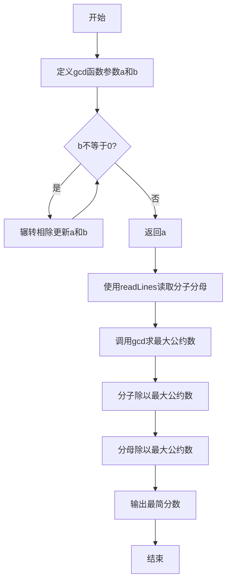
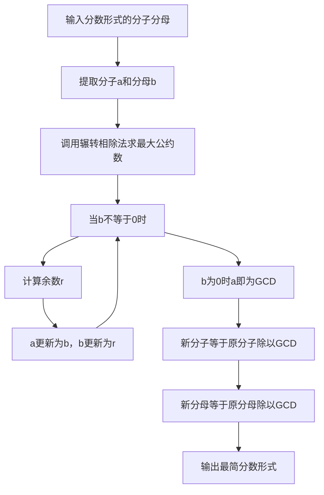

# 7-24 约分最简分式（R语言实现）

## 前言

本题（7-24 约分最简分式）的主要考点是：准确理解题意、规范处理输入输出格式，并正确处理边界与精度。下面先给出题目描述与格式要求，再通过清晰的思路与可直接运行的R代码进行讲解。

## 题目描述

分数可以表示为分子/分母的形式。编写一个程序，要求用户输入一个分数，然后将其约分为最简分式。最简分式是指分子和分母不具有可以约分的成分了。如6/12可以被约分为1/2。当分子大于分母时，不需要表达为整数又分数的形式，即11/8还是11/8；而当分子分母相等时，仍然表达为1/1的分数形式。

## 输入格式

输入在一行中给出一个分数，分子和分母中间以斜杠/分隔，如：12/34表示34分之12。分子和分母都是正整数（不包含0，如果不清楚正整数的定义的话）。

提示：

对于C语言，在scanf的格式字符串中加入/，让scanf来处理这个斜杠。
对于Python语言，用a,b=map(int, input().split('/'))这样的代码来处理这个斜杠。

## 输出格式

在一行中输出这个分数对应的最简分式，格式与输入的相同，即采用分子/分母的形式表示分数。如
5/6表示6分之5。

## 输入样例

```in
66/120
```

## 输出样例

```out
11/20
```

## 解题思路

### 1. 核心问题分析

将给定分数约分为最简分式，即分子和分母同时除以它们的最大公约数(GCD)。约分后分子与分母互质。

### 2. 算法原理

使用欧几里得算法（辗转相除法）求两个数的最大公约数。算法核心：gcd(a, b) = gcd(b, a mod b)，反复迭代直到余数为0，此时的除数即为最大公约数。然后分子分母同除以该GCD即得最简分式。

### 3. 具体计算步骤

1. 以"分子/分母"格式读取输入的两个整数
2. 调用gcd函数计算分子和分母的最大公约数
3. 简化分子 = 原分子 ÷ 最大公约数
4. 简化分母 = 原分母 ÷ 最大公约数
5. 按"分子/分母"格式输出结果

## 完整代码

```r
# 使用辗转相除法求最大公约数（file="stdin"）
gcd <- function(a, b) {
    while (b != 0) { temp <- b; b <- a %% b; a <- temp }
    return(a)
}
lines <- readLines(file("stdin"))
if (length(lines) == 0 || trimws(lines[1]) == "") quit(save="no")
frac <- strsplit(trimws(lines[1]), "/")[[1]]
if (length(frac) < 2) quit(save="no")
numerator <- suppressWarnings(as.integer(trimws(frac[1]))); denominator <- suppressWarnings(as.integer(trimws(frac[2])))
if (is.na(numerator) || is.na(denominator) || denominator == 0) quit(save="no")
common_divisor <- gcd(numerator, denominator)
cat(numerator %/% common_divisor, "/", denominator %/% common_divisor, "\n", sep="")
```

## 代码流程说明

1. **gcd函数定义**：使用辗转相除法循环计算最大公约数
   - 当b≠0时，保存b到temp，b=a%%b，a=temp继续迭代
   - b=0时返回a即为最大公约数
2. **输入数据**：使用`readLines()`从标准输入读取一行分数文本，用`strsplit(..., "/")`按斜杠拆分为分子和分母。R是顶层脚本语言，代码自上而下执行，无需main函数与头文件
3. **计算最大公约数**：调用gcd(numerator, denominator)
4. **约分计算**：分子分母分别除以最大公约数（整除使用%/%）
5. **输出结果**：使用`cat()`按"分子/分母"格式输出最简分式

## 代码流程图



## 解题流程图



## 代码解析

```r
# 使用辗转相除法求最大公约数（file="stdin"）
gcd <- function(a, b) { while (b != 0) { temp <- b; b <- a %% b; a <- temp }; return(a) }
lines <- readLines(file("stdin"))
if (length(lines) == 0 || trimws(lines[1]) == "") quit(save="no")
frac <- strsplit(trimws(lines[1]), "/")[[1]]
if (length(frac) < 2) quit(save="no")
numerator <- suppressWarnings(as.integer(trimws(frac[1]))); denominator <- suppressWarnings(as.integer(trimws(frac[2])))
if (is.na(numerator) || is.na(denominator) || denominator == 0) quit(save="no")
common_divisor <- gcd(numerator, denominator)
cat(numerator %/% common_divisor, "/", denominator %/% common_divisor, "\n", sep="")
```

gcd函数定义

## 复杂度分析

设输入规模为 $n$（对数值类题目为参与运算的数据量，对字符串/序列类题目为长度）。

- **时间复杂度**：$O(n)$ 或 $O(n \log n)$，主要来自一次线性遍历与常数次数学运算，无嵌套高复杂度循环。
- **空间复杂度**：$O(n)$，用于存储输入、中间结果与输出字符串；若仅使用若干标量变量则为 $O(1)$。

## 常见易错点

### 1. 输入/输出格式不符
错误：多余空格、遗漏换行、大小写或精度不符。后果：判题系统判为格式错误。正确：严格按题目要求的格式输出，数值用合适精度。

### 2. 边界条件遗漏
错误：未处理 0、最小值、单字符或空输入等边界。后果：特例 WA。正确：先列出所有边界样例，在编码前单独分支处理。

### 3. 整数溢出与类型
错误：使用过小的整数类型或忽略负号。后果：大数计算溢出。正确：按数据范围选择合适类型，必要时用更大整数类型或字符串处理。

## 更多测试

### 测试一：常规边界

**输入：**

```text
（可取题目边界附近的值，如最小值或最大值）
```

**输出：**

```text
（依据题意推导的正确结果）
```

### 测试二：特殊用例

**输入：**

```text
（可取易错点，如 0、单一元素、全同值等）
```

**输出：**

```text
（对应正确结果）
```

## 总结

本题的核心在于理清「约分最简分式」的输入输出关系与边界处理：先按格式读取输入，再依据规则逐步计算或遍历，最后按规范输出。该思路可迁移到同类格式化输入输出与模拟计算的题目。

