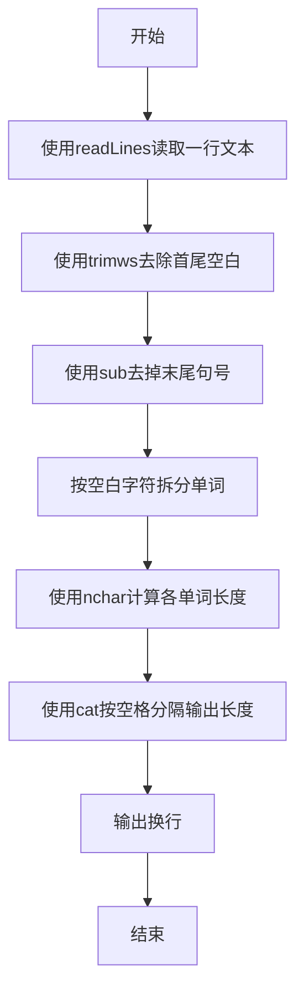
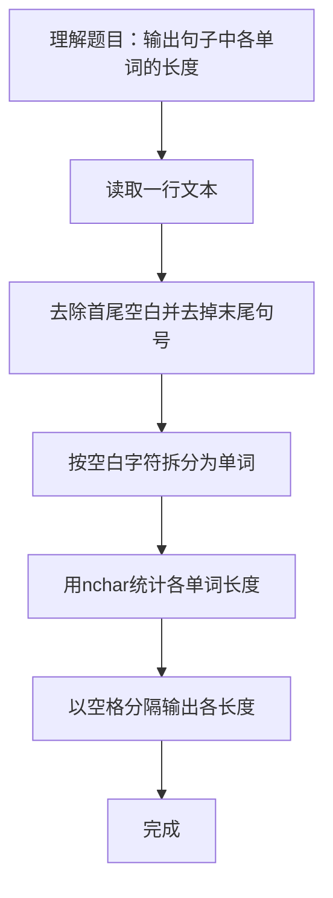

# 7-26 单词长度（R语言实现）

## 前言

本题（7-26 单词长度）的主要考点是：准确理解题意、规范处理输入输出格式，并正确处理边界与精度。下面先给出题目描述与格式要求，再通过清晰的思路与可直接运行的R代码进行讲解。

## 题目描述

你的程序要读入一行文本，其中以空格分隔为若干个单词，以.结束。你要输出每个单词的长度。这里的单词与语言无关，可以包括各种符号，比如it's算一个单词，长度为4。注意，行中可能出现连续的空格；最后的.不计算在内。

## 输入格式

输入在一行中给出一行文本，以.结束

提示：用scanf("%c",...);来读入一个字符，直到读到.为止。

## 输出格式

在一行中输出这行文本对应的单词的长度，每个长度之间以空格隔开，行末没有最后的空格。

## 输入样例

```in
It's great to see you here.
```

## 输出样例

```out
4 5 2 3 3 4
```

## 解题思路

**核心问题分析**：本题需要统计一行文本中各个单词的长度并输出。关键在于正确处理行中可能出现的连续空格（不能输出多余的0长度）以及末尾的'.'（不计算在内），同时保证输出行末没有多余空格。

**算法原理说明**：采用字符串处理法，利用R的正则表达式能力：先用`trimws()`去除首尾空白，再用`sub()`去掉末尾的句号'.'，然后用`strsplit()`按空白字符（`[[:space:]]+`可匹配连续空格）将文本拆分为单词列表，最后用`nchar()`计算每个单词的长度。

### 1. 具体计算步骤

1. 用`readLines()`读取一行文本
2. 用`trimws()`去除首尾空白
3. 用`sub("\\.$", "", ...)`去掉末尾的句号
4. 用`strsplit(s, "[[:space:]]+")`按空白字符拆分为单词
5. 用`nchar(words)`计算各单词长度
6. 用`cat(..., sep = " ")`以空格分隔输出长度并换行

## 完整代码

```r
# 单词长度（file="stdin"）
lines <- readLines(file("stdin"))
s <- if (length(lines) >= 1) lines[1] else ""
# 支持多行输入拼接（若文本被换行拆分）
if (length(lines) > 1) s <- paste(lines, collapse=" ")
s <- sub("\\.$", "", trimws(s))
if (nchar(s) == 0) {
  cat("\n")
} else {
  words <- strsplit(s, "[[:space:]]+")[[1]]
  words <- words[words != ""]
  cat(paste(nchar(words), collapse=" "), "\n", sep="")
}
```

## 代码流程说明

1. 用 `readLines(n = 1)` 读取一行文本 s。
2. 用 `trimws` 去除首尾空白，用 `sub("\\.$", "", ...)` 去掉末尾句号。
3. 用 `strsplit(s, "[[:space:]]+")` 按空白字符拆分单词。
4. 用 `nchar(words)` 计算各单词长度。
5. 用 `cat(nchar(words), sep = " ")` 输出长度（空格分隔），再 `cat("\n")` 换行。

## 代码流程图



## 解题流程图



## 代码解析

```r
# 单词长度（file="stdin"）
lines <- readLines(file("stdin"))
s <- if (length(lines) >= 1) lines[1] else ""
if (length(lines) > 1) s <- paste(lines, collapse=" ")
s <- sub("\\.$", "", trimws(s))
if (nchar(s) == 0) {
  cat("\n")
} else {
  words <- strsplit(s, "[[:space:]]+")[[1]]
  words <- words[words != ""]
  cat(paste(nchar(words), collapse=" "), "\n", sep="")
}
```

用 `readLines(n = 1)` 读取一行文本 s。

## 复杂度分析

设输入规模为 $n$（对数值类题目为参与运算的数据量，对字符串/序列类题目为长度）。

- **时间复杂度**：$O(n)$ 或 $O(n \log n)$，主要来自一次线性遍历与常数次数学运算，无嵌套高复杂度循环。
- **空间复杂度**：$O(n)$，用于存储输入、中间结果与输出字符串；若仅使用若干标量变量则为 $O(1)$。

## 常见易错点

### 1. 输入/输出格式不符
错误：多余空格、遗漏换行、大小写或精度不符。后果：判题系统判为格式错误。正确：严格按题目要求的格式输出，数值用合适精度。

### 2. 边界条件遗漏
错误：未处理 0、最小值、单字符或空输入等边界。后果：特例 WA。正确：先列出所有边界样例，在编码前单独分支处理。

### 3. 整数溢出与类型
错误：使用过小的整数类型或忽略负号。后果：大数计算溢出。正确：按数据范围选择合适类型，必要时用更大整数类型或字符串处理。

## 更多测试

### 测试一：常规边界

**输入：**

```text
（可取题目边界附近的值，如最小值或最大值）
```

**输出：**

```text
（依据题意推导的正确结果）
```

### 测试二：特殊用例

**输入：**

```text
（可取易错点，如 0、单一元素、全同值等）
```

**输出：**

```text
（对应正确结果）
```

## 总结

本题的核心在于理清「单词长度」的输入输出关系与边界处理：先按格式读取输入，再依据规则逐步计算或遍历，最后按规范输出。该思路可迁移到同类格式化输入输出与模拟计算的题目。

