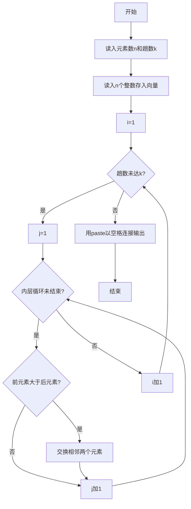
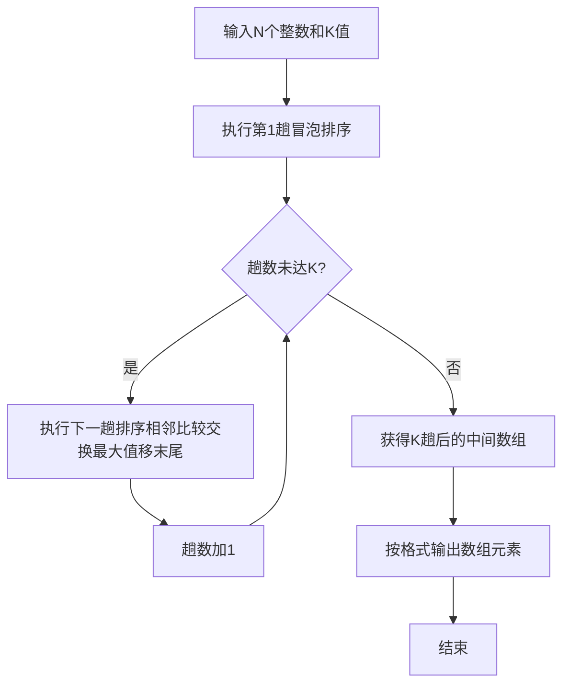

# 7-27 冒泡法排序（R语言实现）

## 前言

本题（7-27 冒泡法排序）的主要考点是：准确理解题意、规范处理输入输出格式，并正确处理边界与精度。下面先给出题目描述与格式要求，再通过清晰的思路与可直接运行的R代码进行讲解。

## 题目描述

将N个整数按从小到大排序的冒泡排序法是这样工作的：从头到尾比较相邻两个元素，如果前面的元素大于其紧随的后面元素，则交换它们。通过一遍扫描，则最后一个元素必定是最大的元素。然后用同样的方法对前N−1个元素进行第二遍扫描。依此类推，最后只需处理两个元素，就完成了对N个数的排序。

本题要求对任意给定的K（<N），输出扫描完第K遍后的中间结果数列。

## 输入格式

输入在第1行中给出N和K（1≤K<N≤100），在第2行中给出N个待排序的整数，数字间以空格分隔。

## 输出格式

在一行中输出冒泡排序法扫描完第K遍后的中间结果数列，数字间以空格分隔，但末尾不得有多余空格。

## 输入样例

```in
6 2
2 3 5 1 6 4
```

## 输出样例

```out
2 1 3 4 5 6
```

## 解题思路

**核心问题分析**：本题要求实现冒泡排序算法，但不需要完成全部排序，只需执行K趟扫描后输出中间结果。冒泡排序的特点是每趟扫描会将当前未排序部分的最大值"冒泡"到末尾。

**算法原理说明**：冒泡排序通过两层循环实现，外层循环控制排序趟数（本题执行K趟），内层循环进行相邻元素的比较与交换。第i趟扫描时，只需比较前n-1-i个元素（因为末尾i个元素已经有序）。若`a[j] > a[j+1]`则交换两者位置。

### 1. 具体计算步骤

1. 读入N（元素个数）和K（排序趟数），再读入N个整数存入向量a
2. 外层循环执行K趟排序（i从1到K）
3. 第i趟内层循环比较前n-i对相邻元素（R向量下标从1开始，比较a[j]与a[j+1]），将最大值移到末尾
4. K趟排序完成后，按格式输出向量（数字间以空格分隔，行末无多余空格）

## 完整代码

```r
# 冒泡法排序 K 趟（一次性读取全部行）
lines <- readLines(file("stdin"))
if (length(lines) == 0 || trimws(lines[1]) == "") quit(save="no")
tmp <- suppressWarnings(as.integer(strsplit(trimws(lines[1]), "\\s+")[[1]]))
if (length(tmp) < 2 || any(is.na(tmp[1:2]))) quit(save="no")
n <- tmp[1]; k <- tmp[2]
if (is.na(n) || is.na(k) || n < 1 || k < 0) quit(save="no")
# 第二行可能包含全部 N 个数，若被拆多行则合并
all_nums <- suppressWarnings(as.integer(unlist(strsplit(paste(lines[-1], collapse=" "), "\\s+"))))
all_nums <- all_nums[!is.na(all_nums)]
if (length(all_nums) < n) quit(save="no")
a <- all_nums[1:n]
for (i in seq_len(k)) {
  if (n - i >= 1) {
    for (j in 1:(n - i)) {
      if (a[j] > a[j + 1]) { tmpv <- a[j]; a[j] <- a[j + 1]; a[j + 1] <- tmpv }
    }
  }
}
cat(paste(a, collapse=" "), "\n", sep="")
```

## 代码流程说明

1. **输入数据**：使用`readLines()`从标准输入读取一行两个整数n（待排序元素个数）和k（排序趟数），再读取一行n个整数存入向量a。R是顶层脚本语言，代码自上而下执行，无需main函数与头文件
2. **K趟冒泡排序**：外层循环i从1到k，控制执行k趟排序；内层循环j从1到n-i，每次比较a[j]和a[j+1]，若前者大则交换两者，使较大元素逐步后移（R向量下标从1开始）
3. **输出结果**：使用`cat()`配合`paste(..., collapse = " ")`将向量元素以空格连接后输出，确保行末无多余空格

## 代码流程图



## 解题流程图



## 代码解析

```r
# 冒泡法排序 K 趟（file="stdin"，一次性读取全部行）
lines <- readLines(file("stdin"))
if (length(lines) == 0 || trimws(lines[1]) == "") quit(save="no")
tmp <- suppressWarnings(as.integer(strsplit(trimws(lines[1]), "\\s+")[[1]]))
if (length(tmp) < 2 || any(is.na(tmp[1:2]))) quit(save="no")
n <- tmp[1]; k <- tmp[2]
if (is.na(n) || is.na(k) || n < 1 || k < 0) quit(save="no")
all_nums <- suppressWarnings(as.integer(unlist(strsplit(paste(lines[-1], collapse=" "), "\\s+"))))
all_nums <- all_nums[!is.na(all_nums)]
if (length(all_nums) < n) quit(save="no")
a <- all_nums[1:n]
for (i in seq_len(k)) {
  if (n - i >= 1) {
    for (j in 1:(n - i)) {
      if (a[j] > a[j + 1]) { tmpv <- a[j]; a[j] <- a[j + 1]; a[j + 1] <- tmpv }
    }
  }
}
cat(paste(a, collapse=" "), "\n", sep="")
```

### 代码解析要点

每一趟冒泡都从左到右比较相邻元素，较大值移到未排序区末尾；只执行K趟，因此输出的是中间状态而非必然完全有序的结果。

## 复杂度分析

设输入规模为 $n$（对数值类题目为参与运算的数据量，对字符串/序列类题目为长度）。

- **时间复杂度**：$O(n)$ 或 $O(n \log n)$，主要来自一次线性遍历与常数次数学运算，无嵌套高复杂度循环。
- **空间复杂度**：$O(n)$，用于存储输入、中间结果与输出字符串；若仅使用若干标量变量则为 $O(1)$。

## 常见易错点

### 1. 输入/输出格式不符
错误：多余空格、遗漏换行、大小写或精度不符。后果：判题系统判为格式错误。正确：严格按题目要求的格式输出，数值用合适精度。

### 2. 边界条件遗漏
错误：未处理 0、最小值、单字符或空输入等边界。后果：特例 WA。正确：先列出所有边界样例，在编码前单独分支处理。

### 3. 整数溢出与类型
错误：使用过小的整数类型或忽略负号。后果：大数计算溢出。正确：按数据范围选择合适类型，必要时用更大整数类型或字符串处理。

## 更多测试

### 测试一：常规边界

**输入：**

```text
5 1
5 1 4 2 3
```

**输出：**

```text
1 4 2 3 5
```

### 测试二：特殊用例

**输入：**

```text
3 1
1 2 3
```

**输出：**

```text
1 2 3
```

## 总结

本题的核心在于理清「冒泡法排序」的输入输出关系与边界处理：先按格式读取输入，再依据规则逐步计算或遍历，最后按规范输出。该思路可迁移到同类格式化输入输出与模拟计算的题目。
