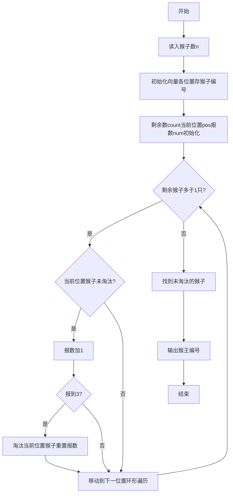
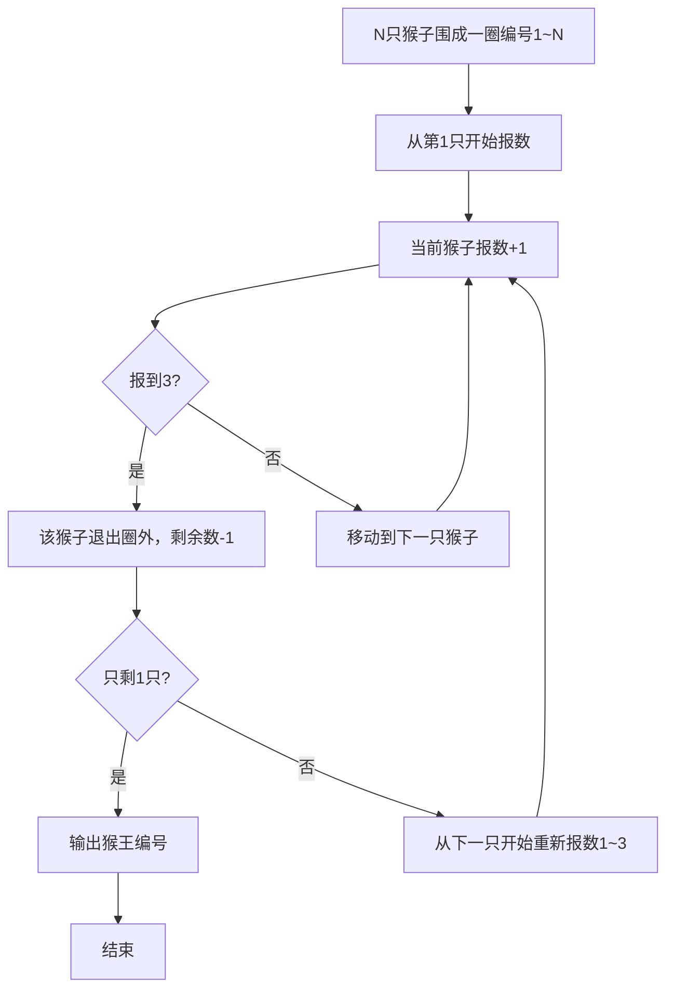

# 7-28 猴子选大王（R语言实现）

## 前言

本题（7-28 猴子选大王）的主要考点是：准确理解题意、规范处理输入输出格式，并正确处理边界与精度。下面先给出题目描述与格式要求，再通过清晰的思路与可直接运行的R代码进行讲解。

## 题目描述

一群猴子要选新猴王。新猴王的选择方法是：让N只候选猴子围成一圈，从某位置起顺序编号为1~N号。从第1号开始报数，每轮从1报到3，凡报到3的猴子即退出圈子，接着又从紧邻的下一只猴子开始同样的报数。如此不断循环，最后剩下的一只猴子就选为猴王。请问是原来第几号猴子当选猴王？

## 输入格式

输入在一行中给一个正整数N（≤1000）。

## 输出格式

在一行中输出当选猴王的编号。

## 输入样例

```in
11
```

## 输出样例

```out
7
```

## 解题思路

**核心问题分析**：本题是经典的约瑟夫环问题，N只猴子围成一圈依次报数1~3，报到3的退出，求最后剩下的猴子编号。需要模拟循环报数和淘汰过程，关键是如何高效地跟踪当前位置和报数计数。

**算法原理说明**：使用数组存储猴子编号，用0表示该位置猴子已退出。通过`pos=(pos+1)%n`实现环形遍历，用`num`计数器记录当前报数，`count`记录剩余猴子数。当`num==3`时将当前位置标记为0并减少count，重置num从0重新计数，直到count==1时停止。

### 1. 具体计算步骤

1. 初始化向量monkeys，第i个位置存编号i（猴子编号从1到N，R向量下标从1开始）
2. 初始化count=n（剩余猴子数）、pos=1（当前遍历位置）、num=0（当前报数）
3. 当count>1时循环：若当前猴子未退出（monkeys[pos]≠0），报数num加1；若num==3则淘汰该猴子（置0），count减1，num重置0
4. 位置pos移动到(pos %% n) + 1实现环形移动
5. 循环结束后找到向量中不为0的元素即为猴王编号

## 完整代码

```r
# 读取猴子总数n（兼容空输入与首尾空格）
lines <- readLines(file("stdin"))
if (length(lines) == 0 || trimws(lines[1]) == "") {
    quit(save = "no")
}
n <- suppressWarnings(as.integer(trimws(lines[1])))
if (is.na(n) || n < 1) {
    quit(save = "no")
}

# 初始化向量monkeys，第i个位置存编号i（R向量下标从1开始）
monkeys <- 1:n

count <- n  # 剩余猴子数
pos <- 1    # 当前遍历位置
num <- 0    # 当前报数

# 循环淘汰，直到只剩1只猴子
while (count > 1) {
    # 若当前位置猴子未被淘汰则报数
    if (monkeys[pos] != 0) {
        num <- num + 1
        # 报到3则淘汰该猴子
        if (num == 3) {
            monkeys[pos] <- 0  # 标记为已退出
            count <- count - 1 # 剩余猴子数减1
            num <- 0           # 报数重置为0
        }
    }
    # 环形移动到下一个位置
    pos <- (pos %% n) + 1
}

# 找到未被淘汰的猴子编号并输出
king <- which(monkeys != 0)
cat(monkeys[king], "\n", sep="")
```

## 代码流程说明

1. **初始化**：使用`readLines()`从标准输入读取猴子总数n，创建向量monkeys，monkeys[i]=i表示初始编号（R向量下标从1开始）
2. **状态变量**：count=n表示初始剩余猴子数，pos=1从第1个位置开始遍历，num=0初始报数为0
3. **淘汰循环**：当剩余猴子数大于1时持续执行
   - 若当前位置猴子未被淘汰（值不为0），报数num自增
   - 若报数达到3，将该位置置0（淘汰），剩余数count减1，报数重置为0
   - pos移动到下一个位置(pos %% n) + 1，实现环形遍历
4. **查找猴王**：使用`cat()`输出向量中值不为0的元素即为猴王编号

## 代码流程图



## 解题流程图



## 代码解析

```r
# 读取猴子总数n（兼容空输入与首尾空格）
lines <- readLines(file("stdin"))
if (length(lines) == 0 || trimws(lines[1]) == "") {
    quit(save = "no")
}
n <- suppressWarnings(as.integer(trimws(lines[1])))
if (is.na(n) || n < 1) {
    quit(save = "no")
}

# 初始化向量monkeys，第i个位置存编号i（R向量下标从1开始）
monkeys <- 1:n

count <- n  # 剩余猴子数
pos <- 1    # 当前遍历位置
num <- 0    # 当前报数

# 循环淘汰，直到只剩1只猴子
while (count > 1) {
    # 若当前位置猴子未被淘汰则报数
    if (monkeys[pos] != 0) {
        num <- num + 1
        # 报到3则淘汰该猴子
        if (num == 3) {
            monkeys[pos] <- 0  # 标记为已退出
            count <- count - 1 # 剩余猴子数减1
            num <- 0           # 报数重置为0
        }
    }
    # 环形移动到下一个位置
    pos <- (pos %% n) + 1
}

# 找到未被淘汰的猴子编号并输出
king <- which(monkeys != 0)
cat(monkeys[king], "\n", sep="")
```

初始化

## 复杂度分析

设输入规模为 $n$（对数值类题目为参与运算的数据量，对字符串/序列类题目为长度）。

- **时间复杂度**：$O(n)$ 或 $O(n \log n)$，主要来自一次线性遍历与常数次数学运算，无嵌套高复杂度循环。
- **空间复杂度**：$O(n)$，用于存储输入、中间结果与输出字符串；若仅使用若干标量变量则为 $O(1)$。

## 常见易错点

### 1. 输入/输出格式不符
错误：多余空格、遗漏换行、大小写或精度不符。后果：判题系统判为格式错误。正确：严格按题目要求的格式输出，数值用合适精度。

### 2. 边界条件遗漏
错误：未处理 0、最小值、单字符或空输入等边界。后果：特例 WA。正确：先列出所有边界样例，在编码前单独分支处理。

### 3. 整数溢出与类型
错误：使用过小的整数类型或忽略负号。后果：大数计算溢出。正确：按数据范围选择合适类型，必要时用更大整数类型或字符串处理。

## 更多测试

### 测试一：常规边界

**输入：**

```text
（可取题目边界附近的值，如最小值或最大值）
```

**输出：**

```text
（依据题意推导的正确结果）
```

### 测试二：特殊用例

**输入：**

```text
（可取易错点，如 0、单一元素、全同值等）
```

**输出：**

```text
（对应正确结果）
```

## 总结

本题的核心在于理清「猴子选大王」的输入输出关系与边界处理：先按格式读取输入，再依据规则逐步计算或遍历，最后按规范输出。该思路可迁移到同类格式化输入输出与模拟计算的题目。

