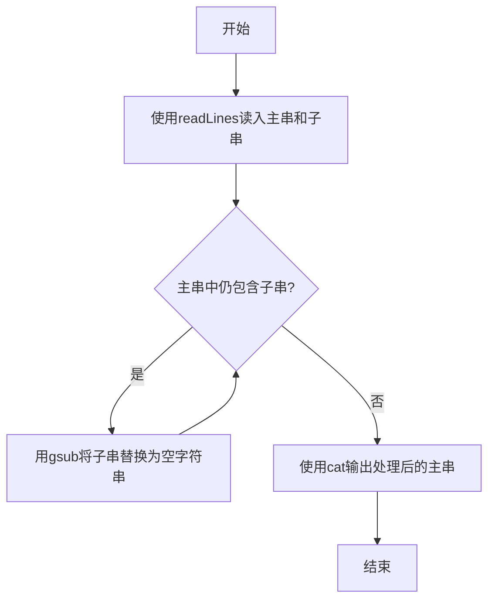
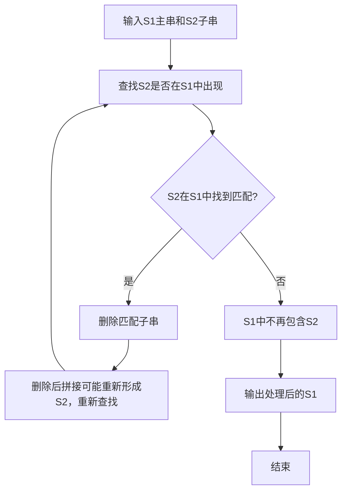

# 7-29 删除字符串中的子串（R语言实现）

## 前言

本题（7-29 删除字符串中的子串）的主要考点是：准确理解题意、规范处理输入输出格式，并正确处理边界与精度。下面先给出题目描述与格式要求，再通过清晰的思路与可直接运行的R代码进行讲解。

## 题目描述

输入2个字符串S1和S2，要求删除字符串S1中出现的所有子串S2，即结果字符串中不能包含S2。

## 输入格式

输入在2行中分别给出不超过80个字符长度的、以回车结束的2个非空字符串，对应S1和S2。

## 输出格式

在一行中输出删除字符串S1中出现的所有子串S2后的结果字符串。

## 输入样例

```in
Tomcat is a male ccatat
cat
```

## 输出样例

```out
Tom is a male 
```

## 解题思路

**核心问题分析**：需要从主串S1中删除所有出现的子串S2，难点在于删除子串后新拼接的字符串可能重新产生S2子串（如样例中删除"cat"后，剩余字符拼接可能再次形成"cat"），因此需要循环查找删除直到S1中不再包含S2。

**算法原理说明**：采用反复查找删除法，每次查找S2是否存在于S1中，若存在则将其删除（R中可用`gsub`将S2替换为空字符串），删除后拼接的新字符串可能再次产生S2子串，因此循环查找删除直到S1中不再包含S2，确保删除拼接后新产生的子串也被清除。

### 1. 具体计算步骤

1. 使用`readLines`从标准输入读入S1和S2（自动去除末尾换行符）
2. 设置循环：只要S1中仍包含S2就继续执行删除（对应循环查找删除的过程）
3. 调用`gsub`将S2替换为空字符串，删除当前S1中出现的所有S2
4. 由于删除子串后剩余字符拼接可能重新形成S2（如样例中删除"cat"后拼接仍可能再次出现"cat"），因此每次删除后都要重新检查
5. 当S1中不再包含S2时结束循环，使用`cat`输出处理后的S1

## 完整代码

```r
# 删除字符串中的子串（一次性读取，file="stdin"）
lines <- readLines(file("stdin"))
s1 <- if (length(lines) >= 1) lines[1] else ""
s2 <- if (length(lines) >= 2) lines[2] else ""
# s2 非空才进行删除，避免空串导致无限循环
if (nchar(s2) > 0) {
  while (grepl(s2, s1, fixed = TRUE)) {
    s1 <- gsub(s2, "", s1, fixed = TRUE)
  }
}
cat(s1, "\n", sep = "")
```

## 代码流程说明

1. **读入字符串**：使用`readLines()`按行读取s1和s2（可包含空格，readLines自动去除末尾换行符）
2. **循环查找删除**：设置while循环，只要s1中仍包含s2就持续执行删除
3. **删除子串**：调用`gsub()`将s2替换为空字符串，删除所有出现的s2；删除后拼接的字符可能重新产生s2，因此循环继续检查
4. **输出结果**：当s1中不再出现s2时退出循环，使用`cat()`输出处理后的s1

## 代码流程图



## 解题流程图



## 代码解析

```r
# 读取主串S1和子串S2（readLines自动去除末尾换行符，file="stdin"）
lines <- readLines(file("stdin"))
s1 <- if (length(lines) >= 1) lines[1] else ""
s2 <- if (length(lines) >= 2) lines[2] else ""

# 反复删除S1中出现的S2，直到不再包含S2
# 删除后拼接的字符可能重新形成S2（如样例中删除"cat"后仍可能再次出现"cat"），故需循环检查
# s2 非空才进行删除，避免空串导致无限循环
if (nchar(s2) > 0) {
    while (grepl(s2, s1, fixed = TRUE)) {
        s1 <- gsub(s2, "", s1, fixed = TRUE)
    }
}

# 输出删除后的结果字符串
cat(s1, "\n", sep = "")
```

读入字符串

## 复杂度分析

设输入规模为 $n$（对数值类题目为参与运算的数据量，对字符串/序列类题目为长度）。

- **时间复杂度**：$O(n)$ 或 $O(n \log n)$，主要来自一次线性遍历与常数次数学运算，无嵌套高复杂度循环。
- **空间复杂度**：$O(n)$，用于存储输入、中间结果与输出字符串；若仅使用若干标量变量则为 $O(1)$。

## 常见易错点

### 1. 输入/输出格式不符
错误：多余空格、遗漏换行、大小写或精度不符。后果：判题系统判为格式错误。正确：严格按题目要求的格式输出，数值用合适精度。

### 2. 边界条件遗漏
错误：未处理 0、最小值、单字符或空输入等边界。后果：特例 WA。正确：先列出所有边界样例，在编码前单独分支处理。

### 3. 整数溢出与类型
错误：使用过小的整数类型或忽略负号。后果：大数计算溢出。正确：按数据范围选择合适类型，必要时用更大整数类型或字符串处理。

## 更多测试

### 测试一：常规边界

**输入：**

```text
（可取题目边界附近的值，如最小值或最大值）
```

**输出：**

```text
（依据题意推导的正确结果）
```

### 测试二：特殊用例

**输入：**

```text
（可取易错点，如 0、单一元素、全同值等）
```

**输出：**

```text
（对应正确结果）
```

## 总结

本题的核心在于理清「删除字符串中的子串」的输入输出关系与边界处理：先按格式读取输入，再依据规则逐步计算或遍历，最后按规范输出。该思路可迁移到同类格式化输入输出与模拟计算的题目。

