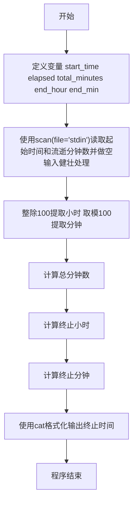
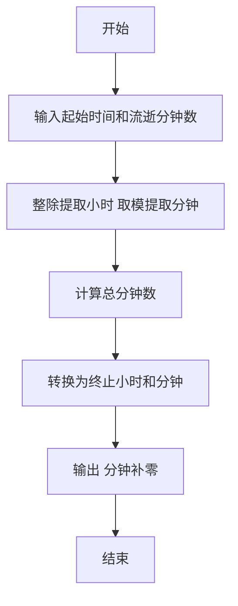

# 7-2 然后是几点（R语言实现）

## 前言

本题（7-2 然后是几点）的主要考点是：准确理解题意、规范处理输入输出格式，并正确处理边界与精度。下面先给出题目描述与格式要求，再通过清晰的思路与可直接运行的R代码进行讲解。

## 题目描述

有时候人们用四位数字表示一个时间，比如 `1106` 表示 11 点零 6 分。现在，你的程序要根据起始时间和流逝的时间计算出终止时间。

读入两个数字，第一个数字以这样的四位数字表示当前时间，第二个数字表示分钟数，计算当前时间经过那么多分钟后是几点，结果也表示为四位数字。当小时为个位数时，没有前导的零，例如 5 点 30 分表示为 `530`；0 点 30 分表示为 `030`。注意，第二个数字表示的分钟数可能超过 60，也可能是负数。

## 输入格式

输入在一行中给出 2 个整数，分别是四位数字表示的起始时间、以及流逝的分钟数，其间以空格分隔。注意：在起始时间中，当小时为个位数时，没有前导的零，即 5 点 30 分表示为 `530`；0 点 30 分表示为 `030`。流逝的分钟数可能超过 60，也可能是负数。

## 输出格式

输出不多于四位数字表示的终止时间，当小时为个位数时，没有前导的零。题目保证起始时间和终止时间在同一天内。

## 输入样例

```in
1120 110
```

## 输出样例

```out
1310
```

## 解题思路

这道题的核心是**时间的加减运算**，关键在于将时间统一转换为分钟数进行计算，再将结果还原为小时和分钟的格式。

### 核心问题分析

1. **起始时间格式解析**：起始时间可能是3位数（如`530`表示5点30分）或4位数（如`1120`表示11点20分），需要正确提取小时和分钟。由于起始时间按整数读入，直接整除100即得小时，取模100即得分钟；不足三位时整除结果为0，天然对应0点几分。
2. **流逝时间处理**：流逝分钟数可能超过60，也可能是负数，需要统一转换为总分钟数进行加减。
3. **输出格式控制**：分钟部分需要始终保持两位数（不足补零），小时部分不需要前导零。

### 算法原理说明

采用**总分钟数累加法**：
1. 将起始时间的小时和分钟转换为从0点开始的总分钟数
2. 加上流逝的分钟数（正数表示前进，负数表示倒退）
3. 将总分钟数重新换算为小时和分钟
4. 按要求格式输出

### 具体计算步骤

1. 解析起始时间`start`：小时 = `start %/% 100`，分钟 = `start %% 100`（起始时间不足三位时整除结果为0，即0点几分）
2. 计算总分钟数：`total_minutes = hour * 60 + minute + elapsed`
3. 还原终止时间：
   - 终止小时 = `total_minutes %/% 60`
   - 终止分钟 = `total_minutes %% 60`
4. 输出小时和分钟（分钟补零至两位）

## 完整代码

```r
# 读取输入：起始时间与流逝分钟数（使用 file="stdin" 避免读到脚本本身）
vals <- scan(file="stdin", what=integer(), quiet=TRUE)
# 健壮处理空输入/NA（避免长度不足导致 NA 传播为 NANA 输出）
if (length(vals) < 2) vals <- c(vals, rep(0L, 2 - length(vals)))
vals[is.na(vals)] <- 0L
start_time <- vals[1]
elapsed <- vals[2]
total_minutes <- (start_time %/% 100) * 60 + start_time %% 100 + elapsed
end_hour <- total_minutes %/% 60
end_min <- total_minutes %% 60
cat(sprintf("%d%02d\n", end_hour, end_min))
```

## 代码流程说明

1. **R 脚本顶层代码**：R 是解释型脚本语言，无需引入头文件，也不存在 main 函数，代码自上而下依次执行。
2. **定义变量**：定义`start_time`（起始时间）、`elapsed`（流逝分钟数）、`total_minutes`（总分钟数）、`end_hour`（终止小时）、`end_min`（终止分钟）。
3. **读取输入**：使用`scan(file="stdin", what=integer(), quiet=TRUE)`从标准输入读取起始时间和流逝分钟数，并对空输入/NA做健壮处理（补0）。
4. **解析起始时间**：通过`%/%`整除100提取小时，`%%`取模100提取分钟；起始时间不足三位时整除结果为0，天然对应0点几分。
5. **计算总分钟数**：小时×60加分钟得到起始总分钟数，再加上流逝分钟数。
6. **还原终止时间**：总分钟数`%/%`整除60得到终止小时，`%%`取模60得到终止分钟。
7. **格式化输出**：使用`sprintf("%d%02d", end_hour, end_min)`输出，小时按实际值输出，分钟不足两位补前导0。
8. **程序结束**：R 脚本执行完毕即自然结束。

## 代码流程图



## 解题流程图



## 代码解析

```r
# 读取输入：四位数字表示的起始时间与流逝的分钟数（解析版，与完整代码一致，使用 file="stdin"）
vals <- scan(file = "stdin", what = integer(), quiet = TRUE)
# 健壮处理空输入/NA
if (length(vals) < 2) vals <- c(vals, rep(0L, 2 - length(vals)))
vals[is.na(vals)] <- 0L
start_time <- vals[1]
elapsed <- vals[2]

# 拆出小时与分钟，并累加流逝的分钟数（整除提取小时，取模提取分钟，不足三位时整除结果为0）
total_minutes <- (start_time %/% 100) * 60 + start_time %% 100 + elapsed

# 换算为终止时间的小时与分钟（分钟不足两位时补前导0）
end_hour <- total_minutes %/% 60
end_min <- total_minutes %% 60

# 输出结果（小时无前导零，分钟补零至两位）
cat(sprintf("%d%02d\n", end_hour, end_min))
```

### 代码解析要点

起始时间先拆成小时和分钟，再统一转换为总分钟；加上可能为负的流逝时间后，用整除和取余恢复终止时间，并用 `%02d` 补足分钟。

## 复杂度分析

设输入规模为 $n$（对数值类题目为参与运算的数据量，对字符串/序列类题目为长度）。

- **时间复杂度**：$O(n)$ 或 $O(n \log n)$，主要来自一次线性遍历与常数次数学运算，无嵌套高复杂度循环。
- **空间复杂度**：$O(n)$，用于存储输入、中间结果与输出字符串；若仅使用若干标量变量则为 $O(1)$。

## 常见易错点

### 1. 输入/输出格式不符
错误：多余空格、遗漏换行、大小写或精度不符。后果：判题系统判为格式错误。正确：严格按题目要求的格式输出，数值用合适精度。

### 2. 边界条件遗漏
错误：未处理 0、最小值、单字符或空输入等边界。后果：特例 WA。正确：先列出所有边界样例，在编码前单独分支处理。

### 3. 整数溢出与类型
错误：使用过小的整数类型或忽略负号。后果：大数计算溢出。正确：按数据范围选择合适类型，必要时用更大整数类型或字符串处理。

## 更多测试

### 测试一：常规边界

**输入：**

```text
530 30
```

**输出：**

```text
600
```

### 测试二：特殊用例

**输入：**

```text
1200 -60
```

**输出：**

```text
1100
```

## 总结

本题的核心在于理清「然后是几点」的输入输出关系与边界处理：先按格式读取输入，再依据规则逐步计算或遍历，最后按规范输出。该思路可迁移到同类格式化输入输出与模拟计算的题目。
