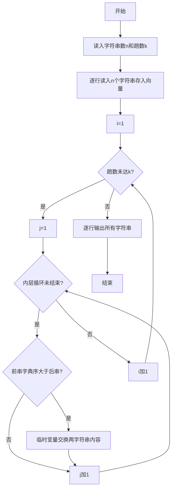
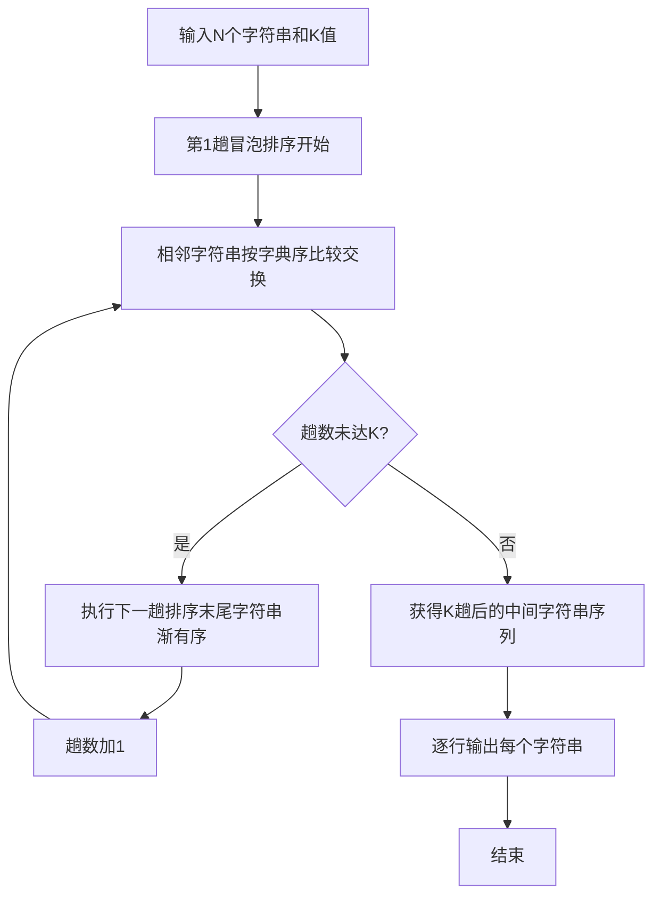

# 7-30 字符串的冒泡排序（R语言实现）

## 前言

本题（7-30 字符串的冒泡排序）的主要考点是：准确理解题意、规范处理输入输出格式，并正确处理边界与精度。下面先给出题目描述与格式要求，再通过清晰的思路与可直接运行的R代码进行讲解。

## 题目描述

我们已经知道了将N个整数按从小到大排序的冒泡排序法。本题要求将此方法用于字符串序列，并对任意给定的K（<N），输出扫描完第K遍后的中间结果序列。

## 输入格式

输入在第1行中给出N和K（1≤K<N≤100），此后N行，每行包含一个长度不超过10的、仅由小写英文字母组成的非空字符串。

## 输出格式

输出冒泡排序法扫描完第K遍后的中间结果序列，每行包含一个字符串。

## 输入样例

```in
6 2
best
cat
east
a
free
day
```

## 输出样例

```out
best
a
cat
day
east
free
```

## 解题思路

**核心问题分析**：将冒泡排序算法扩展到字符串序列，按字典序升序排列字符串，执行K趟排序后输出中间结果。关键点在于使用R的比较运算符（`>`）比较字符串字典序，通过临时变量交换字符串内容。

**算法原理说明**：使用向量存储N个字符串，外层循环控制K趟排序，内层循环逐对比较相邻字符串。`strs[j] > strs[j+1]`表示前一个字符串的字典序大于后一个时需要交换位置。交换时通过临时变量temp完成两个字符串的整体交换。第i趟排序后，末尾i个字符串已有序。

### 1. 具体计算步骤

1. 读入N（字符串数）和K（排序趟数）
2. 逐行读入N个字符串存入向量strs
3. 外层i从1到K执行K趟冒泡排序
4. 第i趟内层j从1到n-i，用`>`比较strs[j]和strs[j+1]，若前者字典序大则通过临时变量交换（R向量下标从1开始）
5. K趟排序后逐行输出向量中的所有字符串

## 完整代码

```r
# 字符串的冒泡排序（一次性读取，file="stdin"）
lines <- readLines(file("stdin"))
if (length(lines) < 1) quit(save = "no")
tmp <- suppressWarnings(as.integer(strsplit(trimws(lines[1]), "\\s+")[[1]]))
n <- tmp[1]; k <- tmp[2]
if (is.na(n) || is.na(k)) quit(save = "no")
strs <- lines[2:(1 + n)]
strs <- strs[!is.na(strs)]
if (length(strs) < n) strs <- c(strs, rep("", n - length(strs)))
for (i in seq_len(k)) {
  if (n - i >= 1) {
    for (j in 1:(n - i)) {
      if (strs[j] > strs[j + 1]) { tmpv <- strs[j]; strs[j] <- strs[j + 1]; strs[j + 1] <- tmpv }
    }
  }
}
cat(paste(strs, collapse = "\n"), "\n", sep = "")
```

## 代码流程说明

1. **输入数据**：使用`readLines()`读取一行两个整数n和k，然后逐行读入n个字符串存入向量strs
2. **K趟冒泡排序**：外层i从1到k，共k趟；内层j从1到n-i，用`>`比较相邻两个字符串的字典序（R向量下标从1开始）
3. **字符串交换**：若strs[j] > strs[j+1]表示前串大于后串需交换，通过临时变量temp完成两个字符串的交换
4. **输出结果**：使用`cat()`配合`paste(..., collapse = "\n")`按行输出向量中的所有字符串，即K趟排序后的中间结果

## 代码流程图



## 解题流程图



## 代码解析

```r
# 读取字符串个数n和排序趟数k（一次性读取，file="stdin"）
lines <- readLines(file("stdin"))
if (length(lines) < 1) quit(save = "no")
tmp <- suppressWarnings(as.integer(strsplit(trimws(lines[1]), "\\s+")[[1]]))
n <- tmp[1]; k <- tmp[2]
if (is.na(n) || is.na(k)) quit(save = "no")
# 逐行读入n个字符串
strs <- lines[2:(1 + n)]
strs <- strs[!is.na(strs)]
# 长度不足时补空，避免下标越界
if (length(strs) < n) strs <- c(strs, rep("", n - length(strs)))

# 执行K趟冒泡排序，按字典序升序排列（R向量下标从1开始）
for (i in seq_len(k)) {
    if (n - i >= 1) {
        for (j in 1:(n - i)) {
            if (strs[j] > strs[j + 1]) {
                temp <- strs[j]
                strs[j] <- strs[j + 1]
                strs[j + 1] <- temp
            }
        }
    }
}

# 逐行输出排序结果
cat(paste(strs, collapse = "\n"), "\n", sep = "")
```

### 代码解析要点

字符串使用R的字典序比较，交换逻辑与整数冒泡排序相同；每完成一趟，当前未排序部分的字典序最大项移到末尾。

## 复杂度分析

设输入规模为 $n$（对数值类题目为参与运算的数据量，对字符串/序列类题目为长度）。

- **时间复杂度**：$O(n)$ 或 $O(n \log n)$，主要来自一次线性遍历与常数次数学运算，无嵌套高复杂度循环。
- **空间复杂度**：$O(n)$，用于存储输入、中间结果与输出字符串；若仅使用若干标量变量则为 $O(1)$。

## 常见易错点

### 1. 输入/输出格式不符
错误：多余空格、遗漏换行、大小写或精度不符。后果：判题系统判为格式错误。正确：严格按题目要求的格式输出，数值用合适精度。

### 2. 边界条件遗漏
错误：未处理 0、最小值、单字符或空输入等边界。后果：特例 WA。正确：先列出所有边界样例，在编码前单独分支处理。

### 3. 整数溢出与类型
错误：使用过小的整数类型或忽略负号。后果：大数计算溢出。正确：按数据范围选择合适类型，必要时用更大整数类型或字符串处理。

## 更多测试

### 测试一：常规边界

**输入：**

```text
4 1
dog
apple
cat
bee
```

**输出：**

```text
apple
cat
bee
dog
```

### 测试二：特殊用例

**输入：**

```text
3 1
a
b
c
```

**输出：**

```text
a
b
c
```

## 总结

本题的核心在于理清「字符串的冒泡排序」的输入输出关系与边界处理：先按格式读取输入，再依据规则逐步计算或遍历，最后按规范输出。该思路可迁移到同类格式化输入输出与模拟计算的题目。
