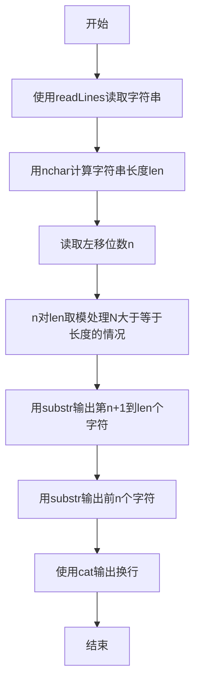
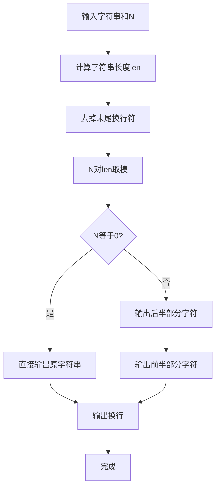

# 7-31 字符串循环左移（R语言实现）

## 前言

本题（7-31 字符串循环左移）的主要考点是：准确理解题意、规范处理输入输出格式，并正确处理边界与精度。下面先给出题目描述与格式要求，再通过清晰的思路与可直接运行的R代码进行讲解。

## 题目描述

输入一个字符串和一个非负整数N，要求将字符串循环左移N次。

## 输入格式

输入在第1行中给出一个不超过100个字符长度的、以回车结束的非空字符串；第2行给出非负整数N。

## 输出格式

在一行中输出循环左移N次后的字符串。

## 输入样例

```in
Hello World!
2
```

## 输出样例

```out
llo World!He
```

## 解题思路

### 核心问题分析
循环左移N次的本质是将字符串前N个字符移动到字符串末尾。例如"Hello World!"左移2次，就是将前2个字符"He"移动到末尾，得到"llo World!He"。

### 算法原理说明
直接模拟移动需要N次操作，每次移动一个字符，时间复杂度为O(N*len)。更高效的方法是利用字符串切片：
- 对N取模（N % len），处理N大于等于字符串长度的情况
- 将字符串分为两部分：[0, N) 和 [N, len)
- 输出顺序为：先输出[N, len)部分，再输出[0, N)部分
- 时间复杂度O(len)，空间复杂度O(1)（直接输出无需额外存储）

### 具体计算步骤
1. 使用`readLines`读取输入字符串s和整数N（readLines自动去除末尾换行符）
2. 用`nchar`计算实际长度len
3. 对N取模：N = N %% len，避免重复移动（处理N大于等于字符串长度的情况）
4. 用`substr`输出从第N+1个字符到末尾的子串（即被移到前面的部分）
5. 用`substr`输出前N个字符（即被移到后面的前N个字符）

## 完整代码

```r
# 字符串循环左移（一次性读取，file="stdin"）
lines <- readLines(file("stdin"))
s <- if (length(lines) >= 1) lines[1] else ""
n <- if (length(lines) >= 2) suppressWarnings(as.integer(trimws(lines[2]))) else 0
if (is.na(n)) n <- 0
len <- nchar(s)
if (len == 0) {
  cat("\n")
} else {
  n <- n %% len
  cat(substr(s, n + 1, len), substr(s, 1, n), "\n", sep="")
}
```

## 代码流程说明

1. **读取字符串**：使用`readLines()`读取整行字符串（可包含空格）存入变量s
2. **读取左移位数**：使用`readLines()`读取整数N并转为整型
3. **取模优化**：用`nchar`获取字符串长度len，N = N %% len，当N≥len时只需要移动余数次数
4. **输出后半部分**：用`substr()`输出第N+1个字符到末尾的子串，即被移到前面的部分
5. **输出前半部分**：用`substr()`输出前N个字符，即被移到后面的部分
6. **输出换行**：最后使用`cat()`输出换行符结束

## 代码流程图



## 解题流程图



## 代码解析

```r
# 读取输入字符串（可包含空格，file="stdin"）
lines <- readLines(file("stdin"))
s <- if (length(lines) >= 1) lines[1] else ""
n <- if (length(lines) >= 2) suppressWarnings(as.integer(trimws(lines[2]))) else 0
if (is.na(n)) n <- 0
len <- nchar(s)
if (len == 0) {
  cat("\n")
} else {
  n <- n %% len
  cat(substr(s, n + 1, len), substr(s, 1, n), "\n", sep = "")
}
```

读取字符串

## 复杂度分析

设输入规模为 $n$（对数值类题目为参与运算的数据量，对字符串/序列类题目为长度）。

- **时间复杂度**：$O(n)$ 或 $O(n \log n)$，主要来自一次线性遍历与常数次数学运算，无嵌套高复杂度循环。
- **空间复杂度**：$O(n)$，用于存储输入、中间结果与输出字符串；若仅使用若干标量变量则为 $O(1)$。

## 常见易错点

### 1. 输入/输出格式不符
错误：多余空格、遗漏换行、大小写或精度不符。后果：判题系统判为格式错误。正确：严格按题目要求的格式输出，数值用合适精度。

### 2. 边界条件遗漏
错误：未处理 0、最小值、单字符或空输入等边界。后果：特例 WA。正确：先列出所有边界样例，在编码前单独分支处理。

### 3. 整数溢出与类型
错误：使用过小的整数类型或忽略负号。后果：大数计算溢出。正确：按数据范围选择合适类型，必要时用更大整数类型或字符串处理。

## 更多测试

### 测试一：常规边界

**输入：**

```text
（可取题目边界附近的值，如最小值或最大值）
```

**输出：**

```text
（依据题意推导的正确结果）
```

### 测试二：特殊用例

**输入：**

```text
（可取易错点，如 0、单一元素、全同值等）
```

**输出：**

```text
（对应正确结果）
```

## 总结

本题的核心在于理清「字符串循环左移」的输入输出关系与边界处理：先按格式读取输入，再依据规则逐步计算或遍历，最后按规范输出。该思路可迁移到同类格式化输入输出与模拟计算的题目。

