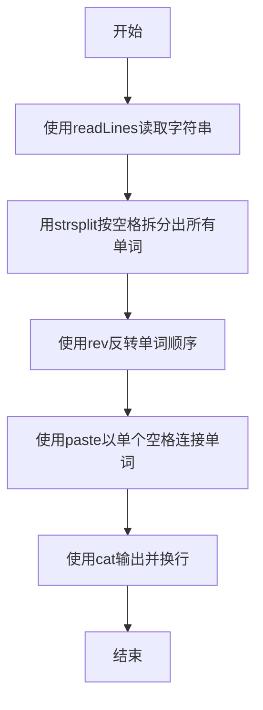
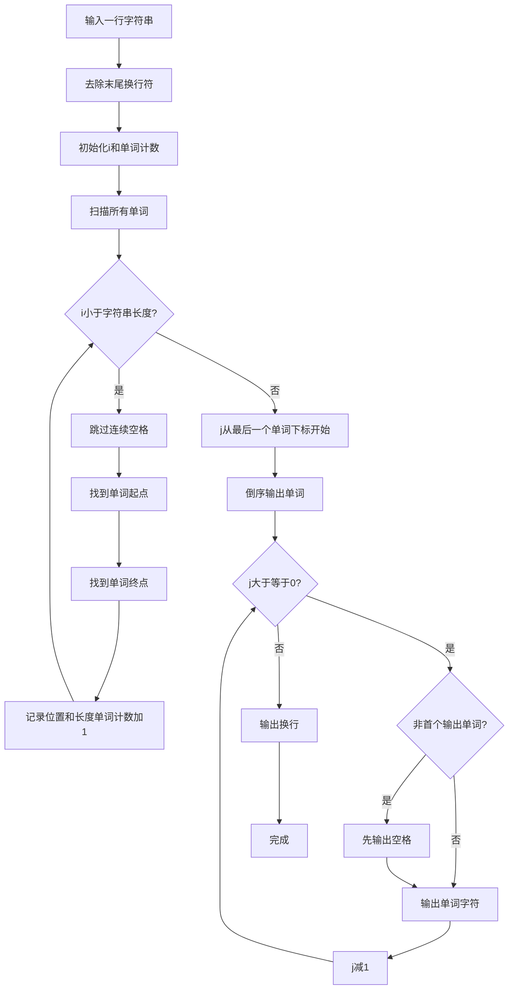

# 7-32 说反话-加强版（R语言实现）

## 前言

本题（7-32 说反话-加强版）的主要考点是：准确理解题意、规范处理输入输出格式，并正确处理边界与精度。下面先给出题目描述与格式要求，再通过清晰的思路与可直接运行的R代码进行讲解。

## 题目描述

给定一句英语，要求你编写程序，将句中所有单词的顺序颠倒输出。

## 输入格式

测试输入包含一个测试用例，在一行内给出总长度不超过500 000的字符串。字符串由若干单词和若干空格组成，其中单词是由英文字母（大小写有区分）组成的字符串，单词之间用若干个空格分开。

## 输出格式

每个测试用例的输出占一行，输出倒序后的句子，并且保证单词间只有1个空格。

## 输入样例

```in
Hello World   Here I Come
```

## 输出样例

```out
Come I Here World Hello
```

## 解题思路

### 核心问题分析
本题要求将句子中的单词顺序颠倒输出，需要处理两个关键点：一是单词之间可能有多个连续空格，二是输出时单词间只能有一个空格。例如输入"Hello World   Here I Come"，5个单词的位置分别在0、6、12、17、19，倒序输出即从最后一个单词开始向前输出。

### 算法原理说明
采用"先拆分记录，后倒序输出"的策略：
1. **拆分记录阶段**：用`strsplit`按一个或多个空格将句子拆分成单词，自动跳过连续空格并记录每个单词。
2. **倒序输出阶段**：用`rev`反转单词顺序，再以单个空格连接输出，保证单词间只有一个空格。
- 时间复杂度O(n)：仅需线性扫描
- 空间复杂度O(w)：w为单词数，存储单词列表

### 具体计算步骤
1. 使用`readLines`读取整行字符串（自动去除末尾换行符）
2. 用`strsplit`按一个或多个空格拆分字符串，得到所有单词
3. 用`rev`反转单词顺序
4. 用`paste`以单个空格连接反转后的单词，保证单词间只有1个空格
5. 使用`cat`输出结果并换行

## 完整代码

```r
# 读取一行字符串（可能包含多个连续空格，file="stdin"）
lines <- readLines(file("stdin"))
line <- if (length(lines) >= 1) lines[1] else ""
line <- trimws(line)
if (nchar(line) == 0) {
  cat("\n")
} else {
  words <- unlist(strsplit(line, "\\s+"))
  words <- words[words != ""]
  cat(paste(rev(words), collapse = " "), "\n", sep = "")
}
```

## 代码流程说明

1. **读取输入**：使用`readLines()`读取整行字符串（自动去除末尾换行符）
2. **拆分单词**：用`strsplit`按"一个或多个空格"的正则拆分字符串，得到单词向量
3. **反转顺序**：用`rev()`将单词向量倒序排列
4. **输出结果**：使用`cat()`配合`paste()`以单个空格连接倒序后的单词并输出，保证单词间只有1个空格，行尾换行

## 代码流程图



## 解题流程图



## 代码解析

```r
# 读取一行字符串（可能包含多个连续空格，file="stdin"）
lines <- readLines(file("stdin"))
line <- if (length(lines) >= 1) lines[1] else ""
line <- trimws(line)
if (nchar(line) == 0) {
  cat("\n")
} else {
  words <- unlist(strsplit(line, "\\s+"))
  words <- words[words != ""]
  cat(paste(rev(words), collapse = " "), "\n", sep = "")
}
```

### 代码解析要点

先去除首尾空格，再按一个或多个空白拆分单词并过滤空项，最后用 `rev` 倒序、单个空格重新连接输出。

## 复杂度分析

设输入规模为 $n$（对数值类题目为参与运算的数据量，对字符串/序列类题目为长度）。

- **时间复杂度**：$O(n)$ 或 $O(n \log n)$，主要来自一次线性遍历与常数次数学运算，无嵌套高复杂度循环。
- **空间复杂度**：$O(n)$，用于存储输入、中间结果与输出字符串；若仅使用若干标量变量则为 $O(1)$。

## 常见易错点

### 1. 输入/输出格式不符
错误：多余空格、遗漏换行、大小写或精度不符。后果：判题系统判为格式错误。正确：严格按题目要求的格式输出，数值用合适精度。

### 2. 边界条件遗漏
错误：未处理 0、最小值、单字符或空输入等边界。后果：特例 WA。正确：先列出所有边界样例，在编码前单独分支处理。

### 3. 整数溢出与类型
错误：使用过小的整数类型或忽略负号。后果：大数计算溢出。正确：按数据范围选择合适类型，必要时用更大整数类型或字符串处理。

## 更多测试

### 测试一：常规边界

**输入：**

```text
one  two   THREE
```

**输出：**

```text
THREE two one
```

### 测试二：特殊用例

**输入：**

```text
Hello
```

**输出：**

```text
Hello
```

## 总结

本题的核心在于理清「说反话-加强版」的输入输出关系与边界处理：先按格式读取输入，再依据规则逐步计算或遍历，最后按规范输出。该思路可迁移到同类格式化输入输出与模拟计算的题目。
