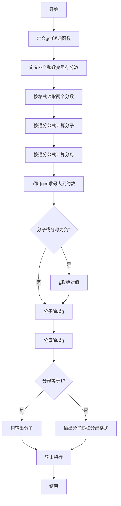
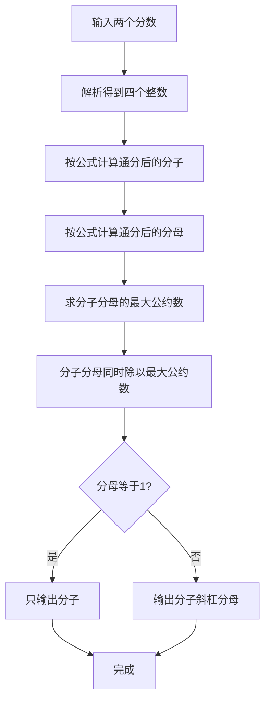

# 7-33 有理数加法（R语言实现）

## 前言

本题（7-33 有理数加法）的主要考点是：准确理解题意、规范处理输入输出格式，并正确处理边界与精度。下面先给出题目描述与格式要求，再通过清晰的思路与可直接运行的R代码进行讲解。

## 题目描述

本题要求编写程序，计算两个有理数的和。

## 输入格式

输入在一行中按照a1/b1 a2/b2的格式给出两个分数形式的有理数，其中分子和分母全是整形范围内的正整数。

## 输出格式

在一行中按照a/b的格式输出两个有理数的和。注意必须是该有理数的最简分数形式，若分母为1，则只输出分子。

## 输入样例

```in
1/3 1/6
```

```in
4/3 2/3
```

## 输出样例

```out
1/2
```

```out
2
```

## 解题思路

### 核心问题分析
本题需要计算两个分数的和并输出最简形式。核心难点在于：一是正确解析带斜杠的输入格式（如"1/3 1/6"），二是分数相加后的约分处理。例如1/3 + 1/6 = 6/18 + 3/18 = 9/18，约分后为1/2。

### 算法原理说明
1. **分数加法公式**：a1/b1 + a2/b2 = (a1×b2 + a2×b1) / (b1×b2)
2. **约分算法**：使用辗转相除法（欧几里得算法）求分子和分母的最大公约数（GCD），然后分子分母同时除以GCD得到最简分数。
3. **辗转相除法原理**：gcd(a, b) = gcd(b, a mod b)，当b=0时a即为最大公约数。
- 时间复杂度O(log(min(a,b)))：由辗转相除法的复杂度决定
- 空间复杂度O(1)：仅需几个整数变量

### 具体计算步骤
1. 按"a1/b1 a2/b2"格式读取两个分数的分子和分母
2. 计算通分后的分子：numerator = a1×b2 + a2×b1
3. 计算通分后的分母：denominator = b1×b2
4. 求分子和分母的最大公约数g = gcd(numerator, denominator)
5. 约分：numerator /= g，denominator /= g
6. 若分母为1，只输出分子；否则输出"分子/分母"格式

## 完整代码

```r
# 辗转相除法（欧几里得算法）求最大公约数
gcd <- function(a, b) {
    a <- if (a < 0) -a else a
    b <- if (b < 0) -b else b
    while (b != 0) {
        t <- a %% b
        a <- b
        b <- t
    }
    return(a)
}

# 从标准输入读取一行：a1/b1 a2/b2（file="stdin"）
line <- readLines(file("stdin"), n = 1)
if (length(line) == 0) quit(save = "no")
nums <- suppressWarnings(as.integer(unlist(strsplit(trimws(gsub("/", " ", line)), "\\s+"))))
nums <- nums[!is.na(nums)]
a1 <- nums[1]
b1 <- nums[2]
a2 <- nums[3]
b2 <- nums[4]

# 分数加法通分公式计算分子和分母
numerator <- a1 * b2 + a2 * b1
denominator <- b1 * b2

# 求最大公约数并约分
g <- gcd(numerator, denominator)
numerator <- numerator %/% g
denominator <- denominator %/% g

# 输出结果：分母为1只输出分子，否则输出"分子/分母"
if (denominator == 1) {
    cat(numerator, "\n", sep = "")
} else {
    cat(numerator, "/", denominator, "\n", sep = "")
}
```

## 代码流程说明

1. **R脚本顶层代码**：R 无需 main 函数与头文件，代码自上而下执行
2. **定义gcd函数**：使用 while 循环实现辗转相除法求最大公约数，先对负数取绝对值
3. **读取输入**：使用 readLines() 从标准输入读取一行，解析两个分数的分子和分母
4. **计算和**：按分数加法公式计算分子和分母
5. **求GCD**：调用gcd函数求分子分母的最大公约数
6. **约分**：分子分母分别除以最大公约数（整除用 %/%）
7. **输出结果**：判断分母是否为1，使用 cat() 选择输出格式

## 代码流程图



## 解题流程图



## 代码解析

```r
# 辗转相除法（欧几里得算法）求最大公约数
gcd <- function(a, b) {
    a <- if (a < 0) -a else a
    b <- if (b < 0) -b else b
    while (b != 0) {
        t <- a %% b
        a <- b
        b <- t
    }
    return(a)
}

# 从标准输入读取一行：a1/b1 a2/b2（file="stdin"）
line <- readLines(file("stdin"), n = 1)
if (length(line) == 0) quit(save = "no")
nums <- suppressWarnings(as.integer(unlist(strsplit(trimws(gsub("/", " ", line)), "\\s+"))))
nums <- nums[!is.na(nums)]
a1 <- nums[1]
b1 <- nums[2]
a2 <- nums[3]
b2 <- nums[4]

# 分数加法通分公式计算分子和分母
numerator <- a1 * b2 + a2 * b1
denominator <- b1 * b2

# 求最大公约数并约分
g <- gcd(numerator, denominator)
numerator <- numerator %/% g
denominator <- denominator %/% g

# 输出结果：分母为1只输出分子，否则输出"分子/分母"
if (denominator == 1) {
    cat(numerator, "\n", sep = "")
} else {
    cat(numerator, "/", denominator, "\n", sep = "")
}
```

R脚本顶层代码

## 复杂度分析

设输入规模为 $n$（对数值类题目为参与运算的数据量，对字符串/序列类题目为长度）。

- **时间复杂度**：$O(n)$ 或 $O(n \log n)$，主要来自一次线性遍历与常数次数学运算，无嵌套高复杂度循环。
- **空间复杂度**：$O(n)$，用于存储输入、中间结果与输出字符串；若仅使用若干标量变量则为 $O(1)$。

## 常见易错点

### 1. 输入/输出格式不符
错误：多余空格、遗漏换行、大小写或精度不符。后果：判题系统判为格式错误。正确：严格按题目要求的格式输出，数值用合适精度。

### 2. 边界条件遗漏
错误：未处理 0、最小值、单字符或空输入等边界。后果：特例 WA。正确：先列出所有边界样例，在编码前单独分支处理。

### 3. 整数溢出与类型
错误：使用过小的整数类型或忽略负号。后果：大数计算溢出。正确：按数据范围选择合适类型，必要时用更大整数类型或字符串处理。

## 更多测试

### 测试一：常规边界

**输入：**

```text
（可取题目边界附近的值，如最小值或最大值）
```

**输出：**

```text
（依据题意推导的正确结果）
```

### 测试二：特殊用例

**输入：**

```text
（可取易错点，如 0、单一元素、全同值等）
```

**输出：**

```text
（对应正确结果）
```

## 总结

本题的核心在于理清「有理数加法」的输入输出关系与边界处理：先按格式读取输入，再依据规则逐步计算或遍历，最后按规范输出。该思路可迁移到同类格式化输入输出与模拟计算的题目。

