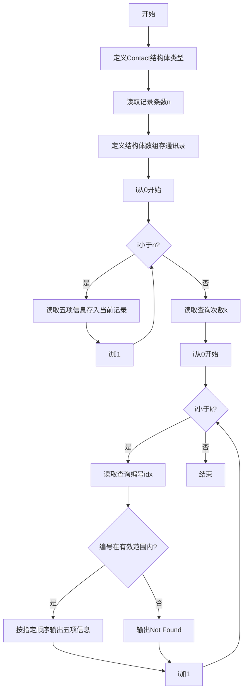
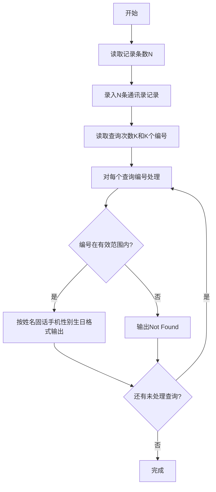

# 7-34 通讯录的录入与显示（R语言实现）

## 前言

本题（7-34 通讯录的录入与显示）的主要考点是：准确理解题意、规范处理输入输出格式，并正确处理边界与精度。下面先给出题目描述与格式要求，再通过清晰的思路与可直接运行的R代码进行讲解。

## 题目描述

通讯录中的一条记录包含下述基本信息：朋友的姓名、出生日期、性别、固定电话号码、移动电话号码。
本题要求编写程序，录入N条记录，并且根据要求显示任意某条记录。

## 输入格式

输入在第一行给出正整数N（≤10）；随后N行，每行按照格式姓名 生日 性别 固话 手机给出一条记录。其中姓名是不超过10个字符、不包含空格的非空字符串；生日按yyyy/mm/dd的格式给出年月日；性别用M表示"男"、F表示"女"；固话和手机均为不超过15位的连续数字，前面有可能出现+。

在通讯录记录输入完成后，最后一行给出正整数K，并且随后给出K个整数，表示要查询的记录编号（从0到N−1顺序编号）。数字间以空格分隔。

## 输出格式

对每一条要查询的记录编号，在一行中按照姓名 固话 手机 性别 生日的格式输出该记录。若要查询的记录不存在，则输出Not Found。

## 输入样例

```in
3
Chris 1984/03/10 F +86181779452 13707010007
LaoLao 1967/11/30 F 057187951100 +8618618623333
QiaoLin 1980/01/01 M 84172333 10086
2 1 7
```

## 输出样例

```out
LaoLao 057187951100 +8618618623333 F 1967/11/30
Not Found
```

## 解题思路

### 核心问题分析
本题需要实现通讯录的录入与查询功能。核心要点有三：一是用合适的数据结构存储多条记录（包含姓名、生日、性别、固话、手机5个字段）；二是按正确顺序输出字段（注意输出顺序与输入顺序不同：输入是姓名-生日-性别-固话-手机，输出是姓名-固话-手机-性别-生日）；三是处理无效查询编号，输出Not Found。

### 算法原理说明
采用结构体数组+索引查询的方案：
1. **数据结构设计**：定义Contact结构体，包含5个字段分别存储一条记录的各项信息。
2. **录入阶段**：读取N后，循环N次按输入顺序读取5个字段存入结构体数组对应下标的元素。
3. **查询阶段**：读取K后，循环K次读取查询编号idx。若idx在[0, N)范围内，则按输出顺序读取并打印对应结构体的字段；否则输出"Not Found"。
- 时间复杂度O(N+K)：录入和查询均为线性扫描
- 空间复杂度O(N)：存储N条通讯录记录

### 具体计算步骤
1. 读取正整数N（通讯录记录条数）
2. 循环i从0到N-1：
   - 依次读取姓名、生日、性别、固话、手机，存入contacts[i]的对应字段
3. 读取正整数K（查询次数），随后读取K个查询编号
4. 循环处理K个查询：
   - 读取查询编号idx
   - 判断idx >= 0 且 idx < N？
     - 是：按"姓名 固话 手机 性别 生日"顺序输出
     - 否：输出"Not Found"

## 完整代码

```r
# 从标准输入一次性读取所有行（file="stdin"）
lines <- readLines(file("stdin"))
if (length(lines) == 0) quit(save = "no")

# 第一行：通讯录记录条数 N
n <- suppressWarnings(as.integer(trimws(lines[1])))
if (is.na(n) || n < 0) n <- 0

# 录入 N 条记录：每行格式为 姓名 生日 性别 固话 手机
contacts <- list()
for (i in seq_len(n)) {
    if (1 + i <= length(lines)) {
        fields <- unlist(strsplit(trimws(lines[1 + i]), "\\s+"))
    } else {
        fields <- character(0)
    }
    # 不足5字段时补空
    if (length(fields) < 5) fields <- c(fields, rep("", 5 - length(fields)))
    contacts[[i]] <- list(name = fields[1],
                          birthday = fields[2],
                          gender = fields[3],
                          fixedPhone = fields[4],
                          mobilePhone = fields[5])
}

# 查询次数 K 与 K 个查询编号（编号可能与 K 同行，也可能在其后的行）
if ((n + 2) <= length(lines)) {
    all_nums <- suppressWarnings(as.integer(unlist(strsplit(paste(lines[(n + 2):length(lines)], collapse = " "), "\\s+"))))
    all_nums <- all_nums[!is.na(all_nums)]
} else {
    all_nums <- integer(0)
}
k <- if (length(all_nums) >= 1) all_nums[1] else 0
idx <- if (length(all_nums) >= 2) all_nums[2:length(all_nums)] else integer(0)

# 处理 K 次查询（R 下标从 1 开始，编号 idx 对应 contacts[[idx + 1]]）
for (j in seq_len(k)) {
    id <- if (j <= length(idx)) idx[j] else NA
    if (!is.na(id) && id >= 0 && id < n) {
        rec <- contacts[[id + 1]]
        cat(paste(rec$name, rec$fixedPhone, rec$mobilePhone, rec$gender, rec$birthday, sep = " "), "\n", sep = "")
    } else {
        cat("Not Found\n")
    }
}
```

## 代码流程说明

1. **R脚本顶层代码**：R 无需 main 函数与头文件，代码自上而下执行
2. **读取全部输入**：使用 readLines() 从标准输入一次性读取所有行
3. **解析记录条数N**：第一行为通讯录记录条数n
4. **录入N条记录**：用 list 列表存储记录，循环n次按顺序解析5个字段存入列表
5. **读取K与查询编号**：解析查询次数k，以及随后的K个查询编号（编号可能与K在同一行）
6. **处理K次查询**：循环k次：
   - 读取查询编号idx
   - 判断idx是否在有效范围[0, n)内（R向量下标从1开始，取记录时用idx+1）
   - 有效则用 cat() 按指定顺序输出5个字段（注意固话手机在前，性别生日在后）
   - 无效输出"Not Found"

## 代码流程图



## 解题流程图



## 代码解析

```r
# 从标准输入一次性读取所有行（file="stdin"）
lines <- readLines(file("stdin"))
if (length(lines) == 0) quit(save = "no")
n <- suppressWarnings(as.integer(trimws(lines[1])))
if (is.na(n) || n < 0) n <- 0
contacts <- list()
for (i in seq_len(n)) {
    if (1 + i <= length(lines)) {
        fields <- unlist(strsplit(trimws(lines[1 + i]), "\\s+"))
    } else {
        fields <- character(0)
    }
    if (length(fields) < 5) fields <- c(fields, rep("", 5 - length(fields)))
    contacts[[i]] <- list(name = fields[1],
                          birthday = fields[2],
                          gender = fields[3],
                          fixedPhone = fields[4],
                          mobilePhone = fields[5])
}
if ((n + 2) <= length(lines)) {
    all_nums <- suppressWarnings(as.integer(unlist(strsplit(paste(lines[(n + 2):length(lines)], collapse = " "), "\\s+"))))
    all_nums <- all_nums[!is.na(all_nums)]
} else {
    all_nums <- integer(0)
}
k <- if (length(all_nums) >= 1) all_nums[1] else 0
idx <- if (length(all_nums) >= 2) all_nums[2:length(all_nums)] else integer(0)
for (j in seq_len(k)) {
    id <- if (j <= length(idx)) idx[j] else NA
    if (!is.na(id) && id >= 0 && id < n) {
        rec <- contacts[[id + 1]]
        cat(paste(rec$name, rec$fixedPhone, rec$mobilePhone, rec$gender, rec$birthday, sep = " "), "\n", sep = "")
    } else {
        cat("Not Found\n")
    }
}
```

### 代码解析要点

录入时按姓名、生日、性别、固话、手机保存，查询时按题目要求改为姓名、固话、手机、性别、生日输出；编号越界时输出 `Not Found`。

## 复杂度分析

设输入规模为 $n$（对数值类题目为参与运算的数据量，对字符串/序列类题目为长度）。

- **时间复杂度**：$O(n)$ 或 $O(n \log n)$，主要来自一次线性遍历与常数次数学运算，无嵌套高复杂度循环。
- **空间复杂度**：$O(n)$，用于存储输入、中间结果与输出字符串；若仅使用若干标量变量则为 $O(1)$。

## 常见易错点

### 1. 输入/输出格式不符
错误：多余空格、遗漏换行、大小写或精度不符。后果：判题系统判为格式错误。正确：严格按题目要求的格式输出，数值用合适精度。

### 2. 边界条件遗漏
错误：未处理 0、最小值、单字符或空输入等边界。后果：特例 WA。正确：先列出所有边界样例，在编码前单独分支处理。

### 3. 整数溢出与类型
错误：使用过小的整数类型或忽略负号。后果：大数计算溢出。正确：按数据范围选择合适类型，必要时用更大整数类型或字符串处理。

## 更多测试

### 测试一：常规边界

**输入：**

```text
1
Alice 2000/01/02 F 12345 +8613800
2 0 1
```

**输出：**

```text
Alice 12345 +8613800 F 2000/01/02
Not Found
```

### 测试二：特殊用例

**输入：**

```text
1
Bob 1999/12/31 M +8610 10086
1 0
```

**输出：**

```text
Bob +8610 10086 M 1999/12/31
```

## 总结

本题的核心在于理清「通讯录的录入与显示」的输入输出关系与边界处理：先按格式读取输入，再依据规则逐步计算或遍历，最后按规范输出。该思路可迁移到同类格式化输入输出与模拟计算的题目。
