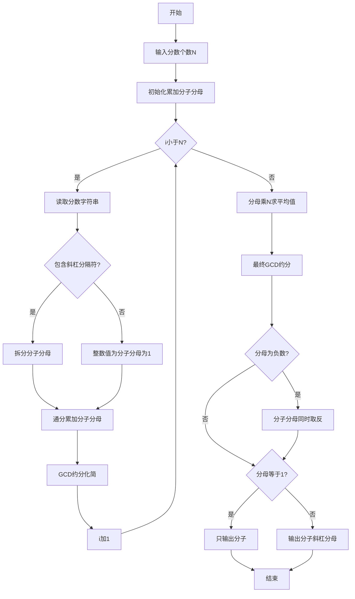
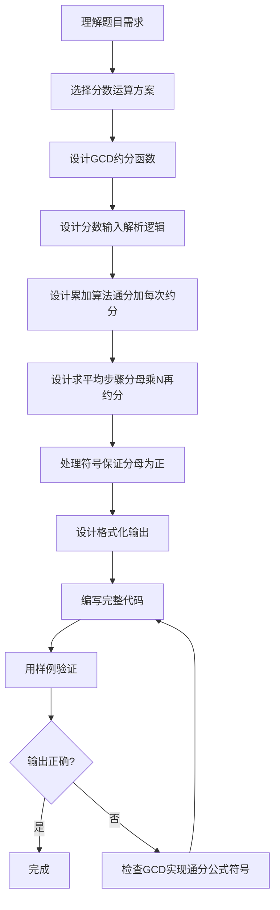

# 7-35 有理数均值（R语言实现）

## 前言

本题（7-35 有理数均值）的主要考点是：准确理解题意、规范处理输入输出格式，并正确处理边界与精度。下面先给出题目描述与格式要求，再通过清晰的思路与可直接运行的R代码进行讲解。

## 题目描述

本题要求编写程序，计算N个有理数的平均值。

## 输入格式

输入第一行给出正整数N（≤100）；第二行中给出N个分数形式的有理数，其中分子和分母全是整形范围内的整数（正负均可），没有分母为0的情况。

## 输出格式

在一行中按照a/b的格式输出N个有理数的平均值。注意必须是该有理数的最简分数形式，若分母为1，则只输出分子。

## 输入样例

```in
4
1/2 1/6 3/6 -5/10
```

## 输出样例

```out
1/6
```

## 解题思路

### 核心问题分析
本题需要解决的核心问题：
1. **分数输入解析**：识别输入中的分数格式（分子/分母）或整数格式
2. **分数累加求和**：多个分数相加需要通分，避免浮点数精度丢失
3. **求平均值**：总和除以个数N
4. **最简分数输出**：用最大公约数约分，保证分母为正

### 算法原理说明
- **辗转相除法(GCD)**：用于求最大公约数，对分数进行约分。公式：`gcd(a, b) = gcd(b, a % b)`，直到b为0时a即为最大公约数
- **分数加法**：`a/b + c/d = (a*d + c*b) / (b*d)`，每次累加后立即约分防止溢出
- **求平均值**：将累加后的分母乘以N，再进行约分
- **符号处理**：确保负号在分子上，分母始终为正

### 具体计算步骤
1. 输入N，初始化分子sumNum=0，分母sumDen=1
2. 对每个分数：
   - 解析分子num和分母den
   - 通分累加：`sumNum = sumNum*den + num*sumDen`，`sumDen = sumDen*den`
   - 用GCD约分化简
3. 求平均：`sumDen *= N`，再次约分
4. 若分母为负，分子分母同时取反
5. 按格式输出结果

## 完整代码

```r
# 有理数均值（一次性读取，file="stdin"）
gcd <- function(a, b) {
    a <- if (a < 0) -a else a
    b <- if (b < 0) -b else b
    while (b != 0) {
        t <- a %% b
        a <- b
        b <- t
    }
    return(a)
}
lines <- readLines(file("stdin"))
if (length(lines) == 0) quit(save = "no")
n <- suppressWarnings(as.integer(trimws(lines[1])))
if (is.na(n) || n < 1) quit(save = "no")
rest <- paste(lines[-1], collapse = " ")
fracs <- unlist(strsplit(trimws(rest), "\\s+"))
fracs <- fracs[fracs != ""]
if (length(fracs) < n) quit(save = "no")
sumNum <- 0
sumDen <- 1
for (i in seq_len(n)) {
    frac <- fracs[i]
    pos <- regexpr("/", frac, fixed = TRUE)
    if (pos > 0) {
        num <- suppressWarnings(as.integer(substr(frac, 1, pos - 1)))
        den <- suppressWarnings(as.integer(substr(frac, pos + 1, nchar(frac))))
        if (is.na(num)) num <- 0
        if (is.na(den) || den == 0) den <- 1
    } else {
        num <- suppressWarnings(as.integer(frac))
        if (is.na(num)) num <- 0
        den <- 1
    }
    sumNum <- sumNum * den + num * sumDen
    sumDen <- sumDen * den
    g <- gcd(sumNum, sumDen)
    if (g != 0) {
        sumNum <- sumNum %/% g
        sumDen <- sumDen %/% g
    }
}
sumDen <- sumDen * n
g <- gcd(sumNum, sumDen)
if (g != 0) {
    sumNum <- sumNum %/% g
    sumDen <- sumDen %/% g
}
if (sumDen < 0) {
    sumNum <- -sumNum
    sumDen <- -sumDen
}
if (sumDen == 1) {
    cat(sumNum, "\n", sep = "")
} else {
    cat(sumNum, "/", sumDen, "\n", sep = "")
}
```

## 代码流程说明

### 1. gcd函数（第2-11行）
- 输入：两个整数a、b
- 功能：求最大公约数
- 流程：先取绝对值，再用 while 循环辗转相除求解

### 2. R脚本顶层代码-初始化（第13-20行）
- 用 readLines() 从标准输入读取分数个数 N
- 初始化累计分子sumNum=0，累计分母sumDen=1

### 3. R脚本顶层代码-分数解析与累加（第22-43行）
- 循环N次读取每个分数字符串
- 用 regexpr() 查找'/'位置：有则拆分分子分母，无则分母为1
- 通分公式累加分子分母
- 每次累加后用GCD约分，避免数值过大

### 4. R脚本顶层代码-求平均与最终约分（第45-56行）
- sumDen乘以N求平均值
- 再次GCD约分
- 若分母为负，分子分母同时取反保证分母为正

### 5. R脚本顶层代码-输出（第58-63行）
- 分母为1时用 cat() 只输出分子
- 否则输出"分子/分母"格式

## 代码流程图



## 解题流程图



## 代码解析

```r
# 辗转相除法（欧几里得算法）求最大公约数（file="stdin"）
gcd <- function(a, b) {
    a <- if (a < 0) -a else a
    b <- if (b < 0) -b else b
    while (b != 0) {
        t <- a %% b
        a <- b
        b <- t
    }
    return(a)
}
lines <- readLines(file("stdin"))
if (length(lines) == 0) quit(save = "no")
n <- suppressWarnings(as.integer(trimws(lines[1])))
if (is.na(n) || n < 1) quit(save = "no")
rest <- paste(lines[-1], collapse = " ")
fracs <- unlist(strsplit(trimws(rest), "\\s+"))
fracs <- fracs[fracs != ""]
if (length(fracs) < n) quit(save = "no")
sumNum <- 0
sumDen <- 1
for (i in seq_len(n)) {
    frac <- fracs[i]
    pos <- regexpr("/", frac, fixed = TRUE)
    if (pos > 0) {
        num <- suppressWarnings(as.integer(substr(frac, 1, pos - 1)))
        den <- suppressWarnings(as.integer(substr(frac, pos + 1, nchar(frac))))
        if (is.na(num)) num <- 0
        if (is.na(den) || den == 0) den <- 1
    } else {
        num <- suppressWarnings(as.integer(frac))
        if (is.na(num)) num <- 0
        den <- 1
    }
    sumNum <- sumNum * den + num * sumDen
    sumDen <- sumDen * den
    g <- gcd(sumNum, sumDen)
    if (g != 0) {
        sumNum <- sumNum %/% g
        sumDen <- sumDen %/% g
    }
}
sumDen <- sumDen * n
g <- gcd(sumNum, sumDen)
if (g != 0) {
    sumNum <- sumNum %/% g
    sumDen <- sumDen %/% g
}
if (sumDen < 0) {
    sumNum <- -sumNum
    sumDen <- -sumDen
}
if (sumDen == 1) {
    cat(sumNum, "\n", sep = "")
} else {
    cat(sumNum, "/", sumDen, "\n", sep = "")
}
```

### 代码解析要点

每次累加后立即用GCD约分以控制中间数规模，全部分数相加后再将分母乘以N求平均，最后统一处理分母符号并输出最简结果。

## 复杂度分析

设输入规模为 $n$（对数值类题目为参与运算的数据量，对字符串/序列类题目为长度）。

- **时间复杂度**：$O(n)$ 或 $O(n \log n)$，主要来自一次线性遍历与常数次数学运算，无嵌套高复杂度循环。
- **空间复杂度**：$O(n)$，用于存储输入、中间结果与输出字符串；若仅使用若干标量变量则为 $O(1)$。

## 常见易错点

### 1. 输入/输出格式不符
错误：多余空格、遗漏换行、大小写或精度不符。后果：判题系统判为格式错误。正确：严格按题目要求的格式输出，数值用合适精度。

### 2. 边界条件遗漏
错误：未处理 0、最小值、单字符或空输入等边界。后果：特例 WA。正确：先列出所有边界样例，在编码前单独分支处理。

### 3. 整数溢出与类型
错误：使用过小的整数类型或忽略负号。后果：大数计算溢出。正确：按数据范围选择合适类型，必要时用更大整数类型或字符串处理。

## 更多测试

### 测试一：常规边界

**输入：**

```text
3
1/2 1/3 1/6
```

**输出：**

```text
1/3
```

### 测试二：特殊用例

**输入：**

```text
2
-1/2 1/2
```

**输出：**

```text
0
```

## 总结

本题的核心在于理清「有理数均值」的输入输出关系与边界处理：先按格式读取输入，再依据规则逐步计算或遍历，最后按规范输出。该思路可迁移到同类格式化输入输出与模拟计算的题目。
