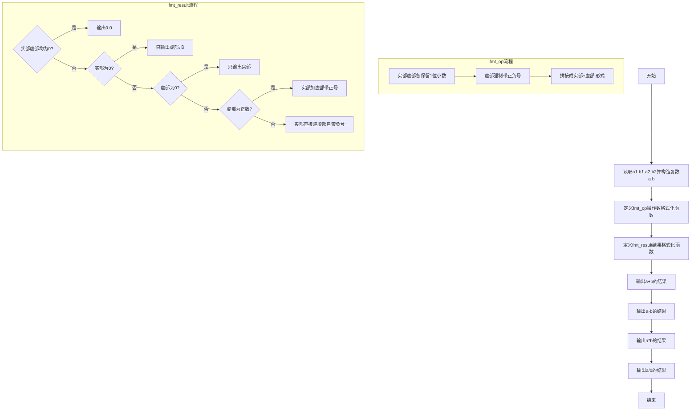
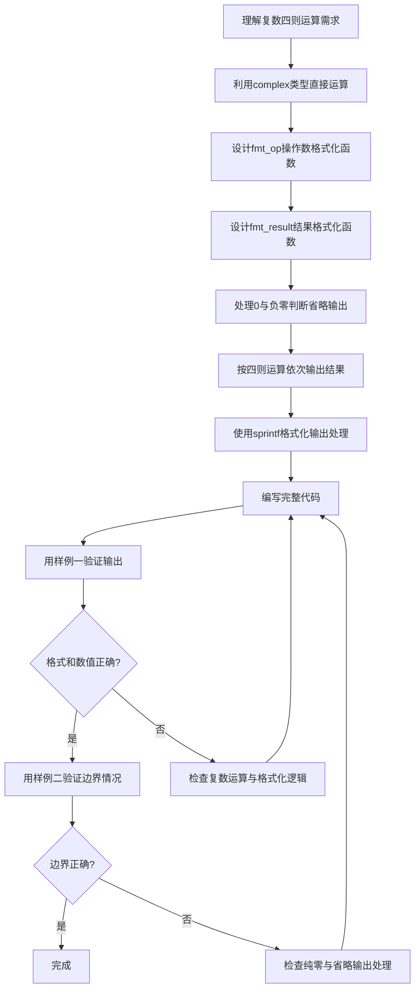

# 7-36 复数四则运算（R语言实现）

## 前言

本题（7-36 复数四则运算）的主要考点是：准确理解题意、规范处理输入输出格式，并正确处理边界与精度。下面先给出题目描述与格式要求，再通过清晰的思路与可直接运行的R代码进行讲解。

## 题目描述

本题要求编写程序，计算2个复数的和、差、积、商。

## 输入格式

输入在一行中按照a1 b1 a2 b2的格式给出2个复数C1=a1+b1i和C2=a2+b2i的实部和虚部。题目保证C2不为0。

## 输出格式

分别在4行中按照(a1+b1i) 运算符 (a2+b2i) = 结果的格式顺序输出2个复数的和、差、积、商，数字精确到小数点后1位。如果结果的实部或者虚部为0，则不输出。如果结果为0，则输出0.0。

## 输入样例1

```in
2 3.08 -2.04 5.06
```

## 输入样例2

```in
1 1 -1 -1.01
```

## 输出样例1

```out
(2.0+3.1i) + (-2.0+5.1i) = 8.1i
(2.0+3.1i) - (-2.0+5.1i) = 4.0-2.0i
(2.0+3.1i) * (-2.0+5.1i) = -19.7+3.8i
(2.0+3.1i) / (-2.0+5.1i) = 0.4-0.6i
```

## 输出样例2

```out
(1.0+1.0i) + (-1.0-1.0i) = 0.0
(1.0+1.0i) - (-1.0-1.0i) = 2.0+2.0i
(1.0+1.0i) * (-1.0-1.0i) = -2.0i
(1.0+1.0i) / (-1.0-1.0i) = -1.0
```

## 解题思路

### 核心问题分析
本题需要解决的核心问题：
1. **复数四则运算**：计算两个复数的和、差、积、商。R 内置 complex 复数类型，直接用 `+`、`-`、`*`、`/` 运算符即可完成运算，无需手工推导公式
2. **操作数格式化**：等号左侧的两个复数操作数始终以"实部+虚部i"形式输出，虚部必须带上正负号
3. **结果格式化**：等号右侧的结果需要判断实部/虚部是否为0（含 -0.0 的情况），为0的省略，全为0时输出"0.0"

### 算法原理说明
- **复数构造**：用 `complex(real = a, imaginary = b)` 构造复数，实部、虚部分别存入
- **复数运算**：直接使用 R 的运算符计算 `a+b`、`a-b`、`a*b`、`a/b`，结果仍为 complex 类型，用 `Re()`、`Im()` 提取实部与虚部
- **操作数格式**：`sprintf("%.1f%+.1fi", Re(z), Im(z))` 将操作数统一格式化为保留1位小数、虚部带符号的形式，如 `-1.0-1.0i`
- **结果格式**：先把实部、虚部用 `sprintf("%.1f")` 格式化为字符串，判断是否等于 `"0.0"` 或 `"-0.0"`（覆盖负零情况）；实部虚部均为0输出"0.0"，某一部分为0则只输出另一部分，否则按"实部±虚部i"输出

### 格式化输出规则
- 实部与虚部格式化后都是 `"0.0"` 或 `"-0.0"`：输出"0.0"
- 只有实部为0：只输出虚部（保留正负号）并加"i"
- 只有虚部为0：只输出实部
- 都不为0：虚部为正时输出"实部+虚部i"，虚部为负时输出"实部虚部i"（负号自带）

### 具体计算步骤
1. 用 `scan()` 读取一行中的4个数值 a1、b1、a2、b2
2. 用 `complex()` 构造复数 a 和 b
3. 定义 `fmt_op` 函数格式化操作数（始终输出实部与虚部，虚部带符号）
4. 定义 `fmt_result` 函数格式化结果（按0判断裁剪输出）
5. 依次计算并输出 a+b、a-b、a*b、a/b 的结果

## 完整代码

```r
# 复数四则运算（file="stdin"）
x <- scan(file="stdin", what=numeric(), quiet=TRUE)
if (length(x) < 4) quit(save = "no")
a <- complex(real=x[1], imaginary=x[2])
b <- complex(real=x[3], imaginary=x[4])
fmt_op <- function(z) sprintf("(%.1f%+.1fi)", Re(z), Im(z))
fmt_result <- function(z) {
  re <- sprintf("%.1f", Re(z))
  im <- sprintf("%.1f", Im(z))
  if (re %in% c("0.0","-0.0") && im %in% c("0.0","-0.0")) return("0.0")
  if (re %in% c("0.0","-0.0")) return(sprintf("%.1fi", as.numeric(im)))
  if (im %in% c("0.0","-0.0")) return(re)
  sprintf("%s%s%si", re, if (as.numeric(im) > 0) "+" else "", im)
}
cat(fmt_op(a), " + ", fmt_op(b), " = ", fmt_result(a + b), "\n", sep="")
cat(fmt_op(a), " - ", fmt_op(b), " = ", fmt_result(a - b), "\n", sep="")
cat(fmt_op(a), " * ", fmt_op(b), " = ", fmt_result(a * b), "\n", sep="")
cat(fmt_op(a), " / ", fmt_op(b), " = ", fmt_result(a / b), "\n", sep="")
```

## 代码流程说明

### 1. 读取输入并构造复数
- 用 `scan(what = numeric())` 读取 a1 b1 a2 b2 四个数值
- 用 `complex(real = x[1], imaginary = x[2])` 构造复数 a，`complex(real = x[3], imaginary = x[4])` 构造复数 b

### 2. fmt_op 操作数格式化函数
- 输入：一个复数 z
- 功能：用 `sprintf("%.1f%+.1fi", Re(z), Im(z))` 格式化操作数，实部保留1位小数，虚部保留1位小数并强制带正负号

### 3. fmt_result 结果格式化函数
- 输入：结果复数 z
- 流程：
  - 分别用 `sprintf("%.1f", Re(z))`、`sprintf("%.1f", Im(z))` 得到实部、虚部字符串
  - 若实部、虚部都在 `c("0.0", "-0.0")` 中 → 返回"0.0"
  - 若实部为0 → 只返回虚部加"i"（保留符号）
  - 若虚部为0 → 只返回实部
  - 否则虚部为正时加"+"号，与实部拼接返回

### 4. 依次输出四则运算结果
- 用 `cat()` 按"操作数 运算符 操作数 = 结果"格式逐行输出 a+b、a-b、a*b、a/b

## 代码流程图



## 解题流程图



## 代码解析

```r
# 读取两个复数的实部与虚部：a1 b1 a2 b2（file="stdin"）
x <- scan(file = "stdin", what = numeric(), quiet = TRUE)
if (length(x) < 4) quit(save = "no")

# 构造两个复数
a <- complex(real = x[1], imaginary = x[2])
b <- complex(real = x[3], imaginary = x[4])

# 操作数的格式：始终输出实部与虚部，虚部带符号
fmt_op <- function(z) sprintf("(%.1f%+.1fi)", Re(z), Im(z))

# 结果的格式：实部或虚部为 0（含 -0.0）时省略对应部分，全为 0 时输出 0.0
fmt_result <- function(z) {
  re <- sprintf("%.1f", Re(z))
  im <- sprintf("%.1f", Im(z))
  if (re %in% c("0.0", "-0.0") && im %in% c("0.0", "-0.0")) {
    return("0.0")
  }
  if (re %in% c("0.0", "-0.0")) {
    # 只输出虚部（保留其正负号）
    return(sprintf("%.1fi", as.numeric(im)))
  }
  if (im %in% c("0.0", "-0.0")) {
    # 只输出实部
    return(re)
  }
  # 实部与虚部都有：虚部为正时加 + 号
  sprintf("%s%s%si", re, if (as.numeric(im) > 0) "+" else "", im)
}

# 依次输出两个复数的和、差、积、商
cat(fmt_op(a), " + ", fmt_op(b), " = ", fmt_result(a + b), "\n", sep = "")
cat(fmt_op(a), " - ", fmt_op(b), " = ", fmt_result(a - b), "\n", sep = "")
cat(fmt_op(a), " * ", fmt_op(b), " = ", fmt_result(a * b), "\n", sep = "")
cat(fmt_op(a), " / ", fmt_op(b), " = ", fmt_result(a / b), "\n", sep = "")
```

读取输入并构造复数

## 复杂度分析

设输入规模为 $n$（对数值类题目为参与运算的数据量，对字符串/序列类题目为长度）。

- **时间复杂度**：$O(n)$ 或 $O(n \log n)$，主要来自一次线性遍历与常数次数学运算，无嵌套高复杂度循环。
- **空间复杂度**：$O(n)$，用于存储输入、中间结果与输出字符串；若仅使用若干标量变量则为 $O(1)$。

## 常见易错点

### 1. 输入/输出格式不符
错误：多余空格、遗漏换行、大小写或精度不符。后果：判题系统判为格式错误。正确：严格按题目要求的格式输出，数值用合适精度。

### 2. 边界条件遗漏
错误：未处理 0、最小值、单字符或空输入等边界。后果：特例 WA。正确：先列出所有边界样例，在编码前单独分支处理。

### 3. 整数溢出与类型
错误：使用过小的整数类型或忽略负号。后果：大数计算溢出。正确：按数据范围选择合适类型，必要时用更大整数类型或字符串处理。

## 更多测试

### 测试一：常规边界

**输入：**

```text
（可取题目边界附近的值，如最小值或最大值）
```

**输出：**

```text
（依据题意推导的正确结果）
```

### 测试二：特殊用例

**输入：**

```text
（可取易错点，如 0、单一元素、全同值等）
```

**输出：**

```text
（对应正确结果）
```

## 总结

本题的核心在于理清「复数四则运算」的输入输出关系与边界处理：先按格式读取输入，再依据规则逐步计算或遍历，最后按规范输出。该思路可迁移到同类格式化输入输出与模拟计算的题目。

