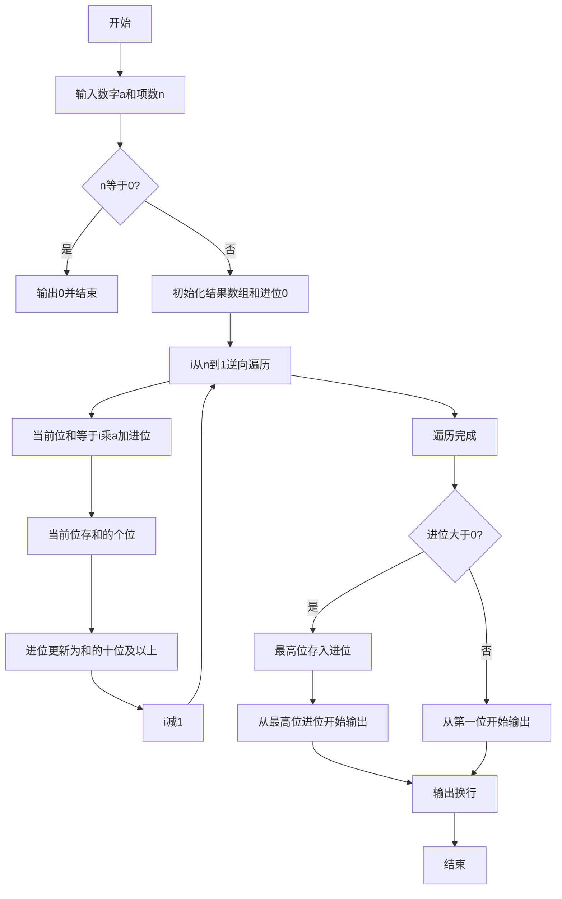
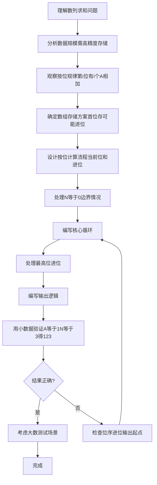

# 7-38 数列求和-加强版（R语言实现）

## 前言

本题（7-38 数列求和-加强版）的主要考点是：准确理解题意、规范处理输入输出格式，并正确处理边界与精度。下面先给出题目描述与格式要求，再通过清晰的思路与可直接运行的R代码进行讲解。

## 题目描述

给定某数字A（1≤A≤9）以及非负整数N（0≤N≤100000），求数列之和S=A+AA+AAA+⋯+AA⋯A（N个A）。例如A=1, N=3时，S=1+11+111=123。

## 输入格式

输入数字A与非负整数N。

## 输出格式

输出其N项数列之和S的值。

## 输入样例

```in
1 3
```

## 输出样例

```out
123
```

## 解题思路

### 核心问题分析
本题需要解决的核心问题：
1. **数据规模大**：N最大为100000，结果可达10万位以上，无法用普通整型存储
2. **按位计算思想**：模拟竖式加法，统计每一位上A出现的次数
3. **进位处理**：逐位计算后处理进位，最后输出

### 算法原理说明
观察数列结构：
      A      = A * 1
     AA      = A * 11
    AAA      = A * 111
   ...
+ AA...A(N个) = A * 111...1(N个)
从低位到高位逐位分析（第 i 步计算的位有 i 个数在这一位上有 A）：
- **第i位（从低位算起，i从N到1）**：该位有 i 个数在这一位上有 A（如个位有 N 个 A、十位有 N-1 个 A）
- 因此第i位的和 = `i * A + 来自低位的进位`
- 当前位数字 = `sum %% 10`
- 新的进位 = `sum %/% 10`

### 具体计算步骤
1. 处理边界：N=0时直接输出0
2. 初始化长度为n+1的结果向量result（result[1]预留存储最高位进位），carry=0
3. 从i=N到i=1逆向遍历（第i步计算的位有i个A相加）
   - sum = i * A + carry
   - result[i+1] = sum %% 10（R下标从1开始，故第i位存入result[i+1]）
   - carry = sum %/% 10
4. 遍历结束后若carry>0，将carry存入result[1]
5. 根据是否有进位决定从result[1]还是result[2]开始输出

## 完整代码

```r
# 从标准输入读取数字 a 和项数 n（file="stdin"）
lines <- readLines(file("stdin"))
if (length(lines) == 0) quit(save = "no")
nums <- suppressWarnings(as.integer(unlist(strsplit(trimws(paste(lines, collapse = " ")), "\\s+"))))
nums <- nums[!is.na(nums)]
a <- if (length(nums) >= 1) nums[1] else 0
n <- if (length(nums) >= 2) nums[2] else 0

# 边界：N=0 时直接输出 0
if (is.na(n) || n == 0) {
    cat("0\n")
} else {

# 结果向量：result[1] 预留存储最高位进位，result[2..n+1] 存储第 1..n 位
result <- integer(n + 1)
carry <- 0

# 从第 n 位到第 1 位逐位求和（第 i 位有 i 个 A 相加）
for (i in n:1) {
    s <- i * a + carry
    result[i + 1] <- s %% 10
    carry <- s %/% 10
}

# 输出结果：最高位有进位则先输出进位，再依次输出各位
    if (carry > 0) {
        result[1] <- carry
        cat(paste(result, collapse = ""), "\n", sep = "")
    } else {
        cat(paste(result[-1], collapse = ""), "\n", sep = "")
    }
}
```

## 代码流程说明

### 1. R脚本顶层代码-输入与边界处理（第1-10行）
- 用 readLines() 读取数字a和项数n
- n==0时用 cat() 直接输出0并退出

### 2. R脚本顶层代码-初始化（第12-14行）
- result向量初始化为0，长度n+1（result[1]预留存储最高位进位）
- carry进位初始化为0

### 3. R脚本顶层代码-按位求和循环（第16-21行）
- 从i=n到i=1循环
- 每位和 = i*a + carry（第i位有i个a相加）
- result[i+1] = 和 %% 10（存当前位，R下标从1开始故偏移1）
- carry = 和 %/% 10（更新进位）

### 4. R脚本顶层代码-进位与输出（第23-29行）
- 若carry>0：最高位有进位，存入result[1]，用 cat() 输出整个result
- 否则：用 cat() 输出result[-1]（即第2到第n+1位）
- 末尾输出换行

## 代码流程图



## 解题流程图



## 代码解析

```r
# 从标准输入读取数字 a 和项数 n（file="stdin"）
lines <- readLines(file("stdin"))
if (length(lines) == 0) quit(save = "no")
nums <- suppressWarnings(as.integer(unlist(strsplit(trimws(paste(lines, collapse = " ")), "\\s+"))))
nums <- nums[!is.na(nums)]
a <- if (length(nums) >= 1) nums[1] else 0
n <- if (length(nums) >= 2) nums[2] else 0

# 边界：N=0 时直接输出 0
if (is.na(n) || n == 0) {
    cat("0\n")
} else {

# 结果向量：result[1] 预留存储最高位进位，result[2..n+1] 存储第 1..n 位
result <- integer(n + 1)
carry <- 0

# 从第 n 位到第 1 位逐位求和（第 i 位有 i 个 A 相加）
for (i in n:1) {
    s <- i * a + carry
    result[i + 1] <- s %% 10
    carry <- s %/% 10
}

# 输出结果：最高位有进位则先输出进位，再依次输出各位
    if (carry > 0) {
        result[1] <- carry
        cat(paste(result, collapse = ""), "\n", sep = "")
    } else {
        cat(paste(result[-1], collapse = ""), "\n", sep = "")
    }
}
```

R脚本顶层代码-输入与边界处理（第1-10行）

## 复杂度分析

设输入规模为 $n$（对数值类题目为参与运算的数据量，对字符串/序列类题目为长度）。

- **时间复杂度**：$O(n)$ 或 $O(n \log n)$，主要来自一次线性遍历与常数次数学运算，无嵌套高复杂度循环。
- **空间复杂度**：$O(n)$，用于存储输入、中间结果与输出字符串；若仅使用若干标量变量则为 $O(1)$。

## 常见易错点

### 1. 输入/输出格式不符
错误：多余空格、遗漏换行、大小写或精度不符。后果：判题系统判为格式错误。正确：严格按题目要求的格式输出，数值用合适精度。

### 2. 边界条件遗漏
错误：未处理 0、最小值、单字符或空输入等边界。后果：特例 WA。正确：先列出所有边界样例，在编码前单独分支处理。

### 3. 整数溢出与类型
错误：使用过小的整数类型或忽略负号。后果：大数计算溢出。正确：按数据范围选择合适类型，必要时用更大整数类型或字符串处理。

## 更多测试

### 测试一：常规边界

**输入：**

```text
（可取题目边界附近的值，如最小值或最大值）
```

**输出：**

```text
（依据题意推导的正确结果）
```

### 测试二：特殊用例

**输入：**

```text
（可取易错点，如 0、单一元素、全同值等）
```

**输出：**

```text
（对应正确结果）
```

## 总结

本题的核心在于理清「数列求和-加强版」的输入输出关系与边界处理：先按格式读取输入，再依据规则逐步计算或遍历，最后按规范输出。该思路可迁移到同类格式化输入输出与模拟计算的题目。

