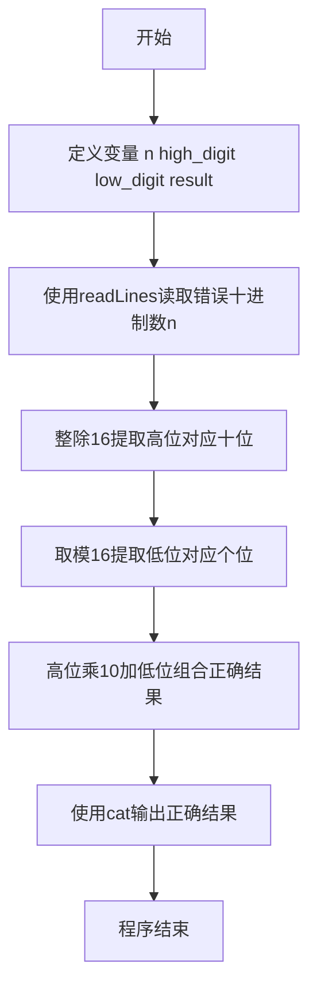
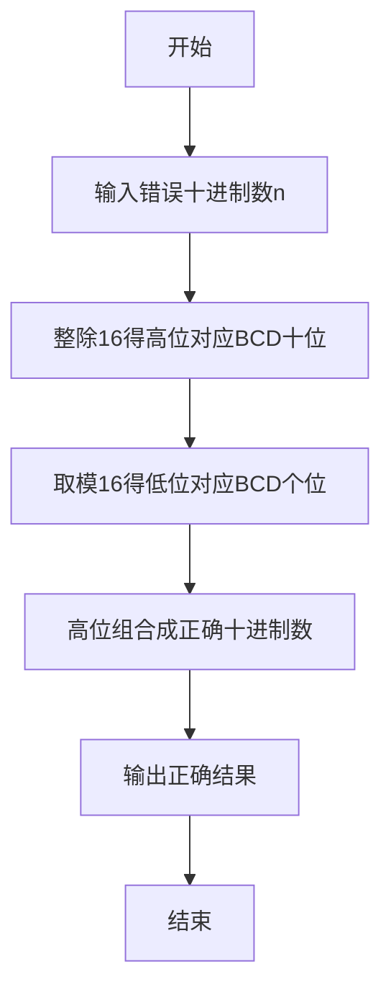

# 7-4 BCD解密（R语言实现）

## 前言

本题（7-4 BCD解密）的主要考点是：准确理解题意、规范处理输入输出格式，并正确处理边界与精度。下面先给出题目描述与格式要求，再通过清晰的思路与可直接运行的R代码进行讲解。

## 题目描述

BCD数是用一个字节来表达两位十进制的数，每四个比特表示一位。所以如果一个BCD数的十六进制是0x12，它表达的就是十进制的12。但是小明没学过BCD，把所有的BCD数都当作二进制数转换成十进制输出了。于是BCD的0x12被输出成了十进制的18了！

现在，你的程序要读入这个错误的十进制数，然后输出正确的十进制数。提示：你可以把18转换回0x12，然后再转换回12。

## 输入格式

输入在一行中给出一个[0, 153]范围内的正整数，保证能转换回有效的BCD数，也就是说这个整数转换成十六进制时不会出现A-F的数字。

## 输出格式

输出对应的十进制数。

## 输入样例

```in
18
```

## 输出样例

```out
12
```

## 解题思路

这道题的核心是**BCD编码的逆向还原**，关键在于理解小明的错误逻辑：他将BCD编码的十六进制数直接当作二进制数转换为十进制。我们需要反向操作，将错误的十进制数还原为BCD编码对应的正确十进制数。

### 核心问题分析

1. **BCD编码原理**：一个字节（8位）存储两位十进制数，高4位表示十位数字，低4位表示个位数字。例如BCD的`0x12`表示十进制的`12`。
2. **错误转换分析**：小明将`0x12`按普通十六进制转换为十进制：`1×16 + 2 = 18`。
3. **逆向还原方法**：给定错误的十进制数（如18），需要将其视为十六进制的各位数字，再按十进制规则组合。

### 算法原理说明

采用**十六进制数位提取法**：
1. 小明的错误：将BCD字节（如0x12）按十六进制转十进制：`high × 16 + low`
2. 我们的修正：将错误十进制数的十六进制各位（high和low）按十进制组合：`high × 10 + low`

关键观察：对错误十进制数 `n` 做 `n / 16` 和 `n % 16`，恰好可以得到原BCD编码的高4位和低4位数字。

### 具体计算步骤

设输入的错误十进制数为 `n`：
1. 提取高位（十位）：`high_digit = n / 16`，即十六进制的高位数字
2. 提取低位（个位）：`low_digit = n % 16`，即十六进制的低位数字
3. 组合正确结果：`result = high_digit * 10 + low_digit`
4. 输出正确的十进制数 `result`

例如：`n = 18`
- `high_digit = 18 / 16 = 1`
- `low_digit = 18 % 16 = 2`
- `result = 1 × 10 + 2 = 12` ✓

## 完整代码

```r
# 从标准输入读取一个整数（错误的十进制数，使用 file="stdin"）
line <- readLines(file("stdin"), n = 1)
if (length(line) == 0 || is.na(line[1]) || trimws(line[1]) == "") {
  n <- 0L
} else {
  n <- as.integer(trimws(line[1]))
}

# 提取高位数字：整除16，得到十六进制的高位数字（对应BCD的十位）
high_digit <- n %/% 16L
# 提取低位数字：取模16，得到十六进制的低位数字（对应BCD的个位）
low_digit <- n %% 16L
# 组合正确结果：高位数字×10 + 低位数字
result <- high_digit * 10L + low_digit

# 输出正确的十进制数并换行
cat(sprintf("%d\n", result))
```

## 代码流程说明

1. **R 脚本顶层代码**：R 是解释型脚本语言，无需引入头文件和 main 函数，代码自上而下执行。
2. **定义变量**：定义整型变量`n`存储输入的错误十进制数。
3. **读取输入**：使用`readLines()`从标准输入读取一个正整数。
4. **提取高位数字**：`n %/% 16`整除16，得到十六进制表示的高位数字（对应BCD的十位）。
5. **提取低位数字**：`n %% 16`取模16，得到十六进制表示的低位数字（对应BCD的个位）。
6. **组合正确结果**：高位数字×10 + 低位数字，得到正确的十进制数。
7. **输出结果**：使用`cat()`输出正确的十进制数并换行。
8. **程序结束**：R 脚本执行完毕即自然结束。

## 代码流程图



## 解题流程图



## 代码解析

```r
# 从标准输入读取一个整数（错误的十进制数，解析版）
line <- readLines(file("stdin"), n = 1)
if (length(line) == 0 || is.na(line[1]) || trimws(line[1]) == "") {
  n <- 0L
} else {
  n <- as.integer(trimws(line[1]))
}

# 提取高位数字：整除16，得到十六进制的高位数字（对应BCD的十位）
high_digit <- n %/% 16L
# 提取低位数字：取模16，得到十六进制的低位数字（对应BCD的个位）
low_digit <- n %% 16L
# 组合正确结果：高位数字×10 + 低位数字
result <- high_digit * 10L + low_digit

# 输出正确的十进制数并换行
cat(sprintf("%d\n", result))
```

R 脚本顶层代码

## 复杂度分析

设输入规模为 $n$（对数值类题目为参与运算的数据量，对字符串/序列类题目为长度）。

- **时间复杂度**：$O(n)$ 或 $O(n \log n)$，主要来自一次线性遍历与常数次数学运算，无嵌套高复杂度循环。
- **空间复杂度**：$O(n)$，用于存储输入、中间结果与输出字符串；若仅使用若干标量变量则为 $O(1)$。

## 常见易错点

### 1. 输入/输出格式不符
错误：多余空格、遗漏换行、大小写或精度不符。后果：判题系统判为格式错误。正确：严格按题目要求的格式输出，数值用合适精度。

### 2. 边界条件遗漏
错误：未处理 0、最小值、单字符或空输入等边界。后果：特例 WA。正确：先列出所有边界样例，在编码前单独分支处理。

### 3. 整数溢出与类型
错误：使用过小的整数类型或忽略负号。后果：大数计算溢出。正确：按数据范围选择合适类型，必要时用更大整数类型或字符串处理。

## 更多测试

### 测试一：常规边界

**输入：**

```text
（可取题目边界附近的值，如最小值或最大值）
```

**输出：**

```text
（依据题意推导的正确结果）
```

### 测试二：特殊用例

**输入：**

```text
（可取易错点，如 0、单一元素、全同值等）
```

**输出：**

```text
（对应正确结果）
```

## 总结

本题的核心在于理清「BCD解密」的输入输出关系与边界处理：先按格式读取输入，再依据规则逐步计算或遍历，最后按规范输出。该思路可迁移到同类格式化输入输出与模拟计算的题目。

