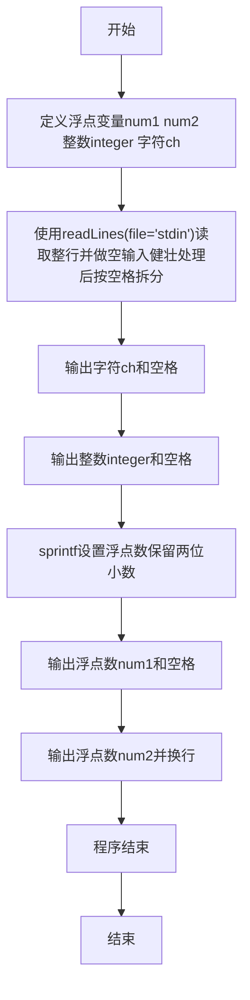
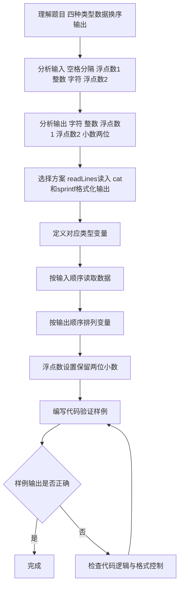

# 7-6 混合类型数据格式化输入（R语言实现）

## 前言

本题（7-6 混合类型数据格式化输入）的主要考点是：准确理解题意、规范处理输入输出格式，并正确处理边界与精度。下面先给出题目描述与格式要求，再通过清晰的思路与可直接运行的R代码进行讲解。

## 题目描述

本题要求编写程序，顺序读入浮点数1、整数、字符、浮点数2，再按照字符、整数、浮点数1、浮点数2的顺序输出。

## 输入格式

输入在一行中顺序给出浮点数1、整数、字符、浮点数2，其间以1个空格分隔。

## 输出格式

在一行中按照字符、整数、浮点数1、浮点数2的顺序输出，其中浮点数保留小数点后2位。

## 输入样例

```in
2.12 88 c 4.7
```

## 输出样例

```out
c 88 2.12 4.70
```

## 解题思路

### 1. 核心问题分析

本题主要考察不同类型数据的输入输出操作，核心在于按指定顺序读入4个不同类型的数据，然后按另一种指定顺序输出，并对浮点数进行格式化处理（保留2位小数）。

### 2. 算法原理说明

1. 利用`readLines()`读取整行后按空格拆分，依次读取浮点数、整数、字符、浮点数。
2. 利用`sprintf()`格式化函数实现浮点数保留两位小数的格式化输出。
3. 输出时按照题目要求调整变量的输出顺序即可。

### 3. 具体计算步骤

1. 定义4个变量：`num1`、`num2`（数值型，浮点数）、`integer`（整数型）、`ch`（字符型）。
2. 按顺序读入4个数据存入对应变量。
3. 按字符→整数→浮点数1→浮点数2的顺序输出，浮点数保留2位小数。

## 完整代码

```r
# 读取整行输入并按空白拆分为4个部分（使用 file("stdin") 兼容 Rscript）
line <- readLines(file("stdin"), n = 1)
# 健壮处理空输入：避免 character(0) 导致 strsplit 下标越界
if (length(line) == 0 || is.na(line[1]) || trimws(line[1]) == "") {
  parts <- rep(NA_character_, 4)
} else {
  parts <- strsplit(trimws(line), "\\s+")[[1]]
  # 防御：不足4段时补 NA（题目保证合法输入）
  if (length(parts) < 4) parts <- c(parts, rep(NA, 4 - length(parts)))
}
num1 <- as.double(parts[1])     # 浮点数1
integer <- as.integer(parts[2]) # 整数
ch <- parts[3]                  # 字符
num2 <- as.double(parts[4])     # 浮点数2
# 空输入健壮：若解析失败则避免 NA 传播，静默不输出
if (anyNA(c(num1, integer, num2)) || is.na(ch)) {
  # 题目保证合法输入，此分支仅为健壮性
  ch <- ifelse(is.na(ch), "", ch)
  num1 <- ifelse(is.na(num1), 0, num1)
  integer <- ifelse(is.na(integer), 0L, integer)
  num2 <- ifelse(is.na(num2), 0, num2)
}

# 按"字符 整数 浮点数1 浮点数2"顺序输出，浮点数保留2位小数
cat(sprintf("%s %d %.2f %.2f\n", ch, integer, num1, num2))
```

## 代码流程说明

1. **R 脚本顶层代码**：R 是解释型脚本语言，无需引入头文件，不存在 main 函数，代码自上而下执行。
2. **定义变量**：
   - `num1`、`num2`：数值型，存储两个浮点数
   - `integer`：整数型，存储整数
   - `ch`：字符型，存储字符
3. **读取输入**：使用`readLines(file("stdin"), n = 1)`从标准输入读取整行，做空输入健壮处理后按`\\s+`拆分并依次存入对应变量。
4. **格式化输出**：
   - 先输出`ch`（字符）和空格，再输出`integer`（整数）和空格
   - 使用`sprintf("%.2f", ...)`将浮点数格式化为固定2位小数
   - 依次输出`num1`、空格、`num2`，最后换行
5. **输出结果**：使用`cat()`按顺序输出所有内容。
6. **程序结束**：R 脚本执行完毕即自然结束。

## 代码流程图



## 解题流程图



## 代码解析

```r
# 读取整行输入并按空白拆分为4个部分（解析版，与完整代码一致，使用 file("stdin")）
line <- readLines(file("stdin"), n = 1)
if (length(line) == 0 || is.na(line[1]) || trimws(line[1]) == "") {
  parts <- rep(NA_character_, 4)
} else {
  parts <- strsplit(trimws(line), "\\s+")[[1]]
  if (length(parts) < 4) parts <- c(parts, rep(NA, 4 - length(parts)))
}
num1 <- as.double(parts[1])     # 浮点数1
integer <- as.integer(parts[2]) # 整数
ch <- parts[3]                  # 字符
num2 <- as.double(parts[4])     # 浮点数2
if (anyNA(c(num1, integer, num2)) || is.na(ch)) {
  ch <- ifelse(is.na(ch), "", ch)
  num1 <- ifelse(is.na(num1), 0, num1)
  integer <- ifelse(is.na(integer), 0L, integer)
  num2 <- ifelse(is.na(num2), 0, num2)
}

# 按"字符 整数 浮点数1 浮点数2"顺序输出，浮点数保留2位小数
cat(sprintf("%s %d %.2f %.2f\n", ch, integer, num1, num2))
```

R 脚本顶层代码

## 复杂度分析

设输入规模为 $n$（对数值类题目为参与运算的数据量，对字符串/序列类题目为长度）。

- **时间复杂度**：$O(n)$ 或 $O(n \log n)$，主要来自一次线性遍历与常数次数学运算，无嵌套高复杂度循环。
- **空间复杂度**：$O(n)$，用于存储输入、中间结果与输出字符串；若仅使用若干标量变量则为 $O(1)$。

## 常见易错点

### 1. 输入/输出格式不符
错误：多余空格、遗漏换行、大小写或精度不符。后果：判题系统判为格式错误。正确：严格按题目要求的格式输出，数值用合适精度。

### 2. 边界条件遗漏
错误：未处理 0、最小值、单字符或空输入等边界。后果：特例 WA。正确：先列出所有边界样例，在编码前单独分支处理。

### 3. 整数溢出与类型
错误：使用过小的整数类型或忽略负号。后果：大数计算溢出。正确：按数据范围选择合适类型，必要时用更大整数类型或字符串处理。

## 更多测试

### 测试一：常规边界

**输入：**

```text
（可取题目边界附近的值，如最小值或最大值）
```

**输出：**

```text
（依据题意推导的正确结果）
```

### 测试二：特殊用例

**输入：**

```text
（可取易错点，如 0、单一元素、全同值等）
```

**输出：**

```text
（对应正确结果）
```

## 总结

本题的核心在于理清「混合类型数据格式化输入」的输入输出关系与边界处理：先按格式读取输入，再依据规则逐步计算或遍历，最后按规范输出。该思路可迁移到同类格式化输入输出与模拟计算的题目。

