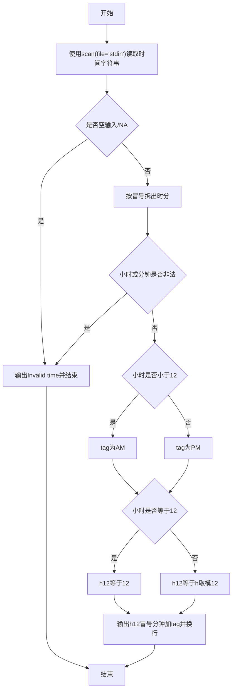
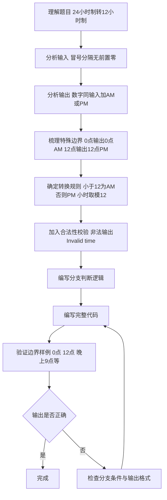

# 7-7 12-24小时制（R语言实现）

## 前言

本题（7-7 12-24小时制）的主要考点是：准确理解题意、规范处理输入输出格式，并正确处理边界与精度。下面先给出题目描述与格式要求，再通过清晰的思路与可直接运行的R代码进行讲解。

## 题目描述

编写一个程序，要求用户输入24小时制的时间，然后显示12小时制的时间。

## 输入格式

输入在一行中给出带有中间的:符号（半角的冒号）的24小时制的时间，如12:34表示12点34分。当小时或分钟数小于10时，均没有前导的零，如5:6表示5点零6分。

提示：在scanf的格式字符串中加入:，让scanf来处理这个冒号。

## 输出格式

在一行中输出这个时间对应的12小时制的时间，数字部分格式与输入的相同，然后跟上空格，再跟上表示上午的字符串AM或表示下午的字符串PM。如5:6 PM表示下午5点零6分。注意，在英文的习惯中，中午12点被认为是下午，所以24小时制的12:00就是12小时制的12:0 PM；而0点被认为是第二天的时间，所以是0:0 AM。

## 输入样例

```in
21:11
```

## 输出样例

```out
9:11 PM
```

## 解题思路

### 1. 核心问题分析

本题需要完成两个核心任务：一是正确读取带有冒号分隔符的时间输入，二是根据24小时制到12小时制的转换规则进行分支判断输出。关键边界点在于0点、12点这两个特殊时间点的处理，以及输入时分的合法性校验。

### 2. 算法原理说明

1. **带分隔符输入处理**：读取时间字符串后按冒号拆分，得到小时和分钟两个部分并转为整数。
2. **合法性校验**：若小时不在0~23范围内或分钟不在0~59范围内，输出"Invalid time"并结束。
3. **时间转换规则**：
   - 上下午判断：`h < 12`时为AM（上午），12点及以后为PM（下午）
   - 12小时制小时换算：`h == 12`时保持12，其余按 `h %% 12` 计算（0点保持0）
   - 输出格式："时:分 AM/PM"，数字部分不带前导零

### 3. 具体计算步骤

1. 读入时间字符串，按冒号拆出小时h与分钟m。
2. 校验h、m是否在合法范围内，非法则输出"Invalid time"并结束。
3. 用 `h < 12` 判断上下午，得到AM或PM标识存入tag。
4. 用 `if (h == 12) 12 else h %% 12` 转换出12小时制小时h12。
5. 用 `cat(sprintf("%d:%d %s\n", h12, m, tag))` 输出转换结果。

## 完整代码

```r
# 读取24小时制时间字符串，如 21:11（使用 file="stdin" 避免 Rscript 读脚本）
s <- scan(file="stdin", what=character(), quiet=TRUE)[1]
# 健壮处理空输入/NA
if (is.na(s) || length(s) == 0) {
  cat("Invalid time\n")
} else {
  parts <- as.integer(strsplit(s, ":", fixed=TRUE)[[1]])
  h <- parts[1]; m <- parts[2]
  # 校验合法性，处理可能的 NA
  if (is.na(h) || is.na(m) || h < 0 || h > 23 || m < 0 || m > 59) {
    cat("Invalid time\n")
  } else {
    tag <- if (h < 12) "AM" else "PM"
    h12 <- if (h == 12) 12 else h %% 12
    cat(sprintf("%d:%d %s\n", h12, m, tag))
  }
}
```

## 代码流程说明

1. **R 脚本顶层代码**：R 是解释型脚本语言，无需引入头文件，也不存在 main 函数，代码自上而下执行。
2. **读取输入**：使用`scan(file="stdin", what=character(), quiet=TRUE)`读取时间字符串，`strsplit()`按冒号拆出小时`h`与分钟`m`并转为整数（带空输入健壮处理）。
3. **合法性校验**：若`h`不在0~23范围内或`m`不在0~59范围内，用`cat()`输出"Invalid time"并结束。
4. **判断上下午**：`h < 12`时为AM，否则为PM，结果存入`tag`。
5. **转换12小时制**：`h == 12`时`h12`保持12，否则`h12 = h %% 12`（0点保持0）。
6. **输出结果**：使用`cat(sprintf("%d:%d %s\n", h12, m, tag))`输出转换后的时间和AM/PM标识，程序自然结束。

## 代码流程图



## 解题流程图



## 代码解析

```r
# 读取24小时制时间字符串，如 21:11（解析版，使用 file="stdin"）
s <- scan(file = "stdin", what = character(), quiet = TRUE)[1]
# 处理空输入
if (is.na(s) || length(s) == 0) {
  cat("Invalid time\n")
} else {
  parts <- as.integer(strsplit(s, ":", fixed = TRUE)[[1]])
  h <- parts[1]
  m <- parts[2]

  # 校验时间合法性：非法输入直接输出 Invalid time（含 NA）
  if (is.na(h) || is.na(m) || h < 0 || h > 23 || m < 0 || m > 59) {
    cat("Invalid time\n")
  } else {
    # 判断上午/下午：0点至11点为AM，12点及以后为PM
    tag <- if (h < 12) "AM" else "PM"

    # 转换为12小时制：12点保持12，0点保持0，其余按 h %% 12
    h12 <- if (h == 12) 12 else h %% 12

    # 输出结果，数字部分不带前导零
    cat(sprintf("%d:%d %s\n", h12, m, tag))
  }
}
```

### 代码解析要点

冒号两侧分别解析为小时和分钟；小时小于12时标记为 AM，否则为 PM，0点保留为0，12点保留为12，其他小时对12取余。

## 复杂度分析

设输入规模为 $n$（对数值类题目为参与运算的数据量，对字符串/序列类题目为长度）。

- **时间复杂度**：$O(n)$ 或 $O(n \log n)$，主要来自一次线性遍历与常数次数学运算，无嵌套高复杂度循环。
- **空间复杂度**：$O(n)$，用于存储输入、中间结果与输出字符串；若仅使用若干标量变量则为 $O(1)$。

## 常见易错点

### 1. 输入/输出格式不符
错误：多余空格、遗漏换行、大小写或精度不符。后果：判题系统判为格式错误。正确：严格按题目要求的格式输出，数值用合适精度。

### 2. 边界条件遗漏
错误：未处理 0、最小值、单字符或空输入等边界。后果：特例 WA。正确：先列出所有边界样例，在编码前单独分支处理。

### 3. 整数溢出与类型
错误：使用过小的整数类型或忽略负号。后果：大数计算溢出。正确：按数据范围选择合适类型，必要时用更大整数类型或字符串处理。

## 更多测试

### 测试一：常规边界

**输入：**

```text
0:0
```

**输出：**

```text
0:0 AM
```

### 测试二：特殊用例

**输入：**

```text
12:5
```

**输出：**

```text
12:5 PM
```

## 总结

本题的核心在于理清「12-24小时制」的输入输出关系与边界处理：先按格式读取输入，再依据规则逐步计算或遍历，最后按规范输出。该思路可迁移到同类格式化输入输出与模拟计算的题目。
