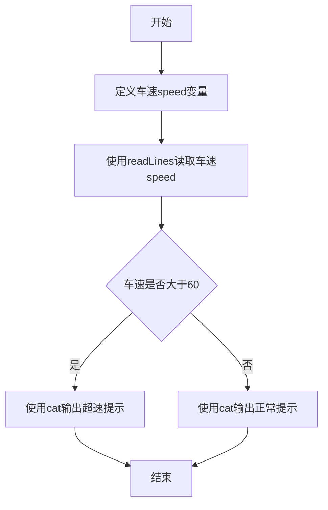
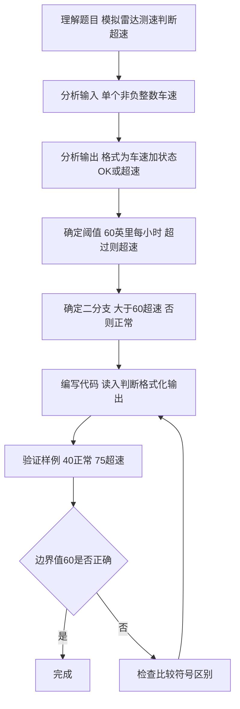

# 7-8 超速判断（R语言实现）

## 前言

本题（7-8 超速判断）的主要考点是：准确理解题意、规范处理输入输出格式，并正确处理边界与精度。下面先给出题目描述与格式要求，再通过清晰的思路与可直接运行的R代码进行讲解。

## 题目描述

模拟交通警察的雷达测速仪。输入汽车速度，如果速度超出60 mph，则显示“Speeding”，否则显示“OK”。

## 输入格式

输入在一行中给出1个不超过500的非负整数，即雷达测到的车速。

## 输出格式

在一行中输出测速仪显示结果，格式为：Speed: V - S，其中V是车速，S或者是Speeding、或者是OK。

## 输入样例1

```in
40
```

## 输入样例2

```in
75
```

## 输出样例1

```out
Speed: 40 - OK
```

## 输出样例2

```out
Speed: 75 - Speeding
```

## 解题思路

### 1. 核心问题分析

本题是典型的单条件二分支判断问题，核心在于读取车速后与阈值60 mph进行比较，根据比较结果输出不同的提示信息，同时需要严格按照指定格式拼接输出字符串。

### 2. 算法原理说明

1. 使用`readLines()`从标准输入读取一个整数车速值。
2. 利用`if-else`条件分支结构进行判断：
   - 若 `speed > 60`，判定为超速，输出"Speeding"
   - 否则（`speed <= 60`），判定为正常，输出"OK"
3. 按照`Speed: V - S`的固定格式拼接车速值和判断结果进行输出。

### 3. 具体计算步骤

1. 定义变量`speed`存储车速。
2. 读取输入的车速值。
3. 判断`speed`是否大于60。
4. 按指定格式输出测速结果。

## 完整代码

```r
# 读取车速（非负整数，使用 file("stdin") 兼容 Rscript）
line <- readLines(file("stdin"), n = 1)
if (length(line) == 0 || is.na(line[1]) || trimws(line[1]) == "") {
  speed <- 0L
} else {
  speed <- as.integer(trimws(line[1]))
}

# 判断车速是否超过60 mph（>60 为超速，=60 为正常，严格按题意）
if (speed > 60) {
  cat(sprintf("Speed: %d - Speeding\n", speed))
} else {
  cat(sprintf("Speed: %d - OK\n", speed))
}
```

## 代码流程说明

1. **定义变量**：`speed` 存储雷达测得的车速值（整数）。
2. **读取输入**：`speed <- as.integer(trimws(readLines(file("stdin"), n = 1)))` 从标准输入读取一个非负整数存入 `speed`（使用 `file("stdin")` 兼容 Rscript 管道，并做空输入健壮处理）。
3. **条件判断与输出**：
   - `speed > 60`为真（超速）：使用 `cat()` 按格式输出`Speed: V - Speeding`并换行
   - 否则（未超速）：使用 `cat()` 按格式输出`Speed: V - OK`并换行
4. **程序结束**：R 脚本为顶层代码，自上而下执行完毕，无需 main 函数与头文件。

## 代码流程图



## 解题流程图



## 代码解析

```r
# 读取车速（非负整数，解析版）
line <- readLines(file("stdin"), n = 1)
if (length(line) == 0 || is.na(line[1]) || trimws(line[1]) == "") {
  speed <- 0L
} else {
  speed <- as.integer(trimws(line[1]))
}

# 判断车速是否超过60 mph
if (speed > 60) {
  cat(sprintf("Speed: %d - Speeding\n", speed))
} else {
  cat(sprintf("Speed: %d - OK\n", speed))
}
```

### 代码解析要点

将车速与严格阈值60比较，只有大于60才输出 `Speeding`；车速和状态通过固定格式一次输出。

## 复杂度分析

设输入规模为 $n$（对数值类题目为参与运算的数据量，对字符串/序列类题目为长度）。

- **时间复杂度**：$O(n)$ 或 $O(n \log n)$，主要来自一次线性遍历与常数次数学运算，无嵌套高复杂度循环。
- **空间复杂度**：$O(n)$，用于存储输入、中间结果与输出字符串；若仅使用若干标量变量则为 $O(1)$。

## 常见易错点

### 1. 输入/输出格式不符
错误：多余空格、遗漏换行、大小写或精度不符。后果：判题系统判为格式错误。正确：严格按题目要求的格式输出，数值用合适精度。

### 2. 边界条件遗漏
错误：未处理 0、最小值、单字符或空输入等边界。后果：特例 WA。正确：先列出所有边界样例，在编码前单独分支处理。

### 3. 整数溢出与类型
错误：使用过小的整数类型或忽略负号。后果：大数计算溢出。正确：按数据范围选择合适类型，必要时用更大整数类型或字符串处理。

## 更多测试

### 测试一：常规边界

**输入：**

```text
60
```

**输出：**

```text
Speed: 60 - OK
```

### 测试二：特殊用例

**输入：**

```text
61
```

**输出：**

```text
Speed: 61 - Speeding
```

## 总结

本题的核心在于理清「超速判断」的输入输出关系与边界处理：先按格式读取输入，再依据规则逐步计算或遍历，最后按规范输出。该思路可迁移到同类格式化输入输出与模拟计算的题目。
